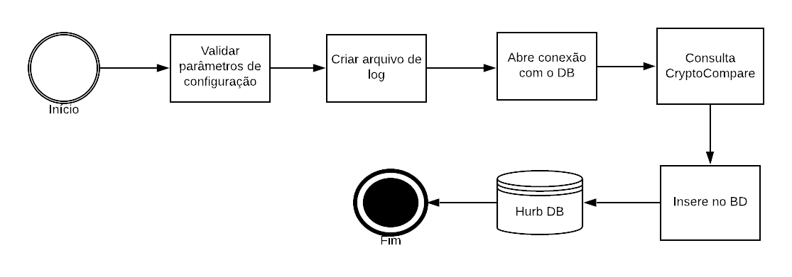

## Crawler bravo
Este processo tem a função simplesmente de tempos em tempos, fazer uma requisição na API da [CryptoCompare](https://www.cryptocompare.com/), estruturar os dados e salvar no banco de dados.

Alguns dos motivos deste processo ter sido desenvolvido separadamente é deixar independente os processos, ter ganho de performance e armazenar esses dados possibilitando a extração de métricas.

#### Abaixo é possível visualizar o diagrama de processso 


#### Arquivo de configuração

```json
  {
      "mongo":
      {
              "hurb":
              {
                  "mongo_user"          : "",
                  "mongo_password"      : "",
                  "mongo_address"       : "ds131676.mlab.com",
                  "mongo_port"          : "31676",
                  "mongo_database"      : "hurb",
                  "mongo_collection"    : "cotation"
              }
      },
      "logger":
      {
          "logger_output_path"  : "./log/",
          "logger_filename"     : "logger_hurb_bravo.txt",
          "logger_name"         : "logger_hurb_bravo"
      },
      "hurb_key": "",
      "timeout": 3600
  }
```

### Descrição dos parâmetros

- Mongo/hurb: credenciais referente a base de dados
- logger: localização e nome dos arquivos de log
- hurb_key: key utilizada para requisição na API CryptoCompare
- timeout: número em segundos que a aplicação ficara ociosa para uma nova execução.

### Modo de Uso

Após o projeto clonado, siga os passos:

```console
$ pip install virtualenv

$ virtualenv nome_do_virtual_env

# Entre no diretório aonde foi criado a pasta "nome_do_virtual_env" e digite
# OS Windows
$ nome_do_virtual_env\bin\activate
# Unix
$ source nome_do_virtual_env\bin\activate

# Instale os pacotes necessários de dentro do requirements.txt.
$ pip install -r requirements.txt

# Execute o processo
$ python crawler.py

# Dica: para desativar o ambiente virtual, digite deactivate
```