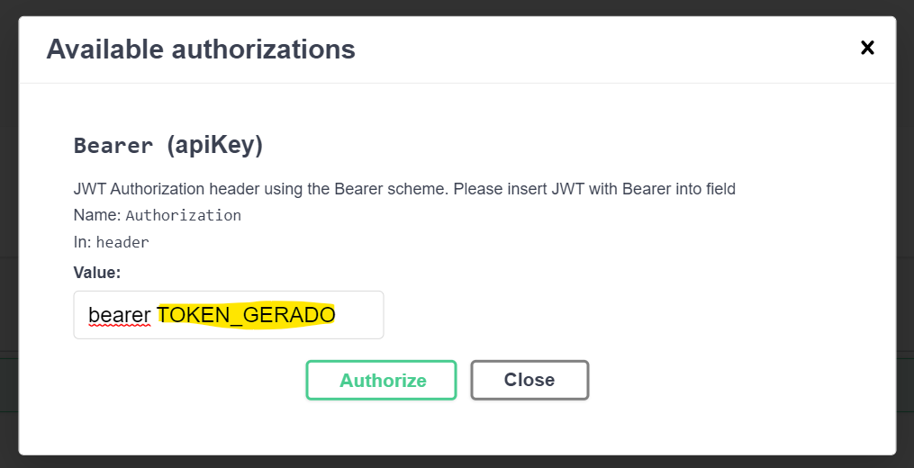

#  Desafio Bravo

[[English](README.md) | [Português](README.pt.md) | [Comentários](README.comments.md)]

Stack da API:
- .NET 6
- C#
- SQL Server
- Entity Framework Core

Detalhes para criação do BD da API:
- Após fazer o Pull da API, na solução dendo da pasta SQLs ficam os seguintes Scripts:
 - 01 - CREATE-TABLES.sql
 - 02 - INSERT-TABLES.sql
  Eles precisam ser executados conforme ordem dos arquivos.

Gerar Token

O token de acesso aos endpoints deverá ser gerado a partir do endpoint /api/Auth.
Para definir token de acesso para consulta ao endpoints, deveremos clicar no botão Authorize no canto superior direito da tela, sendo exibido o seguinte modal:
Ex: `bearer TOKEN`

  

Detalhes Controllers:
- Para alguns endpoints com a finalidade de proteger algumas rotas foi implementado o JWT para geração de Token e validação de acesso.
- Conforme mencionado para atender de forma bem simples a aplicação para gerar Tokens e validar algumas permissões, foi criado uma estrutura bem simples de Usuário e Perfil, no qual temos em nosso BD:
Tabela: User
	Name			Perfil
	User			  1	
	Analyst		  	  2
	Admintratrator	  3
- Na API temos um enumerador para atender os Perfis relacionado ao nosso BD.
- Em nossa API somente o Perfil Analyst estaremos sendo ultilizado.

Controller - Auth
- Controller responsável por gerar o Token a partir do "acesso" do usuário.
- Pemitindo qualquer acesso.

Controller - Country
- Controller responsável por listar todos os países cadastrados.
- Permitindo acesso somente para usuários com perfil Analyst.

Controller - Currency
- Controller responsável por gerenciar o cadastro de todas as moedas suas informações.
- Permitindo acesso somente para usuários com perfil Analyst.

Controller - Quotation
- Controller principal da API, com o objetivo de permitir qualquer usuário realizar cotações para moedas cadastradas.
- Permitindo qualquer acesso.

Controller - QuotationCurrency
- Controller responsável por listar valores cotados para cada moeda conforme "país selecionado". Controller com as informações base para cotações.
- Permitindo acesso somente para usuários com perfil Analyst.

Controller - User
- Controller responsável por listar valores usuários cadastrados. Controller criado informações simples somente para atender JWT de forma simples.
- Permitindo acesso somente para usuários com perfil Analyst.
