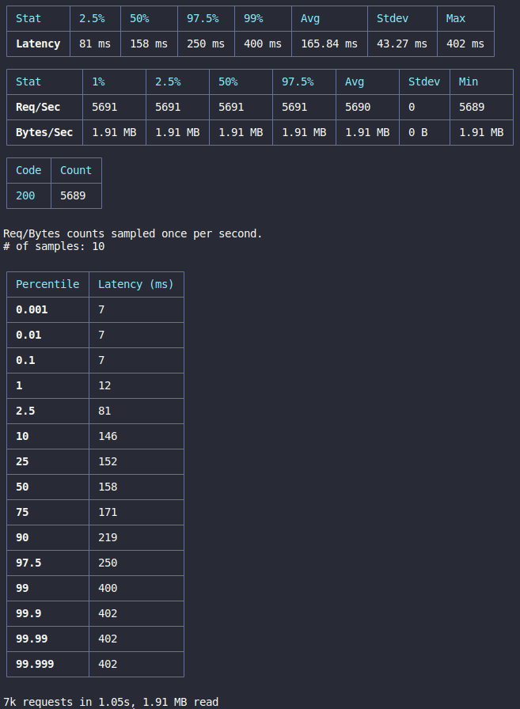

# Challenge Bravo - Hurb

Este é um [desafio técnico da Hurb](https://github.com/hurbcom/challenge-bravo/blob/main/README.pt.md), que consiste na criação de uma API que realiza a conversão entre moedas reais, crypto ou fictícias.


## Stack utilizada

- Node.js 
- Express.js 
- Axios 
- Redis 
- Docker
- Jest
- Swagger-ui-express


## Documentação

É possível acessar a documentação desta API - criada utilizando Swagger - na rota `/api-documentation` da própria API.


## Rodando localmente

Clone o projeto
```bash
  git clone https://github.com/mdeosjr/challenge-bravo
```

Entre no diretório do projeto
```bash
  cd challenge-bravo
```

Instale as dependências
```bash
  npm install
```

Adicione as variáveis de ambiente seguindo .env.example (ou copie e cole as seguintes variáveis)
```bash
  PORT=5000
  REDIS_PORT=6379
  REDIS_HOST=localhost
  REDIS_KEY=currencies
  API_KEY=bc48f82c06ff4196b304e5a0f8a8ee7d
```

Inicie o servidor
```bash
  npm run start

      ou

  npm run dev
```


## Docker-compose

Caso seja a primeira vez rodando a aplicação pelo Docker, utilize o comando
```bash
  docker-compose up --build
```

E para as próximas vezes utilize o comando
```bash
  docker-compose up 
```
## Testes

Foram realizados testes de integração, para resposta das controllers, e testes unitários, para possíveis erros da aplicação, no nível das services. 
Importante ressaltar a utilização do `.env.test` (copie as variáveis de `.env.test.example`) para que seja criada uma chave diferente no Redis, e assim não intefira na chave sendo utilizada pela API.
Ao rodar (utilize o comando `npm t`) será criada uma pasta de coverage onde terá o seguinte resultado.


File                         | % Stmts | % Branch | % Funcs | % Lines | Uncovered Line #s 
-----------------------------|---------|----------|---------|---------|-------------------
All files                    |   84.87 |    77.14 |      80 |   86.11 |                   
 src                         |      50 |        0 |       0 |      50 |                   
  db.js                      |   33.33 |      100 |       0 |   33.33 | 9-10              
  index.js                   |      75 |      100 |       0 |      75 | 20-21             
  server.js                  |       0 |        0 |       0 |       0 | 3-7               
  setup.js                   |     100 |      100 |     100 |     100 |                   
 src/controllers             |     100 |      100 |     100 |     100 |                   
  currenciesController.js    |     100 |      100 |     100 |     100 |                   
  exchangesController.js     |     100 |      100 |     100 |     100 |                   
 src/middlewares             |     100 |      100 |     100 |     100 |                   
  errorHandlingMiddleware.js |     100 |      100 |     100 |     100 |                   
  validateSchema.js          |     100 |      100 |     100 |     100 |                   
 src/repositories            |     100 |      100 |     100 |     100 |                   
  currenciesRepository.js    |     100 |      100 |     100 |     100 |                   
 src/routes                  |     100 |      100 |     100 |     100 |                   
  currenciesRoute.js         |     100 |      100 |     100 |     100 |                   
  exchangesRoute.js          |     100 |      100 |     100 |     100 |                   
  routes.js                  |     100 |      100 |     100 |     100 |                   
 src/schemas                 |     100 |      100 |     100 |     100 |                   
  newCurrencySchema.js       |     100 |      100 |     100 |     100 |                   
 src/services                |     100 |      100 |     100 |     100 |                   
  currenciesService.js       |     100 |      100 |     100 |     100 |                   
  exchangesService.js        |     100 |      100 |     100 |     100 |                   
 src/utils                   |   41.17 |       40 |      50 |   41.66 |                   
  errorUtils.js              |   66.66 |       50 |     100 |      80 | 9                 
  seed.js                    |    12.5 |        0 |       0 |   14.28 | 7-45              

Test Suites: 2 passed, 2 total  
Tests:       15 passed, 15 total  
Snapshots:   0 total  
Time:        1.679 s, estimated 2 s


## Teste de estresse

Para estressar a API foi utilizado o [Autocannon](https://github.com/mcollina/autocannon#readme), com o comando `npx autocannon -c 1000 -d 1 -w 10 --renderStatusCodes -l -W [-c 1 -d 2] -m 'POST' 'http://localhost:5000/exchange?from=USD&to=BRL&amount=10'`, e foram obtidos os seguintes resultados:

Running 1s test @ http://localhost:5000/exchange?from=USD&to=BRL&amount=10
1000 connections
10 workers

