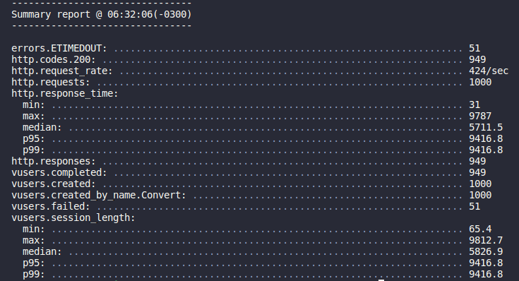

# 💰 Bravo Challenge


[Documentation](docs/docs.md)

[ [English](docs/README.en.md) | [Português](docs/README.pt.md) ]

This app was created as a NodeJS coding challenge.

Build an API, which responds to JSON, for currency conversion. It must have a backing currency (USD) and make conversions between different currencies with real and live values.

- [💰 Bravo Challenge](#-bravo-challenge)
  - [Requirements](#requirements)
  - [:floppy_disk: Cloning and Installing](#floppy_disk-cloning-and-installing)
  - [:electric_plug: Connecting to Database](#electric_plug-connecting-to-database)
  - [:cd: Starting](#cd-starting)
  - [:whale2: Docker](#whale2-docker)
    - [Build Image](#build-image)
  - [:running: Running Tests](#running-running-tests)
    - [Unit Testing](#unit-testing)
    - [Stress Tests](#stress-tests)
  - [:mailbox_closed: Postman](#mailbox_closed-postman)

## Requirements
Convert between currencies with live and real values. It also allows fictionary currencies to be created.
The [Exchange Rate API](https://app.exchangerate-api.com/dashboard) was used for current currencies.

## :floppy_disk: Cloning and Installing
```
git clone https://github.com/debora-rebelatto/challenge-bravo
cd challenge-bravo
npm install
```

## :electric_plug: Connecting to Database
Run this command on the terminal to create the .env file.
```
touch .env
```
Copy the keys avaliable at [this docs](https://docs.google.com/document/d/1Ah5wYJXp0VzSFCz_ec_M_RbxVmq04Dup14sZGwNXJok/edit) to the file created at the project root.

## :cd: Starting
To run the NodeJS application, run this in the terminal:

```
node src/server.js
```

But, reloading the terminal every time you make an update can be tiring so we can use nodemon to automatically restart the app. Install it globally:
```
npm i -g nodemon
```

and run this command to start the server
```
nodemon
```

## :whale2: Docker
### Build Image
```
docker build -t hurb-app .
```

Your image will now be listed by Docker:

```bash
docker images
```
Start the container and expose port 8000 to port 8000 on the host.

```bash
docker run --publish 8000:8000 hurb-app
```

## :running: Running Tests
### Unit Testing
To run tests, run the following command

```bash
npm run test
```

### Stress Tests
First, install the artillery package globally:
```bash
npm i -g artillery
```

Then run this at the command line:
```bash
artillery run load-test.yml
```

The Exchange Rate External API only disposes of 1500 requests per month, so the Artillery 1000 requests in 1s were not possible.

<p align="center">
  
</p>

## :mailbox_closed: Postman
Using Postman, create a new collection and import the `Bravo.postman_collection.json` file avaliable at the `docs` folder to import the requests used during development.

<p align="center"> Made with 🐝 </p>