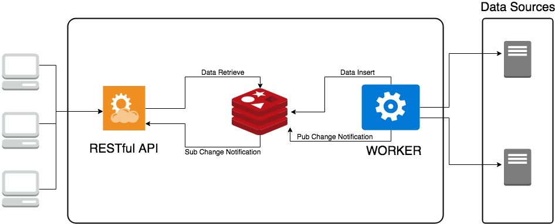

#  Desafio Bravo

Construa uma API, que responda JSON, para conversão monetária. Ela deve ter uma moeda de lastro (USD) e fazer conversões entre diferentes moedas com cotações de verdade e atuais.

A API deve converter entre as seguintes moedas:
- USD
- BRL
- EUR
- BTC
- ETH


Ex: USD para BRL, USD para BTC, ETH para BRL, etc...

A requisição deve receber como parâmetros: A moeda de origem, o valor a ser convertido e a moeda final.

Ex: `?from=BTC&to=EUR&amount=123.45`


# Arquitetura

<p align="center">
  
</p>

Temos 3 componentes principais que compoem a solução do desafio bravo: uma API REST, um Worker, e um componente para auxiliar no modelo PUB/SUB, que também pode atuar como cache.

## Worker
Este tem como objetivo:
* acessar as diversas fontes de dados e transformar os resultados num formato comum para a API onde a moeda de lastro é o dólar
* notificar para o sistema de PUB/SUB qualquer mudança nos valores das moedas.

## API
Esta tem como objetivo:
* receber notificações de mudança de valores das moedas e guardar em memória.
* calcular o `rate` entre as moedas do `FROM->TO`, o multiplicador `amount` e responder às requisições.

## PUB/SUB e cache
Esta tem como objetivo:
* manter os últimos valores das moedas para que o worker possa comparar se ouve mudança.
* servir de comunicação entre o worker e api

## Executando a solução

#### FIXER_APIKEY
Será necessária uma chave de acesso para a API do
FIXER (cotação de moedas estrangeiras).

Esta é a minha: `f1c643@f243|4333d94f@3c6fe5|b2fb6808`

Basta remover os `|` e `@` e colocar no `docker-compose.yml`, no `manager` como variável de ambiente `FIXER_APIKEY`.

Para que você possa rapidamente subir o ambiente e ver o funcionamento da solução, você vai precisar do `docker` e do `docker-compose`. Tendo estes requisitos atendidos, basta executar:

```
docker-compose up -d
```

E a api estará pronta para responder em:
```
http://localhost:8080/?from=BRL&to=EUR&amount=10000
```

# Rodando os testes

Temos duas aplicações neste projeto. As duas em node. Para rodas os testes da API basta:

```
cd api
npm install
npm test
```

O mesmo para o Currency Manager (Worker):
```
cd currencyManager
npm install
npm test
```

# Teste de carga

Temos dois resultados completamente distintos.

O primeiro é quando temos a api rodando dentro do docker:

```
vteixeira ~ $ wrk -t20 -c500 -d10s "http://localhost:8080/?from=BRL&to=EUR&amount=10000"
Running 10s test @ http://localhost:8080/?from=BRL&to=EUR&amount=10000
  20 threads and 500 connections
  Thread Stats   Avg      Stdev     Max   +/- Stdev
    Latency   124.08ms   38.16ms 473.73ms   81.46%
    Req/Sec   201.04     49.52   363.00     74.00%
  39810 requests in 10.07s, 8.39MB read
  Socket errors: connect 0, read 129, write 31, timeout 0
Requests/sec:   3953.74
Transfer/sec:    853.30KB
```

O segundo rodando diretamente no host:

```
vteixeira@RJ-MB2308 ~ $ wrk -t20 -c500 -d10s "http://localhost:3000/?from=BRL&to=EUR&amount=10000"
Running 10s test @ http://localhost:3000/?from=BRL&to=EUR&amount=10000
  20 threads and 500 connections
  Thread Stats   Avg      Stdev     Max   +/- Stdev
    Latency    42.81ms    7.77ms 118.78ms   74.98%
    Req/Sec   544.32     90.93     0.89k    75.90%
  108618 requests in 10.04s, 22.89MB read
  Socket errors: connect 0, read 296, write 2, timeout 0
Requests/sec:  10820.18
Transfer/sec:      2.28MB
```

Os dois resultados atendem o requisito de 1000 req/s

TODO:
* Documentação e `live try` usando Swagger
* Melhorar `auto recover` quando algum componente da solução morrer (Redis, por exemplo)
* Melhorar `route handle` na api.
