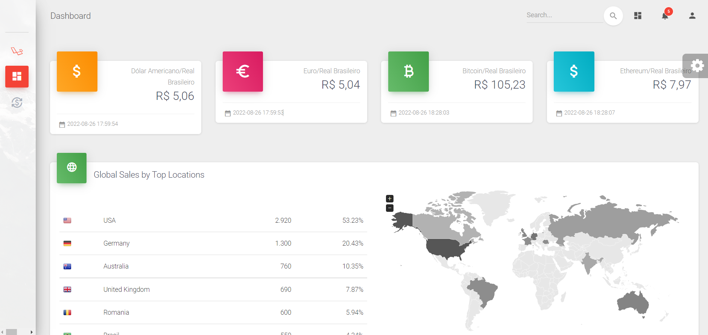

#  **Desafio Bravo**

O projeto foi todo desenvolvido com o Framework Laravel na versão 8.X. 
O template, utilizei o Material Dashboard Laravel - Predefinição Frontend Gratuita para Laravel.
Algumas funcionalidades mais básicas como login no frontend já vieram prontas para agilizar o processo de desenvolvimento. 
Com exceção do login do frontend e do template, todo o projeto backend,  frontend, API e configurações do docker foram feitos por mim. 

## **Desenvolvimento por mim**

	 1. Todo o conteúdo da pasta **Collection**
	 2. Em APP/HTTP/Controllers todo conteúdo da pasta Awesame (API de cotação)
	 3. Ainda em APP/HTTP/Controllers os controllers (AuthController.php e UserController.php )
	 4. Na pasta APP/models apenas User.php e HistoricoCotacao.php
	 5. Na pasta database/migrations todo as migrations
	 6. Ainda na pasta database/seeders só o UsersSeeder.php
	 7. Em resources/views o conteúdo da pasta cotacao/index.blade.php e a dashboard.blade.php

## **Como rodar o projeto?**

- Baixe ou clone o projeto no Linux, macOS ou Windows;
- Se optar por usar Windows (10 ou superior), pode usar Docker Desktop ou WSL (Ubuntu).
- No WSL devemos usar o seguinte comando para executar Docker -> sudo service docker start.

**Obs.:** Fiz o todo o projeto no Windows com WSL e Docker Nativo.

## Como configurar e rodar o projeto

- **Crie o Arquivo .env como comando abaixo**

	    `cp .env.example .env`
    
- **Atualize as variáveis de ambiente do arquivo .env**
	 `
	    
	    APP_NAME="Desafio Bravo - Cotação"
	    APP_URL=http://localhost:8181
	    DB_CONNECTION=mysql
	    DB_HOST=mysql
	    DB_PORT=3306
	    DB_DATABASE=cotacao
	    DB_USERNAME=root
	    DB_PASSWORD=root
	    
	    CACHE_DRIVER=redis
	    QUEUE_CONNECTION=redis
	    SESSION_DRIVER=redis
	    
	    REDIS_HOST=redis
	    REDIS_PASSWORD=null
	    REDIS_PORT=6379`
  
    
- **Suba os containers do projeto**

	     docker-compose up -d

- **Acessar o container**

		docker-compose exec laravel_8 bash

- **Instalar as dependências do projeto**

		composer install

- **Gerar a key do projeto Laravel**

		php artisan key:generate
    
- **Criar banco e usuário admin**

	    php artisan migrate:fresh --seed
    
- **Para criar usuários fakes**

	     php artisan db:seed --class=UsersSeeder

**Acesse o projeto:** http://localhost:8181

## **API para Integrações**

Pensando em possível integrações desenvolvi endpoints para consumir a API do sistema, todas as collection encontram-se na pasta Collection.

Dentro da pasta estou envio:
    
    - Auth:
        - Login - Gera Token de acesso;
        - Logout - Desloga usuário;
    
    - Users (CRUD):
        - GET - Para lista todos os usuários (limitado por pagination = 10);
        - GET/id - Para exibir apenas um usuário conforme id passado por parâmetro;
        - POST - Para cadastrar novos usuários;
        - PUT/id - Edita usuário existente passando id como parâmetro e dados no body (como json);
        - DELETE/id - Deleta usuário conforma id passado por parâmetro;
    
    - Cotação
        - Last - Exibi a cotação existe nos últimos 30 segundos, conforme parâmetros (from e to). 
                    Ex: {{BASE_URL}}api/cotacao/last/?from=BTC&to=BRL;
        - Daily - Exibi uma ou mais cotação do dia conforme paramentros passados. 
                    Ex: {{BASE_URL}}api/cotacao/daily/?from=USD&to=BRL&num=3
       
## **Configurar Postman**

No Environment -> Global atribua a variável TOKEN a key gerada pelo login e crie na BASE_URL o link conforme exemplo abaixo:

TOKEN -> 1|ipRV4U0DybvdtFFrUAY2lJHLRvIyKfTtPLTzfYUW (exemplo)
BASE_URL -> http://localhost:8181/ 

## **Docker**

Estou usando a versão 3.7, rodando as imagens:

	 - Laravel_8 com todas as configurações necessárias para o funcionamento do projeto;
	 - Nginx rodando na porta 8181;
     - PHP 7.4;
	 - MySql versão 5.7.22 pega as configurações de .env para criação do banco 
	 - queue para gerênciar filas
	 - redis banco de dados em memória para informações mais rápidas

**Template:**
https://github.com/laravel-frontend-presets/material-dashboard
