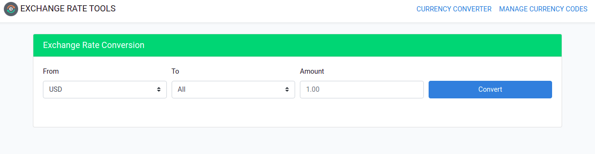
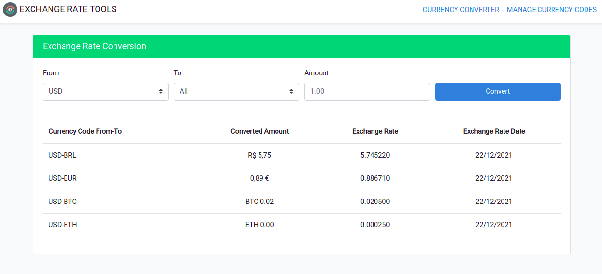
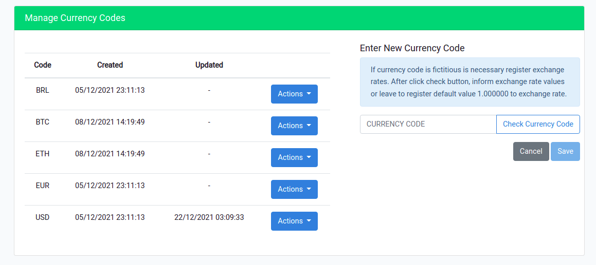
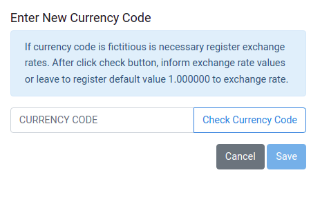
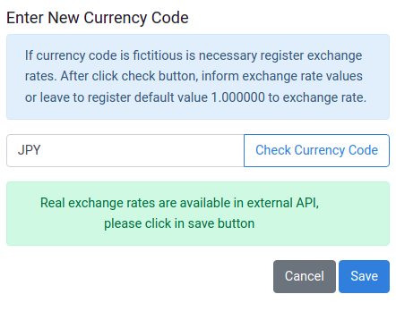
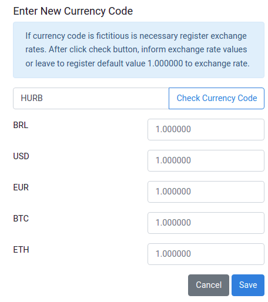
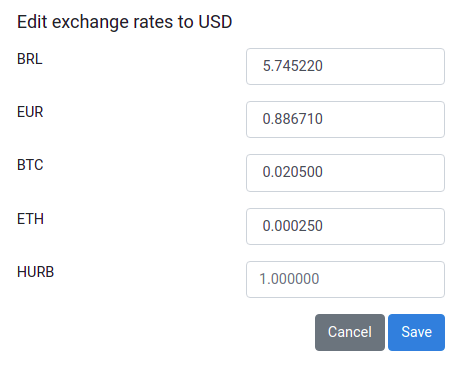
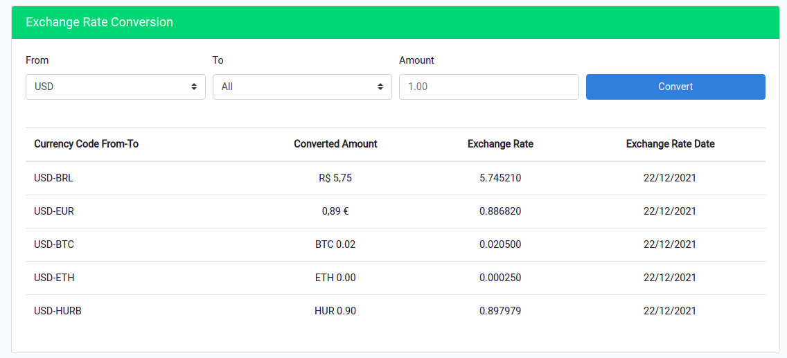
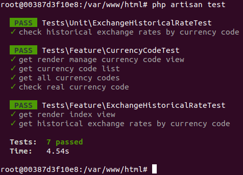

# Conversor de moeda

Criação de API e dashboard para conversão de diferentes tipos de moedas.

O sistema utiliza uma API externa com dados de taxas de câmbio para sincronização e o cálculo da conversão, para saber mais acesse [Free Currency API](https://freecurrencyapi.net/)

O sistema utiliza também uma API desenvolvida em Go, para saber mais [Clique Aqui](golang/)
## Requisitos

- Utilizar cotações de verdade e atuais
- Adicionar novas moedas conforme o uso
- A requisição deve receber como parâmetros: A moeda de origem, o valor a ser convertido e a moeda final
- Possibilitar a inclusão e remoção de moedas
- Suportar conversão entre moedas fiduciárias, crypto e fictícias
- Suportar um volume de 1000 requisições por segundo

Para maiores informações sobre o escopo do projeto, acesse a [descrição completa](projectdoc/README.pt.md)

## Recursos utilizados

- [PHP](https://www.php.net/releases/7_4_0.php)
- [Laravel](https://laravel.com/docs/8.x)
- [Golang](https://go.dev/)
- [NGINX](https://www.nginx.com/)
- [AngularJS](https://angularjs.org/)
- [Redis](https://redis.io/)
- [Sqlite](https://www.sqlite.org/index.html) - Utilizado no conjunto de testes do App
- [MariaDB](https://mariadb.org/)
- [Docker](https://www.docker.com/)
- [Bootstrap](https://getbootstrap.com/docs/4.0/getting-started/introduction/)


O conjunto de recursos PHP, Laravel, AngularJS e Bootstrap formam o App, ou dashboard criado para o projeto.

O NGINX é o provedor do serviço HTTP para o interpretador PHP que roda o App.

O Golang está sendo utilizado para criar a API interna consumida pelo App.

O Redis está sendo utilizado para o armazenamento de cache dos dados históricos para as requisições.

O Sqlite está sendo utilizado para mock da base e realização de testes do App.

O banco relacional MariaDB está sendo utilizado para armazenar os códigos de moedas e as taxas históricas de conversão entre moedas.

## Configuração do ambiente

Para iniciar o uso do sistema é necessário possuir o docker e o docker compose em seu ambiente. As portas de conexão utilizadas pelos contêineres por default são:

- NGINX :8080
- PHP :9000
- Redis :6379
- MySQL :3306
- API :9092

É necessário manter essas portas disponíveis em seu ambiente para que a rede utilizada pelos contêineres seja criada e funcione corretamente.

Baixe os arquivos deste repositório.
```bash
$ git clone git@github.com:ALCTorres/challenge-bravo.git
```

Execute o shell para alterar as permissões de arquivos e diretórios do Laravel.
```bash
$ cd challenge-bravo/
$ ./permissions_paths.sh
```

Execute o comando para inicar os serviços por meio do docker e aguarde alguns minutos. Se não quiser observar os logs das operações que estão sendo realizadas no uso do sistema, adicione ao final do comando a opção -d.
```bash
$ docker-compose up
```

### Conversor de moedas

Após os passos acima você será capaz de acessar o dashboard para conversão de moedas no navegador acessando a URL http://localhost:8080, a tela inicial do dashboard é a área para conversão de moedas, já existem cadastradas no sistema as moedas informadas nos requisitos iniciais(USD, BRL, EUR, BTC, ETH). Caso nenhum valor seja informado no campo `Amount` o valor padrão utilizado será 1.00.

<p align="center">
  
</p>

Após selecionar o de/para e o valor a ser convertido será exibido o resultado da consulta, você pode usar o valor `All` para conversão, neste caso a conversão irá ser efetuada para todas as moedas disponíveis no sistema.

<p align="center">
  
</p>

**OBS:** A conversão de valores relacionados a moedas fictícias só é realizada caso a taxa de câmbio seja cadastrada previamente no sistema, ou seja, o cadastro de moedas fictícias carece do cadastro das taxas de câmbio utilizadas para conversão em relação a todas as moedas existentes no sistema.

Essa área é utilizada apenas para pesquisa e conversão de moedas, os passos para inclusão e exclusão de moedas serão descritos mais abaixo.

### Gerenciamento de moedas

É possível efetuar o cadastro, atualização e exclusão de moedas do sistema, as moedas definidas como padrão(USD, BRL, EUR, BTC, ETH) não podem ser removidas mas podem ser alteradas.

<p align="center">
  
</p>

Para incluir uma nova moeda basta inserir no campo de texto o código da nova moeda a ser cadastrada.

<p align="center">
  
</p>

Se as taxas de câmbio da nova moeda estiverem disponíveis na API externa utilizada pelo sistema, não será preciso cadastrar as taxas de câmbio pois o sistema irá armazená-las durante a sincronização de dados ou após uma consulta.

<p align="center">
  
</p>

Caso a moeda seja fictícia, ou não sejam encontradas taxas de câmbio disponíveis na API externa, serão exibidos campos para cadastro das taxas de câmbio para cada código de moeda existente no sistema. Se não forem informados valores para as taxas de câmbio o valor padrão utilizado será 1.000000.

<p align="center">
  
</p>

**OBS:** Após o cadastro de uma moeda fictícia já será possível efeutar a conversão de valores da moeda fictícia para as demais(HURB->USD), porém se for necessário efetuar a conversão de uma moeda já cadastrada no sistema e a nova moeda fictícia, é necessário editar e incluir na moeda real a taxa de câmbio referente a conversão para a moeda fictícia(USD->HURB).

<p align="center">
  
</p>

<p align="center">
  
</p>

### Testes

Para executar os testes criados para o sistema é necessário acessar o contâiner que roda o App e executar o comando para iniciar os testes.

```bash
$ docker exec -it challenge-bravo_app_1 bash
$ php artisan test
```

<p align="center">
  
</p>

O sistema utiliza a API interna desenvolvida em Go para o gerenciamento de moedas e a realização de consultas, veja aqui a documentação da [API interna](golang/).

Caso a API interna esteja indisponível o sistema não irá deixar de funcionar, porém o cadastro, edição e exclusão de moedas não irá funcionar pois esses recursos são providos pela API interna. Consultas as moedas cadastradas no sistema irão funcionar normalmente mas com um delay um pouco mais elevado.

O App também possui um endpoint que pode ser utilizado para conversão de moedas, os parâmetros utilizados na requisição são os mesmo definidos nos requisitos do projeto. Abaixo um exemplo de como efetuar uma requisição a esse endpoint.

http://localhost:8080/api/exchange-rates?from=USD&to=BRL&amount=2.00

Resposta:
`{"data":[{"code":"USD-BRL","historical":"22\/12\/2021","amount":"R$\u00a011,49","rate":"5.745200"}],"success":true}`


Um grande abraço, aproveitem... :)