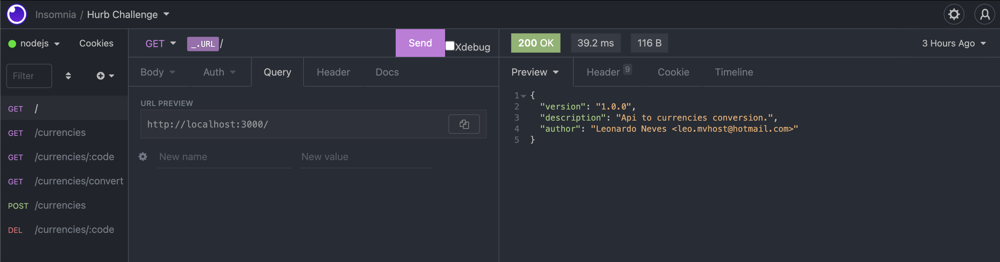

#  Bravo Challenge


Rotas contidas no projeto:
```
[GET] http://URL/ (rota princial)
[GET] http://URL/currencies (lista todas as moedas cadastradas)
[POST] http://URL/currencies (cria uma nova moeda)
[GET] http://URL/currencies/{code} (retorna uma moeda a partir do código)
[DELETE] http://URL/currencies/{code} (remove uma moeda a partir do código)
[GET] http://URL/currencies/convert (converte um valor entre moedas)
# Extra:
[GET] http://URL/api-docs (documentação swagger)
```

Encontra-se na raiz do projeto o arquivo insomnia_request.json já configurado com as requests e os envs para nodejs e php.


## Rodando o projeto com nodejs http://localhost:3000
```sh
docker compose up
```

## Rodando o projeto com php http://localhost:3001

Inicializar mongodb e redis:
```sh
docker compose up
```
Enter folder php projects:
```sh
cd php-laravel
```
Criando o .env:
```sh
cp .env.example .env
```
Instalar as dependências:
```sh
composer install
```
Iniciar o serviço:
```sh
php artisan serve --port=3001
```
