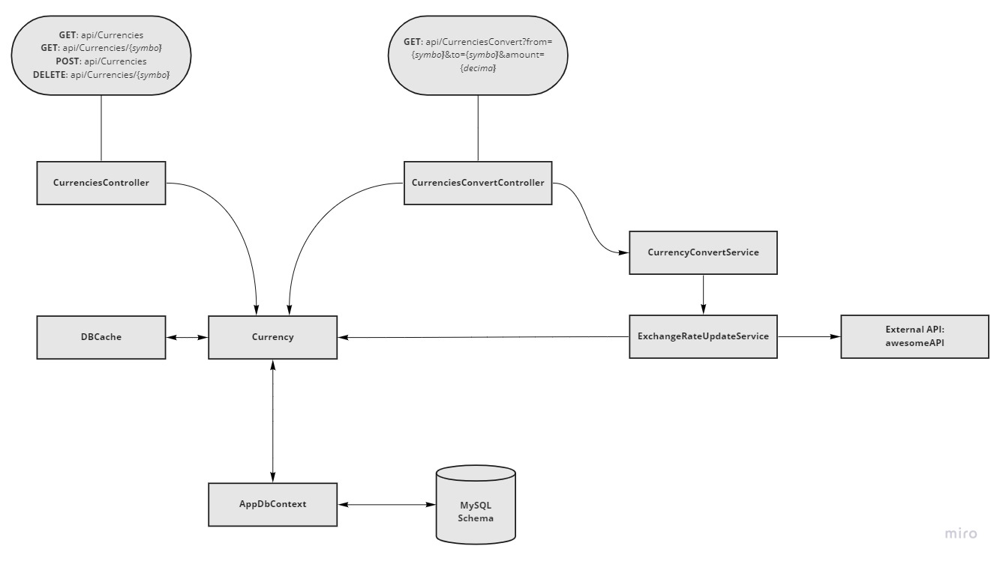

#  Bravo Challenge
## Arquitetura do código

  

### Funcionalidades

- Armazenamento em banco de dados da taxa de cámbio e da data de sua atualização;
- Cada moeda possui um flag que indica se aquela moeda deve ou não ter sua taxa de cámbio atualizada automaticamente via API externa;
- No momento de inclusão de nova moeda, caso seja marcado o flag de auto-atualização, a API externa é consultada para confirmar se se trata de uma moeda disponivel para auto-atualização, caso contrario o flag é marcado como falso;
- Utilização de um TTL(Time to Live) de 30 segundos após cada atualização da taxa de cámbio de uma moeda;
- Toda requisição de conversão checa se a última atualização das moedas envolvidas foi em menos de 30 segundos, caso negativo busca as taxas de cámbio atualizadas;
- Utilização de caching do BD de 1 segundo, evitando o gargalo no banco de dados em situações de muitas requisições simultâneas

## Endpoints

Retornar todas as Moedas:
<pre><code>curl -X 'GET' \
  'http://localhost:8080/api/Currencies' \
  -H 'accept: text/plain'
</code></pre>

Adicionar nova Moeda:
<pre><code>curl -X 'POST' \
  'http://localhost:8080/api/Currencies' \
  -H 'accept: text/plain' \
  -H 'Content-Type: application/json' \
  -d '{
  "symbol": "BRL",
  "name": "Real Brasileiro",
  "exchangeRateInUSD": 0.199,
  "autoUpdateExchangeRate": true,
  "lastTimeUpdatedExchangeRate": "2022-03-19T02:41:17.365Z"
}'

</code></pre>
Retornar Moeda específica:
<pre><code>curl -X 'GET' \
  'http://localhost:8080/api/Currencies/BRL' \
  -H 'accept: text/plain'
</code></pre>

Deletar Moeda específica:
<pre><code>curl -X 'DELETE' \
  'http://localhost:8080/api/Currencies/BRL' \
  -H 'accept: text/plain'
</code></pre>

Converter valor entre Moedas:
<pre><code>curl -X 'GET' \
  'http://localhost:8080/api/CurrenciesConvert?from=BRL&to=EUR&amount=42.10' \
  -H 'accept: text/plain'
</code></pre>

## Libs e Ferramentas
- [Pomelo.EntityFrameworkCore.MySql](https://github.com/PomeloFoundation/Pomelo.EntityFrameworkCore.MySql)
- [xUnit](https://xunit.net/)
- [CacheManager.Core](https://cachemanager.michaco.net/)
- [Swashbuckle.AspNetCore](https://github.com/domaindrivendev/Swashbuckle.AspNetCore)
- [JMeter](https://jmeter.apache.org/)
- [AwesomeAPI](https://docs.awesomeapi.com.br/api-de-moedas)

## Testes

### Teste de Carga

### Testes unitários

## Execução

- `$ docker-compose up -d`
- Aguardar os containers subirem completamente, o BD leva mais tempo e o App só ficara disponível após o BD subir completamente.
- Acessar Swagger: http://localhost:8080/index.html

## Limitações e Possíveis Melhorias

- Delay da cotação
- Dependência de apenas uma API
- Autenticação
- Checar moedas disponíveis para auto update

  

