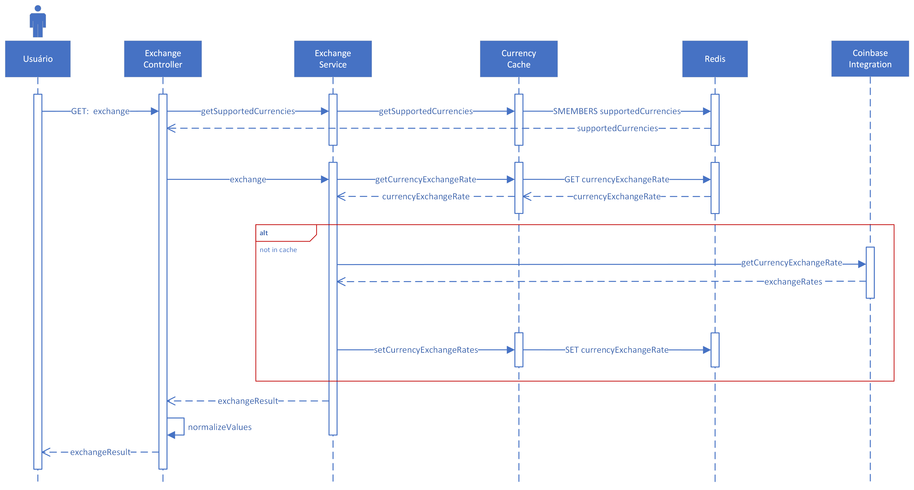
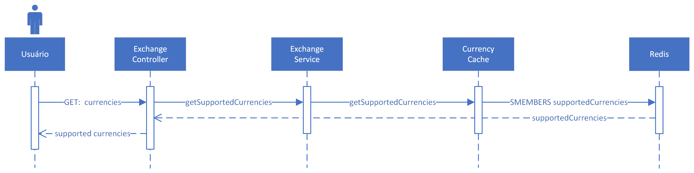
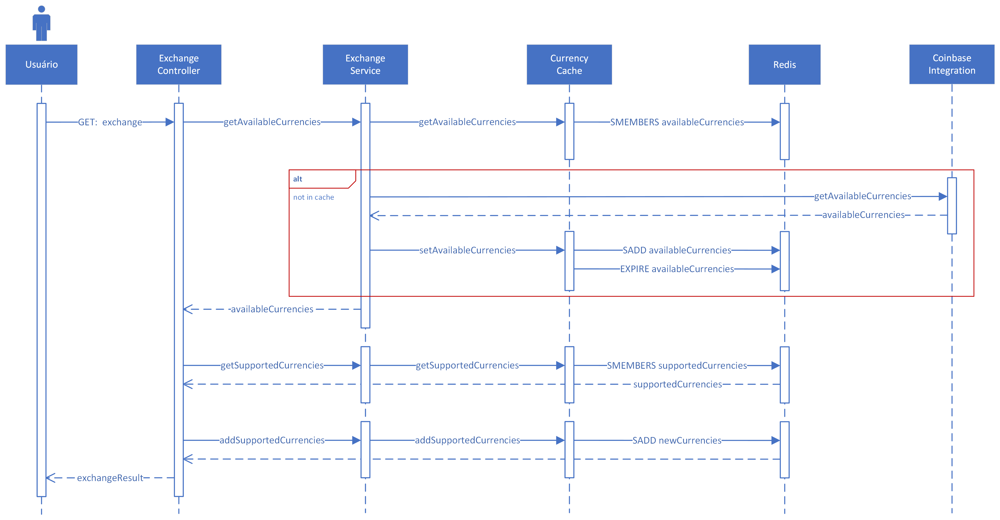
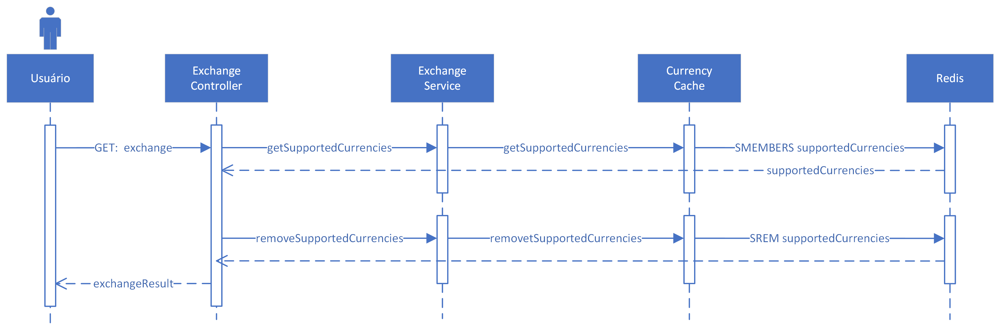

#  Desafio Bravo

## Descrição
A API construída realiza a conversão de valores entre 205 moedas, incluindo as principais criptomoedas do mercado.

As ferramentas utilizadas para sua construção foram:
- Typescript (NodeJS)
- Redis
- Docker

Os frameworks e bibliotecas utilizados para desenvolvimento foram:
- Express, para criação do servidor;
- Ioredis, para conexão com o Redis;
- Axios, para realização de requisições HTTP.

Os frameworks e bibliotecas utilizados para teste foram:
- Mocha, suíte de testes para realização de testes unitários;
- Chai, biblioteca de asserções baseada no princípio de interfaces fluentes;
- Sinon, biblioteca para criação de mocks, stubs e spies;
- Nock, para criação de servidores mock e interceptação de requisições.

## Instalação e Inicialização

### NPM
A instalação por NPM pode ser realizada com o comando:
```
npm install
```

#### Modo de Desenvolvimento
Para inicialização do servidor em modo de desenvolvimento, deve ser utilizado o comando:
```
npm run dev
```

#### Modo de Produção

Para inicialização do servidor em modo de produção, as variáveis de ambiente devem ser configuradas.
A configuração das variáveis pode ser realizada por meio da criação do arquivo `.env`, podendo utilizar o arquivo `.env.example` como base para configuração.

Após configuração das variáveis de ambiente, deve ser utilizado o comando:
```
npm start
```

Caso as variáveis de ambiente não sejam fornecidas, valores padrões serão utilizados, como os fornecidos no arquivo `.env.example`.

### Docker
A instalação por Docker pode ser realizada pelo comando:
```
docker-compose up -d
```

O Docker Compose já vem pré-configurado com alguns valores padrões para as variáveis de ambiente, podendo ser alterados a partir do arquivo `docker-compose.yml`, porém é aconselhável, caso necessário, que sejam alteradas apenas as portas públicas.

## Documentação

### Swagger
O Swagger foi utilizado para documentação da API, podendo ser acessado a partir do endpoint `/api-doc`.

### Diagramas de Sequência

**GET** `/exchange?from=originalCurrency&?to=finalCurrency&amount=value`, onde:

- `originalCurrency` é a moeda a ser utilizada como base para conversão;
- `finalCurrency` é a moeda a ser utilizada como destino para conversão;
- `value` é o valor a ser convertido entre a moeda base e a moeda de destino.

Este é o endpoint para realização de conversão de valores entre duas moedas.

Exemplo de retorno:
```json
{
    "from": "EUR",
    "to": "AUD",
    "rate": "1.651478826240532869633",
    "amount": "15.00",
    "result": "24.772182393607993044495"
}
```
Onde:
- `from` possui o mesmo valor fornecido na requisição;
- `to` possui o mesmo valor fornecido na requisição;
- `amount` possui o mesmo valor fornecido na requisição, podendo ser normalizado, caso um valor inteiro ou com apenas 1 casa decimal seja fornecida;
- `rate` a taxa de conversão entre a moeda base e a moeda de destino;
- `result` é o valor fornecido multiplicado pela taxa de conversão, sendo considerado o resultado final da conversão.

<figure align="center">
  
  <figcaption>Diagrama de sequência da operação <em>obter cotação</em>.</figcaption>
</figure>

---

**GET** `/currencies`

Este é o endpoint para listagem de todas as moedas suportadas pela API.

Exemplo de retorno:
```json
[
    "EUR",
    "NZD",
    "AUD",
    "GBP",
    "JPY"
]
```

<figure align="center">
  
  <figcaption>Diagrama de sequência da operação <em>obter moedas suportadas</em>.</figcaption>
</figure>

---

**POST** `/currencies`

Este é o endpoint para adição de uma moeda à lista de moedas a serem suportadas pela API.

<small>
A lista de moedas que podem ser adicionadas pode ser encontrada na API <a href="https://developers.coinbase.com">Coinbase</a> a partir <a href="https://api.coinbase.com/v2/currencies">deste link</a>.
</small>

Exemplo de corpo de requisição:
```json
[
    "USD"
]
```

Exemplo de retorno:
```json
[
    "EUR",
    "NZD",
    "AUD",
    "GBP",
    "JPY",
    "USD"
]
```

<figure align="center">
  
  <figcaption>Diagrama de sequência da operação <em>adicionar à moedas suportadas</em>.</figcaption>
</figure>

---

**DELETE** `/currencies`

Este é o endpoint para remoção de uma moeda da lista de moedas suportadas pela API.
A moeda deve ser suportada pela API para que a remoção seja efetuada com sucesso.

<small>
A listagem de moedas suportadas pela API pode ser encontrada a partir da versão GET deste mesmo endpoint.
</small>

Exemplo de corpo de requisição:
```json
[
    "EUR",
    "USD"
]
```

Exemplo de retorno:
```json
[
    "NZD",
    "AUD",
    "GBP",
    "JPY"
]
```

<figure align="center">
  
  <figcaption>Diagrama de sequência da operação <em>remover de moedas suportadas</em>.</figcaption>
</figure>
