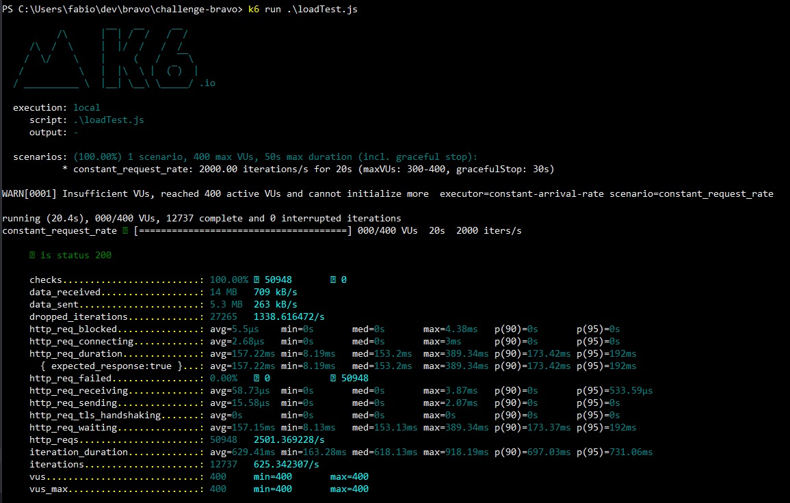

<!-- ABOUT THE PROJECT -->
# Sobre o projeto

O desafio Bravo pedia que fosse desenvolvido um sistema de conversão de moedas, sejam elas reais ou fictícias. Importante notarmos que é necessário que a base de conversão esteja indexada no **dólar**.

Dadas as especificações, foi desenvolvido um sistema na arquitetura de micro serviços, onde encontra-se presente o core-service, sync-er service e nosso serviço de banco.

## Arquitetura

Como mencionado na descrição do desafio, era parte integrante da solução aguentar um teste de estresse de 1.000 requisições por segundo, motivo o qual me levou a optar por tal arquitetura, pois, com ela, posso tornar cada módulo independente e otimiza-lo sem pensar no tempo de resposta das outras sub rotinas presentes.

Assim, tornou-se possível pensar em como um serviço principal iria responder às requisições de conversão de moedas sem pensar em como o mesmo serviço iria atualizar as cotações presentes.

A arquitetura proposta está exemplificada acima.

## Serviços da arquitetura

### Core-service

Esse serviço tem como função resolver todas as questões que envolvem moeda e usuário, ou seja, converter as moedas e devolver ao usuário final o resultado esperado, criar moedas novas indexando-as a qualquer moeda padrão do sistema e remover moedas criadas.

O core-service tem conexão direta com o **redis-server**, onde é armazenado os dados da aplicação.

### Redis-server

O Redis foi escolhido como opção para armazenamento devido a velocidade de resposta do mesmo dada a sua natureza. Nele, foi implementado um armazenamento padrão de chave-valor onde as chaves são **currencies** e **convertingRules**.

Começando por **currencies**, é armazenado nessa chave um json onde temos basicamente o nome da moeda com o valor indexado em dólar. A conversão e atualização dessa moeda é diretamente dependente da chave **convertingRules**.

A chave de regra de conversão nos dá a regra pela qual uma moeda será atualizada, por exemplo, se criarmos a moeda ADA (Cardano) sendo 12 BRL, o valor de proporcionalidade será 12 e a indexação será BRL -> USD, ou seja, apesar de passar 12 R$ como valor, será armazenado o valor referente a conversão do real em relação ao dólar, logo, ADA é aproximadamente 2 dólares. **(Cálculo feito em 13/10/2021)**

### Sync-er

O serviço de sincronização tem como principal objetivo consumir uma api pública e atualizar os dados das duas chaves a cada 30 segundos (Tempo de atualização da API pública)

API: https://docs.awesomeapi.com.br/api-de-moedas

## Testes e Performance

A aplicação é testada tanto de forma unitária quanto de forma integral. Ambas usando o Jest como fonte principal de meios de teste.

Para os testes de integração, foi testado todos os endpoints em seus diferentes cenários.
O core da aplicação (Lógica de conversão) também é testado com teste unitário.

### Testes de performance

Para testar a performance da aplicação, foi criado o `loadTest.js` que é executado via `k6 run loadTest.js`.
Assumindo que o **k6** esteja presente na máquina onde vá ser executado o projeto, o comando anteriormente mencionado irá produzir um resultado similar ao apresentado a seguir:

Dessa imagem, podemos tirar algumas métricas importantes:

Em média, a aplicação respondeu **2501** requisições por **segundo**, com um tempo médio de **157 ms** de tempo de resposta. Vale ressaltar também que foi obtido **100% de respostas com status code 200**, ou seja, nenhuma requisição falhou em chegar ao servidor.

## Executando o projeto

### Explicações iniciais

Todos os componentes da aplicação foram conteinerizados e estão sendo orquestrados pelo docker-compose. Todas as informações referentes a orquestração podem ser encontradas no arquivo `docker-compose.yml`.

Os testes unitários e de integração são executados de forma automática, logo, quando executado o projeto, é necessário esperar que os testes rodem e sejam logados no terminal para que seja possível receber as requisições.

### Como usar a aplicação
Uma moeda só pode ser criada se for indexada em algumas das moedas padrões, pois do contrário, teríamos moedas novas indexadas em moedas novas, sem constraints alguma. O que causaria perda de referências.
Um outro ponto que impossibilita a criação de moedas indexadas a moedas novas é que não há forma de atualizar o valor absoluto da moeda nova, pois não temos cotações de mercados de moedas fictícias.

Moedas padrões não podem ser removidas, pois vão indexar as moedas novas.

Moedas padrões não podem ter seu valor atualizado, pois os dados corretos chegam via Sync-er service.

### Rotas
#### Para converter entre duas moedas: 
`GET 127.0.0.1:3000/?from={MOEDA-ORIGEM}&to={MOEDA-DESTINO}&amount={QUANTIDADE}`

#### Para criar uma moeda: 

`POST 127.0.0.1:3000/`, e no corpo da requisição, passamos o JSON 
`{
"currencyName": {MOEDA-NOVA},
"exchangePairName": {MOEDA-DEFAULT}",
"exchangePairValue": {Valor de proporcionalidade}
}`

Por exemplo, para criarmos a moeda ADA, fariamos:
`{
"currencyName": "ADA",
"exchangePairName": "BRL",
"exchangePairValue": 12
}`
E teriamos o Json de resposta: `{"CurrencyCreated": "ADA", "ExchangeUSDpair": 2.1744}`, pois ADA = 12BRL, E 12 BRL é equivalente a 2.1744USD. **(Cotação de 13/10/21)**

#### Para remover uma moeda:  

`DELETE 127.0.0.1:3000/?currencyName={MOEDA-NÃO-DEFAULT}`

### Executando o projeto

Depois de clonar e mudar o diretório para o root deste projeto, basta apenas executar o comando:

`docker-compose up`

O log dos 3 serviços serão logados de forma independente no mesmo terminal.

Caso haja necessidade de executar o projeto de forma _detached_, acrescente a tag `-d` no comando acima.
Para olhar os logs da aplicação, podemos descobrir o id do container por
`docker ps` e depois `docker logs {id container}`.

**OBS: Os testes demoram cerca de 10 segundos para serem executados completamente.**

## Considerações finais e melhorias

Como o desafio abre espaço para soluções simples e elaboradas, sempre há espaço para melhorias, sempre há espaço para mais uma feature que iria melhorar em algo o projeto. Esta sessão é justamente para adereçar funcionalidades que não foram desenvolvidas, mas que eu gostaria de desenvolver se tivesse mais tempo e se fosse realmente necessárias.

### Load Balancing
Poderíamos escalar o core-service quantas vezes fossem necessárias e ter, antes de chegar no servidor do node.js, um servidor NGINX, que iria balancear as requisições que chegam, fazendo que o response time caísse, pois teríamos várias instâncias do core-service respondendo.

### Serviço de criação de moedas com autenticação
A criação e remoção de moedas poderia ser isolada também. Poderíamos criar um outro serviço, que teria autenticação, para criar e remover moedas. Assim, teríamos um controle maior do que está sendo criado e removido da plataforma.

Um banco relacional como Postgres poderia ser usado para dar suporte a autenticação/autorização de usuários.

### Ubuntu

Como segue a imagem, a aplicação funcionou bem no ubuntu 20.04 **(vm Hyper-v)**.

