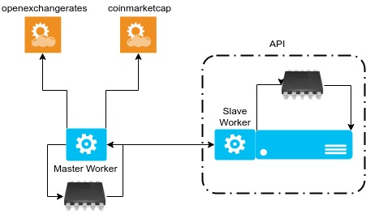

# Bem vindo :) - Challenge Bravo

Segue a solução para o [Challenge Bravo](https://github.com/hurbcom/challenge-bravo) desenvolvida com [Node.js](nodejs.org) utilizando a **API** de cotações da [Open Exchange Rates](https://openexchangerates.org).

## Requisitos

- API Key da [openexchangerates](https://openexchangerates.org).
- [Docker](https://www.docker.com/) versão 18.x
- [Docker Compose](https://docs.docker.com/compose/) versão 1.22+

## Iniciando

    $ git clone 
    $ cd challenge-bravo/
    $ echo .env > API_KEY_OEX=<sua chave aqui, apenas numeros>
    $ docker-compose up -d 

### Utilizando a API
GET Request
```
http://localhost:3000/converter?from=BRL&to=ETH&amount=10
```
Response 

    
	{
	    "from": "BRL",
	    "to": "ETH",
	    "amount": 10,
	    "result": 0.012122772371989152
	}
	

## Arquitetura



 **Worker**
Responsável por buscar os dados da Open Exchange Rates e salva-los no Redis. Uma vez atualizado os valores ele só irá buscar novamente os valores das cotações na API da OEX quando se passar o tempo de update baseado em minutos que são parametrizáveis no arquivo de configuração da aplicação. Assim, mantemos uma base integra, robusta e atualizada de dados da OEX disponíveis para nossa API consultar sempre que sua rotina ordenar ou quando a estrutura escalar, evitando assim buscas excessivas na API da OEX.

**API**
Responsável por disponibilizar rota convert para conversão entre cotações
A estrutura é responsável por buscar as ultimas cotações salvas no redis, guarda as mesmas na memória para não precisar consultar o redis a cada request feito a ela. Apesar disso tem uma rotina de atulização de dados em memoria baseada em minutos que são parametrizáveis.

**Load Balancer & Servidor Escalável**
A solução desenvolvida está preparada para ser escalada. Podendo utilizar tanto serviços como AutoScaling e LoadBalancer da AWS e/ou o Swarm do próprio docker.

**Redis**
Pensando em posteriormente escalar o serviço e manter a disponibilidade dos dados perto de 100% foi escolhido o redis para ter acesso as ultimas cotações sempre que precisar, escalar e sem precisar consultar diretamente a api da open exchange rates
