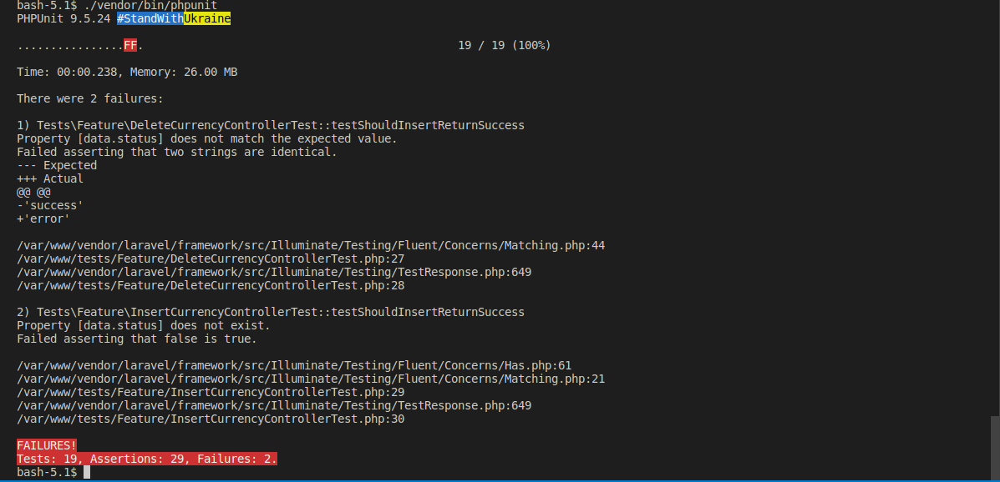

# Bravo Challenge
## An API to currency conversion

# **Warning: ** Not complete + need refactor!

Descprition in challenge bravo repository [link](https://github.com/hurbcom/challenge-bravo)

### Sumary

1. Tecnologies
2. BoilerPlate
3. Architecture Used
4. How to Use on Your Machine
    - Cloning
    - Set Env Variables
    - Runing
5. Tests
    - Unit / Integeration
    - Stress Test
6. API Routes
7. Not done/Updated Features

## **1. Tecnologies**
1. PHP 8
2. Laravel 9
3. Composer
4. Redis
5. Docker

## **2. Boilerplate**

Using Laravel, there are folders and code default.

Code that was done by me is located at this folder strucuture:

```
.
├── app                    
│   ├── Domain              
│       ├── Entity                              # Here
│       ├── UseCases                            # Here
│   ├── Console
|       ├── Kernel.php                          # Here
│   ├── Adpaters            
│       ├── Apis                                # Here
│       ├── Repository                          # Here
│   └── Http                
│       ├── Controllers                         # Here
│   └── ... 
├── ...
├── nginx                                       # Here
├── ...               
├── ...
├── routes                                      # Here
├── ...
├── tests                                       # Here
├── docker-compose.yaml                         # Here
├── dockerFile-app                              # Here
├── dockerFile-cronjob                          # Here
├── dockerFile-dependency-manager-composer      # Here
└──
```

## **3. Architecture Used**
The architecture used is based on the Clean Architecture, as the encapsulation of business logic and the separation of mechanism and delivery bring benefits.

With some changes to this project:

1. The first to point is on the Interface Layer and Frameworks and Drives:
These two layers was merged into one, because of the project's size plus YAGNI.

2. The second to point is the Enterprise Bussines Rules and Application Business Rules kept same.

In the image bellow, taken by Guilherme Biff Zarelli post [link](https://medium.com/luizalabs/descomplicando-a-clean-architecture-cf4dfc4a1ac6), shows how the architecture is:
<br>


And in the folder structure, using laravel default, has been added some more to attendant the architecture:
```
.
├── app                     # Already exists as default
│   ├── Domain              # Created to encapsulate challenge rules
│       ├── Entity          # Entity representations
│       ├── UseCases        # use cases representation
│   ├── Console             # Already exists as default and where crontab script is defined.
│   ├── Adpaters            # implementation repositories from domain and consume API
│       ├── Apis
│       ├── Repository
│   └── Http                # Already exists as default
│       ├── Controllers     # Where the connection to REST be consumed plus use cases be implemented
│   └── ...                
├── ...
├── routes                  # Already exists as default to open API end ├── ...
├── tests                  # Already exists as default to implement automated tests
└── ...
```

## **4. How to Use on Your Machine**

#### Cloning
- Install Docker locally [Docker site](https://docs.docker.com/desktop/).
- Clone this repository.

#### Set Env Variables
- Create an account on abstractapi [link](https://www.abstractapi.com/api/exchange-rate-api) to get your key and add it on `API_KEY_ABSTRACT_API` variable env.
- REDIS env password variable value is NULL.
#### Runing
```
Notice: It's not needed to run command to install dependencies because there is a configuration to do it automatially.
```

- Run command `docker compose up` in root folder (where docker-compose.yaml file is).
- Use your local IP (ex: localhost) and the routes describred in the API Routes Implementation.

## **5. Tests**
- Unit / Integration

    Unit tests were implemented to ensure assertiveness in the smallest amount of code and expected behavior.

    Integration tests were implemented to ensure the database joins the code in general.

    Down bellow a picture showing the results:

    <br>
    
- Stress Test
    Not done.

## **6. API Routes**

### Currencies

- POST /currency/create

    Create Currency

    **Body Params Explation**

    - indentificationName = string | size = 3 
    - isFictional = boolean
    - baseCurrencyForFictionalType = string | size = 3
    -  valueBasedOnRealCurrency = float

    **Exemple body**

    ```
    {
        "indentificationName": "FKE",
        "isFictional": true,
        "baseCurrencyForFictionalType": "BRL",
        "valueBasedOnRealCurrency": 0.50
    }
    ```

    **Responses**

    In Success
    ```
    {
        data: {
            status: "success",
            message: "Insertion with success"
        }
    }
    ```

    In Error

    `Notice: In Error responses, the message param can be error with database integrations, etc.`
    ```
    {
        data: {
            status: "error",
            message: "currency already exists"
        }
    }
    ```

- GET /currency/show

    Show Currencies

    **Body Params Explation**

    No Body params is needed.

    **Exemple body**

    No body exemple is needed.

    **Responses**

    In Success
    ```
    {
        data: {
            status: "success",
            message: [
                "FKE",
                "ABD",
                "TEF"
            ]
        }
    }
    ```

    In Error

    `Notice: In Error responses, the message param can be error with database integrations, etc. But status param will be always "error".`
    ```
    {
        data: {
            status: "error",
            message: "a error has occured while list the currencies"
        }
    }
    ```
- GET /currency/conversion

    Convert a currency

    **Body Params Explation**

    - currencyFrom = string | size = 3 
    - currencyTo = string | size = 3 
    - amount = float

    **Exemple body**

    ```
    {
        "currencyFrom": "BRL",
	    "currencyTo": "EUR",
	    "amount": 100.00
    }
    ```

     **Responses**

    In Success
    ```
    {
        "data": {
            "status": "success",
            "message": "conversion made with success",
            "valueConverted": 506.7704407836381
        }
    }
    ```

    In Error

    `Notice: In Error responses, the errorMessage param can be error with database integrations, etc.`
    ```
    {
        data: {
            status: "error",
            errorMessage: "invalid amount value"
        }
    }
    ```

- DELETE /currency/delete/{indenttificationName}

    Delete currency

    **Body Params Explation**

    No Body params is needed.

    **Query params**

    - indenttificationName = string | size = 3

    **Exemple body**

    No body exemple is needed.

    **Responses**

    In Success
    ```
    {
        "data": {
            "status": "success",
            "errorMessage": "currency deleted with success"
        }
    }
    ```

    In Error

    `Notice: In Error responses, the errorMessage param can be error with database integrations, etc.`

    ```
    {
        data: {
            status: "error",
            errorMessage: "not possible to delete given value"
        }
    }
    ```

## **7. Not done/Updated Features**
Some features are not implemented, listed bellow:

- Stress test was not done

- Update fictional rate is not implement, so the first input of user will not be changed with api updater.

Some features need to be updated, listed bellow:

- The automated tests (feature) is not using an tecnology to refresh database, so error in insert and delete currency happens
because of data stored or no in database.

