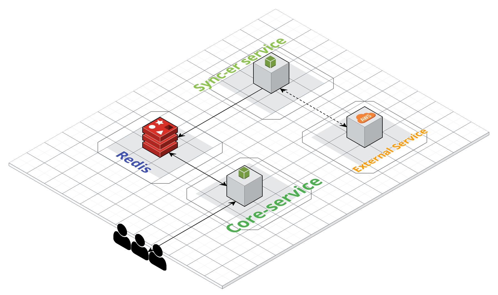

<!-- TABLE OF CONTENTS -->

  
Bravo

  <ol>
    <li>
      <a href="#about-the-project">Sobre o projeto</a>
      <ul>
        <li><a href="#built-with">Arquitetura</a></li>
      </ul>
      <ul>
        <li><a href="#built-with">Serviços</a></li>
      </ul>
      <ul>
        <li><a href="#built-with">Testes e Performance</a></li>
      </ul>
      <ul>
        <li><a href="#built-with">Performance e Load test</a></li>
      </ul>
    </li>
    <li>
      <a href="#getting-started">Executando o projeto</a>
      <ul>
         <li><a href="#usage">Explicações iniciais</a></li>
      </ul>
      <ul>
         <li><a href="#usage">Executando o docker</a></li>
      </ul>
    </li>
    <li><a href="#license">Considerações finais e melhorias</a></li>
  </ol>

<!-- ABOUT THE PROJECT -->
# Sobre o projeto

O desafio Bravo pedia que fosse desenvolvido um sistema de conversão de moedas, sejam elas reais ou ficticias. Importante notarmos que é necessária que a base de conversão esteja indexada no **dolar**.

Dada as especificações, foi desenvolvido um sistema na arquitetura de micro serviços, onde encontra-se presente o core-service, sync-er service e nosso serviço de banco.

## Arquitetura

Como mencionado na descrição do desafio, era parte integrante da solução aguentar um teste de estresse de 1.000 requisições por segundo, motivo o qual me levou a optar por tal arquitetura, pois, com ela, posso tornar cada módulo independente e otimiza-lo sem pensar no tempo de resposta das outras sub rotinas presentes.

Assim, tornou-se possível pensar em como um serviço principal iria responder as requisições de conversão de moedas sem pensar em como o mesmo serviço iria atualizar as cotações presentes.

##Serviços

### Core-service

Esse serviço tem como função resolver todas as questões que envolvem moeda e usuário, ou seja, converter as moedas e devolver ao usuário final o resultado esperado, criar moedas novas indexando-as a qualquer moeda padrão do sistema e remover moedas criadas.

O core-service tem conexão direta com o **redis-server**, onde é armazenado os dados da aplicação.

### Redis-server

O Redis foi escolhido como opção para armazenamento devido a velocidade de resposta do mesmo dada a sua natureza. Nele, foi implementado um armazenado padrão de chave-valor onde as chaves são **currencies** e **convertingRules**.

Começando por currencies, é armazenado nessa chave um json onde temos basicamente o nome da moeda com o valor indexado em dolar. A conversão e atualização dessa moeda é diretamente dependente da chave **convertingRules**.

A chave de regra de conversão nos da a regra pela qual uma moeda será atualizada, por exemplo, se criarmos a moeda ADA (Cardano) sendo 12 BRL, o valor de proporcionalidade será 12 e a indexação será BRL -> USD, ou seja, apesar de passar 12 R$ como valor, será armazenado o valor referente a conversão do real em relação ao dolar, logo, ADA é aproximadamente 2 dolares. (Cálculo feito em 13/10/2021)

###Sync-er

O serviço de sincronização tem como principal objetivo consumir uma api pública e atualizar os dados das duas chaves a cada 30 segundos (Tempo de atualização da API pública)

##Testes e Performance

A aplicação é testada tanto de forma unitário quanto de forma integral. Ambas usando o Jest como fonte principal de meios de teste.

Para os testes de integração, foi testado todos os endpoints em seus diferentes cenários.
O core da aplicação (Lógica de conversão) também é testado com teste unitário.

###Testes de performance

Para testar a performance da aplicação, foi criado o `loadTest.js` que é executado via `k6 run loadTest.js`.
Assumindo que esteja presente na máquina onde vá ser executado o projeto, o comando anteriormente mencionado irá produzir um resultado similar ao apresentado a seguir:

Dessa imagem, podemos tirar algumas métricas importantes:

Em média, a aplicação respondeu 2501 requisições por segundo, com um tempo média de 157ms de tempo de resposta. Vale ressaltar também que foi obtido 100% de respostas com status code 200, ou seja, nenhuma requisição falhou em chegar ao servidor.