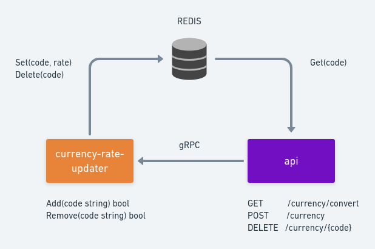

#  Desafio Bravo

Construa uma API, que responda JSON, para conversão monetária. Ela deve ter uma moeda de lastro (USD) e fazer conversões entre diferentes moedas com cotações de verdade e atuais.

A API deve converter entre as seguintes moedas:
- USD
- BRL
- EUR
- BTC
- ETH


Ex: USD para BRL, USD para BTC, ETH para BRL, etc...

A requisição deve receber como parâmetros: A moeda de origem, o valor a ser convertido e a moeda final.

Ex: `?from=BTC&to=EUR&amount=123.45`

# Resposta ao Desafio Bravo
Foram construídas 2 APIs, respondesndo em JSON. Uma feita em **python** com flask e a outra em **golang** com mux.
Como pode ser visto abaixo, para a arquitetura escolhida, é usado um worker que é capaz de buscar cotações atuais entre diversas moedas e à partir de fontes diversas além de ser responsável por atualizá-las a cada 30 min. 
Caso não seja encontrada a taxa no redis, será usada uma moeda de lastro para as conversões, neste caso, o dólar (USD).

## Arquitetura
<p align="center">
  
</p>

### Worker:
- Faz carga inicial das moedas no redis no formato **FROMTO** Ex: `From USD To BRL -> USDBRL:3.258`
- Resposável por manter as cotações sempre atualizadas.
- Foi construído com um scheduler que a cada 30 minutos busca as cotações atualizadas em algumas fontes na internet e as salva no redis no formato mencionado acima.
- Permite diminuir o tempo de resposta da API já que não necessitará consultar a atualização na internet.

### Redis:
- Banco NoSql chave valor in_memory, extremamente rápido.
- Possibilita cache de cotações para consultas da API.

### API:
- Responde aos requests http de converções dos usuários e processa as requisições entregando o resultado da cotação processada no formato **JSON**.

### NGIX:
- Realiza cache (com TTL 2minutos) da resposta da API conforme a query_string assim, a API não precisará processar mais de uma vez a mesma requição dentro do prazo do cache.

## EXECUTANDO
- Pré-requisitos: docker, docker-compose e make
```bash
  $> git clone https://github.com/maypimentel/challenge-bravo.git
  $> cd challenge-bravo
  $> make up
```
Ex: `http://localhost:3333/converter/?from=USD&to=EUR&amount=564.3` 

`$> make up` - Levanta toda arquitetura de infra do projeto

`$> make down` - Desliga toda a infra do projeto

`$> make stress-test-all` - Roda testes de stress nos 3 endpoints

`$> make stress-test-goapi` - Roda testes de stress no endpoint da API em Go 

`$> make stress-test-pythonapi` - Roda testes de stress no endpoint da API em Python

`$> make stress-test-nginx` - Roda testes de stress no endpoint com o NGINX (proxy cache)

`$> make pythonapi-test` - Roda testes na api em python

`$> make goapi-test` - Roda testes na api em golang

## TESTES de carga
### API em GOLANG
- Atendeu mais de 5mil requisições por segundo
```bash
maycon@maycon-VirtualBox:~/challenge-bravo$ wrk -t9 -c1000 -R13000 -d30s 
Running 30s test @ http://goapi:8000/converter/?from=USD&to=eur&amount=56565.2
  9 threads and 1000 connections
  Thread calibration: mean lat.: 1807.231ms, rate sampling interval: 6574ms
  Thread calibration: mean lat.: 1845.180ms, rate sampling interval: 6615ms
  Thread calibration: mean lat.: 1991.234ms, rate sampling interval: 6918ms
  Thread calibration: mean lat.: 1383.391ms, rate sampling interval: 6328ms
  Thread calibration: mean lat.: 1469.831ms, rate sampling interval: 6754ms
  Thread calibration: mean lat.: 1841.249ms, rate sampling interval: 6701ms
  Thread calibration: mean lat.: 1429.321ms, rate sampling interval: 6664ms
  Thread calibration: mean lat.: 1400.337ms, rate sampling interval: 6516ms
  Thread calibration: mean lat.: 1868.011ms, rate sampling interval: 6602ms
  Thread Stats   Avg      Stdev     Max   +/- Stdev
    Latency     5.72s     2.99s   19.94s    67.39%
    Req/Sec     0.99k   116.61     1.22k    68.42%
  245135 requests in 29.99s, 46.76MB read
Requests/sec:   8172.81
Transfer/sec:      1.56MB
```
### API em PYTHON
- Atendeu a pouco mais de 600 requisições por segundo
```bash
maycon@maycon-VirtualBox:~/challenge-bravo$ wrk -t9 -c1000 -R13000 -d30s "http://localhost:8888/converter/?from=USD&to=eur&amount=56565.2"
Running 30s test @ http://localhost:8888/converter/?from=USD&to=eur&amount=56565.2
  9 threads and 1000 connections
  Thread calibration: mean lat.: 3995.608ms, rate sampling interval: 16990ms
  Thread calibration: mean lat.: 4522.102ms, rate sampling interval: 15376ms
  Thread calibration: mean lat.: 4577.954ms, rate sampling interval: 13795ms
  Thread calibration: mean lat.: 3477.261ms, rate sampling interval: 12689ms
  Thread calibration: mean lat.: 3713.810ms, rate sampling interval: 14426ms
  Thread calibration: mean lat.: 4011.517ms, rate sampling interval: 14688ms
  Thread calibration: mean lat.: 4481.127ms, rate sampling interval: 15327ms
  Thread calibration: mean lat.: 3818.135ms, rate sampling interval: 15081ms
  Thread calibration: mean lat.: 3708.798ms, rate sampling interval: 14131ms
  Thread Stats   Avg      Stdev     Max   +/- Stdev
    Latency    18.29s     5.05s   29.43s    58.59%
    Req/Sec    67.00     39.98   127.00     55.56%
  20691 requests in 30.24s, 5.27MB read
  Socket errors: connect 0, read 0, write 0, timeout 9342
Requests/sec:    684.13
Transfer/sec:    178.39KB
```
### NGINX com qualquer API
- Atendeu a mais de 12 mil requisições por segundo
```bash
maycon@maycon-VirtualBox:~/challenge-bravo$ wrk -t9 -c1000 -R13000 -d30s "http://localhost:3333/python_api/?from=USD&to=eur&amount=56565.2"
Running 30s test @ http://localhost:3333/python_api/?from=USD&to=eur&amount=56565.2
  9 threads and 1000 connections
  Thread calibration: mean lat.: 236.036ms, rate sampling interval: 694ms
  Thread calibration: mean lat.: 230.232ms, rate sampling interval: 659ms
  Thread calibration: mean lat.: 242.501ms, rate sampling interval: 664ms
  Thread calibration: mean lat.: 295.256ms, rate sampling interval: 2297ms
  Thread calibration: mean lat.: 311.887ms, rate sampling interval: 2494ms
  Thread calibration: mean lat.: 297.582ms, rate sampling interval: 2158ms
  Thread calibration: mean lat.: 216.182ms, rate sampling interval: 869ms
  Thread calibration: mean lat.: 334.815ms, rate sampling interval: 2496ms
  Thread calibration: mean lat.: 313.218ms, rate sampling interval: 2453ms
  Thread Stats   Avg      Stdev     Max   +/- Stdev
    Latency     1.09s     1.18s    5.82s    84.49%
    Req/Sec     1.36k   305.63     3.69k    88.19%
  364134 requests in 29.96s, 93.40MB read
  Socket errors: connect 0, read 0, write 0, timeout 356
Requests/sec:  12155.89
Transfer/sec:      3.12MB
```
- Justificando que a arquitetura defida com um cache frontal foi acertada.


## BACKLOG
- Incluir mais testes para cobrir todos os cenários