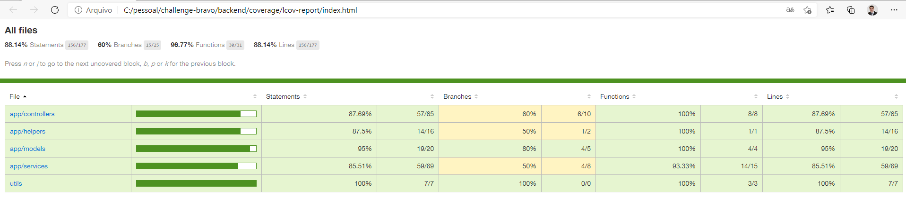

#  Desafio Bravo

**HURB** Challenge feito em **Node.js e REACT**.

## Pacotes globais
 - [Docker-cli - (conteinerização)](https://docs.docker.com/)
 - [Node.js - (js engine)](https://nodejs.org/en/)

## Bibliotecas / frameworks usadas no backend
 - [Express.js - Framework leve](https://expressjs.com/)
 - [Axios.js - Requisições](https://yarnpkg.com/package/axios)
 - [Postgres - Banco](https://yarnpkg.com/package/pg)
 - [Dotenv - Carregar variaveis de ambiente](https://yarnpkg.com/package/dotenv)
 - [Joi - Validação](https://yarnpkg.com/package/joi)
 - [Sequelize - ORM](https://yarnpkg.com/package/sequelize)
 - [Swagger - Documetação de rotas](https://yarnpkg.com/package/swagger-ui-express)
 - [Fns - Formatador de datas simples e bem completo](https://yarnpkg.com/package/date-fns)
 - [Jest - Testes unitários ](https://yarnpkg.com/package/jest)
 - [Supertest - Testes de integração](https://yarnpkg.com/package/supertest)
 - [sqlite3 - Banco para testes](https://yarnpkg.com/package/sqlite3)

## Bibliotecas / frameworks usadas no frontend

 - [Bootstrap - framework](https://yarnpkg.com/package/bootstrap)
 - [Node Sass - pré procesador para scss](https://yarnpkg.com/package/node-sass)
 - [React - Biblioteca js ](https://yarnpkg.com/package/node-sass)
 - [SweetAlert - Mensagens para o usuario customisadas ](https://yarnpkg.com/package/react-bootstrap-sweetalert)
 - [Text-Mask - Máscara para campos ](https://yarnpkg.com/package/text-mask-addons)

## Instalação

Ter Docker-cli e Nodejs instalado e rodando na máquina

1. Renomear o arquivo .env.exemplo para apenas .env ;
2. > docker compose up -d --b
3. Acessar pelo
    >localhost:81

## Testes

1. Trocar no .env o valor da variável NODE_ENV para test;
2. Trocar o DB_HOST para localhost;
2. rodar o comando:
    > yarn test

Cobertura de testes aplicada.

  

## Postman

[Pacote de endpoints do postman](HURB.postman_collection.json)