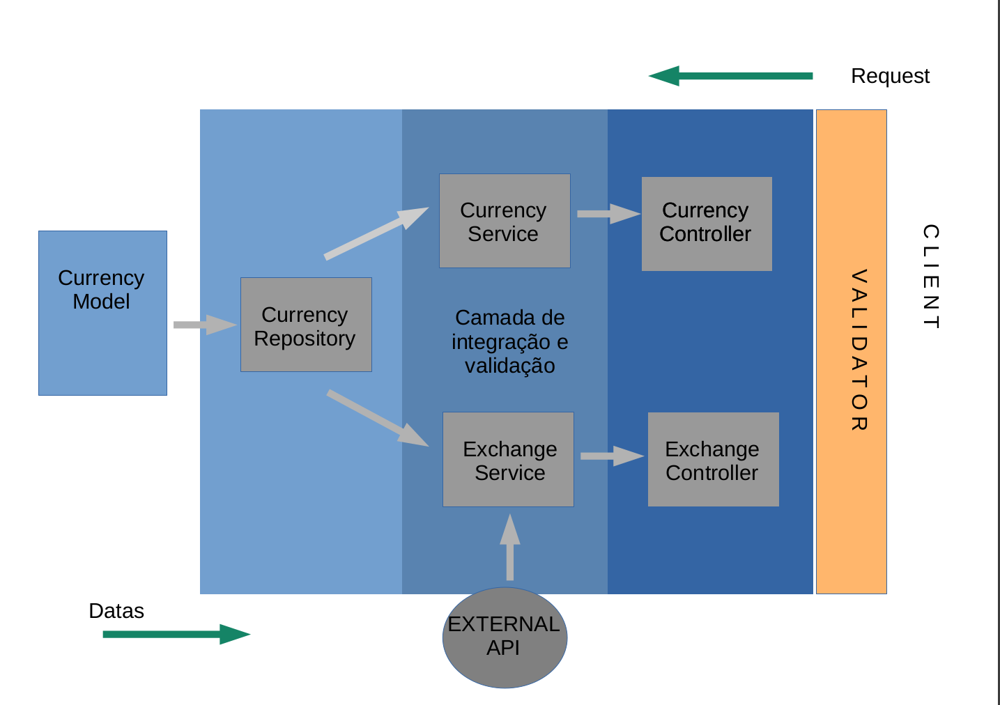
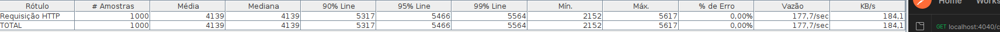

Support for password authentication was removed on August 13, 2021. Please use a personal access token instead.#  Desafio Bravo

[[English](README.md) | [Português](README.pt.md)]

Construa uma API, que responda JSON, para conversão monetária. Ela deve ter uma moeda de lastro (USD) e fazer conversões entre diferentes moedas com **cotações de verdade e atuais**.

A API precisa converter entre as seguintes moedas:

-   USD
-   BRL
-   EUR
-   BTC
-   ETH

Outras moedas podem ser adicionadas conforme o uso.

Ex: USD para BRL, USD para BTC, ETH para BRL, etc...

A requisição deve receber como parâmetros: A moeda de origem, o valor a ser convertido e a moeda final.

Ex: `?from=BTC&to=EUR&amount=123.45`

Construa também um endpoint para adicionar e remover moedas suportadas pela API, usando os verbos HTTP.

A API deve suportar conversão entre moedas fiduciárias, crypto e fictícias. Exemplo: BRL->HURB, HURB->ETH

"Moeda é o meio pelo qual são efetuadas as transações monetárias." (Wikipedia, 2021).

Sendo assim, é possível imaginar que novas moedas passem a existir ou deixem de existir, é possível também imaginar moedas fictícias como as de Dungeons & Dragons sendo utilizadas nestas transações, como por exemplo quanto vale uma Peça de Ouro (D&D) em Real ou quanto vale a GTA$ 1 em Real.

Vamos considerar a cotação da PSN onde GTA$ 1.250.000,00 custam R$ 83,50 claramente temos uma relação entre as moedas, logo é possível criar uma cotação. (Playstation Store, 2021).

Ref:
Wikipedia [Site Institucional]. Disponível em: <https://pt.wikipedia.org/wiki/Moeda>. Acesso em: 28 abril 2021.
Playstation Store [Loja Virtual]. Disponível em: <https://store.playstation.com/pt-br/product/UP1004-CUSA00419_00-GTAVCASHPACK000D>. Acesso em: 28 abril 2021.

Você pode usar qualquer linguagem de programação para o desafio. Abaixo a lista de linguagens que nós aqui do Hurb temos mais afinidade:

-   JavaScript (NodeJS)
-   Python
-   Go
-   Ruby
-   C++
-   PHP

## Requisitos

-   Forkar esse desafio e criar o seu projeto (ou workspace) usando a sua versão desse repositório, tão logo acabe o desafio, submeta um _pull request_.
    -   Caso você tenha algum motivo para não submeter um _pull request_, crie um repositório privado no Github, faça todo desafio na branch **main** e não se esqueça de preencher o arquivo `pull-request.txt`. Tão logo termine seu desenvolvimento, adicione como colaborador o usuário `automator-hurb` no seu repositório e o deixe disponível por pelo menos 30 dias. **Não adicione o `automator-hurb` antes do término do desenvolvimento.**
    -   Caso você tenha algum problema para criar o repositório privado, ao término do desafio preencha o arquivo chamado `pull-request.txt`, comprima a pasta do projeto - incluindo a pasta `.git` - e nos envie por email.
-   O código precisa rodar em macOS ou Ubuntu (preferencialmente como container Docker)
-   Para executar seu código, deve ser preciso apenas rodar os seguintes comandos:
    -   git clone \$seu-fork
    -   cd \$seu-fork
    -   comando para instalar dependências
    -   comando para executar a aplicação
-   A API pode ser escrita com ou sem a ajuda de _frameworks_
    -   Se optar por usar um _framework_ que resulte em _boilerplate code_, assinale no README qual pedaço de código foi escrito por você. Quanto mais código feito por você, mais conteúdo teremos para avaliar.
-   A API precisa suportar um volume de 1000 requisições por segundo em um teste de estresse.
-   A API precisa contemplar cotações de verdade e atuais através de integração com APIs públicas de cotação de moedas

## Critério de avaliação

-   **Organização do código**: Separação de módulos, view e model, back-end e front-end
-   **Clareza**: O README explica de forma resumida qual é o problema e como pode rodar a aplicação?
-   **Assertividade**: A aplicação está fazendo o que é esperado? Se tem algo faltando, o README explica o porquê?
-   **Legibilidade do código** (incluindo comentários)
-   **Segurança**: Existe alguma vulnerabilidade clara?
-   **Cobertura de testes** (Não esperamos cobertura completa)
-   **Histórico de commits** (estrutura e qualidade)
-   **UX**: A interface é de fácil uso e auto-explicativa? A API é intuitiva?
-   **Escolhas técnicas**: A escolha das bibliotecas, banco de dados, arquitetura, etc, é a melhor escolha para a aplicação?

## Dúvidas

Quaisquer dúvidas que você venha a ter, consulte as [_issues_](https://github.com/HurbCom/challenge-bravo/issues) para ver se alguém já não a fez e caso você não ache sua resposta, abra você mesmo uma nova issue!

Boa sorte e boa viagem! ;)

<p align="center">
  
</p>

<br>
<br>

# Bravo Challenge - HURB - Patrick Navega

<p align="left">O objetivo desse projeto foi criar um serviço que realizasse a conversão entre moedas - sejam elas fictícias ou legítimas. Para tal, foi utilizado NODE JS como back-end devido à familiaridade do desenvolvedor com a ferramenta. Em relação ao armazenamento, visando a otimização de perfomance para o proposto teste de stress, foi utilizado o MongoDB como banco de dados.</p>
<br>

## BREVE RESUMO 

<p> O projeto foi arquitetado da maneira simples tendo como principais pilares a organização de idéias, clareza de código e desempenho do serviço. Para alcançar o objetivo, o código possui somente 3 métodos de requisição do protocolo HTTP - GET, POST e DELETE -, e validações de dados rigorosas, com o auxílio de libs e também feitas manualmente, que visam otimizar a sua perfomance.<p>
<br>

## Fluxo da requisição e envio de resposta

 

<br>

## TECNOLOGIAS

- Node JS v16.5 
- Mongo DB v4.6
<br>
<br>

## FRAMEWORKS E LIBS
- Express:4.18 - Servidor WEB 
- Axios:0.27 - Requisições de API 
- DotEnv:16.0 - Encapsulamento de informações frágeis
- Mongoose:6.4 - conexão ao banco de dados
- Yup:0.32 - Validação de entrada de dados
- <strike>Jest:28.1 - Criação de testes unitários</strike>
 

<br>

## API externa
- https://economia.awesomeapi.com.br/json/last/
<br>
<br>
<br>

# Fragilidade do serviço
- Por se tratar de um serviço público permitindo a manipulação total dos dados sem a validação de um token, os dados encontram-se expostos.
<br>
<br>
<br>

# Start do serviço
<p> Inicialmente, é necessário realizar o clone do repositório. Após a criação do clone, entre na pasta do repositório e execute o comando de construção de imagem, conforme instruções abaixo. </p>

```bash
$   git clone 'URL repositório'
$   cd 'repositorio'.
$   docker-compose up
```

<p> Após a criação do ambiente pelo docker-compose o acesso já será possível via URL - Isto é, via browser ou por softwares auxiliares, como o Postman por exemplo. </p>

```bash
    localhost:4040/ping
```

# Como utilizar 

<p> De maneira simplificada, possuímos 5 rotas com seus respectivos endpoints. </p>
<br>

```bash
1    .GET localhost:4040/currency
2    .GET localhost:4040/currency/<STRING>
3    .POST localhost:4040/currency
4    .DELETE localhost:4040/currency/<STRING>  
5    .GET localhost:4040/exchange/?from=<STRING>&to=<STRING>&rate=<NUMBER> 
```
<br>

## Buscando todas as moedas
<p> Ao realizarmos essa primeira requisição do método GET, esperamos como retorno um corpo como informado abaixo. Um array contendo todos os objetos contidos no banco.<p>

```bash
Exemplo de requisição: 

        localhost:4040/currency
```

### Descrição dos campos:
    
<li> name: Nome da moeda: STRING
<li> code: Código daquela moeda: STRING
<li> rate: Cotação da moeda tendo o Dólar como lastro: NUMBER
<li> fiatOrFic: Se é legítima ou fictícia: BOOLEAN
<br>
<br>


```bash
Exemplo de resposta

$   [
        {
            "_id": "62b261647c6a7d7cf3f56a25", 
            "name": "BITCOIN",
            "code": "BTC", 
            "rate": 1, 
            "fiatOrFic": true,
            "createdAt": "2022-06-22T00:25:08.615Z", 
            "updatedAt": "2022-06-22T00:25:08.615Z" 
        },
        .
        .
        .
        {
            "_id": "7896acadc6a7d7cf3f56a25",
            "name": "American Dĺar",
            "code": "USD",
            "rate": 1,
            "fiatOrFic": true,
            "createdAt": "2022-06-22T00:25:08.615Z",
            "updatedAt": "2022-06-22T00:25:08.615Z"
        }
]
```

<br>

## Buscando de um registro específico
<p id="2">Essa segunda requisição GET é aplicada em situações que estejamos buscando um elemento específico ao longo da base de dados a partir do código da moeda.<p>


```bash
Exemplo de requisição: 

        localhost:4040/currency/BTC
```

<p> O exemplo do retorno da requisição anterior é valido para esse caso também, entretanto, com somente <b>um</b> objeto no array. A menos que a requisição não encontre o registro solicitado, nesse caso haverá um outro retorno informando o status. <p>

```bash
Exemplo de resposta - CASO NÃO ENCONTRE O CODE PASSADO POR PARÂMETRO: 

$ { error: 'Currency code not exists at database' } 
```

<br>

## Cadastrar uma moeda
<p>

```bash
Exemplo de requisição:

    localhost:4040/currency

BODY da requisição

{
    "name": "PokeCoin",
    "code": "POK",
    "rate": 900,
    "fiatOrFic": 0
}
```

<p>Em caso de conversão <b>entre moedas legítimas</b>, não é necessário se importar com o campo de cotação (rate), uma vez que ele será atualizado de maneira assíncrona a cada requisição, conforme será visto mais adiante.</p>

<p>A princípio, o serviço não aceita a inserção de uma mesma moeda mais de uma vez no banco - usando como parâmetro de validação o código da moeda. O intuito dessa validação é minimizar quaisquer problemas que possam vir a ocorrer durante a conversão caso houvesse mais de um registro.</p>
<br>

## Deletar uma moeda

<p> O parâmetro a ser excluído deve ser enviado via parâmetro abaixo</p>

```bash
Exemplo de requisição DELETE:

    localhost:4040/currency/BTC
```
<br>

## Conversão de moedas

```bash
Exemplo de requisição GET/exchange:

    localhost:4040/exchange?to=BRL&from=USD&rate=10
```

<p> Antes de prosseguirmos à resposta da requisição, é importante entendermos a distinção que há entre as moedas fictícias para as moedas legítimas. Os códigos definidos como legítimos realizarão requisições assíncronas à API externa a cada requisição de conversão e gravarão seus novos dados no banco de dados. Já os códigos definidos como fictícios não, usarão como base o campo 'rate' inserido no dado.</p>

```bash
Retorno da requisição GET/Exchange
$ {
    "from": "USD",
    "to": "BRL",
    "rate": "BRL : 52.38 "
}
```

# Cobertura de testes

<p> Conforme imagem a seguir, utilizando o software Jmeter da empresa Apache, o serviço foi capaz de suportar o teste de stress de 1000 requisições simultâneas com 100% de eficácia.</p>

 

<p> Entretanto, devido à falta de habilidade do desenvolvedor desafiado com a criação de testes unitários, não fui capaz de elaborar testes com qualidade suficiente para serem entregues. Sorry for that. =D </p>

