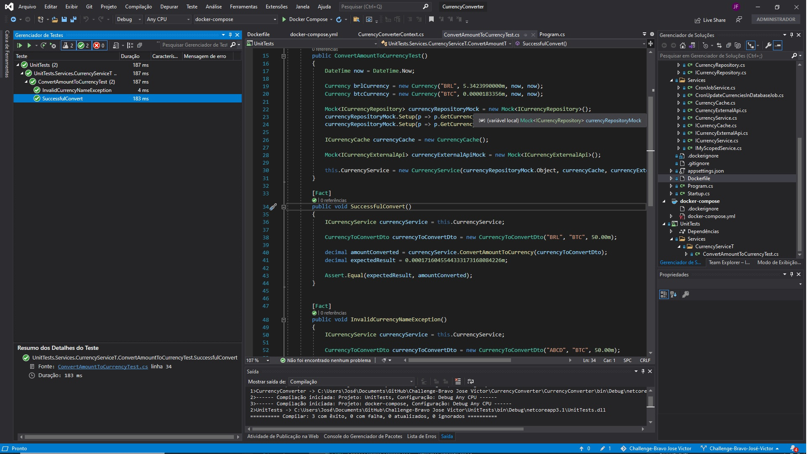

#  Desafio Bravo

# Api de conversão de moedas

## Pré-requisitos
- Docker: https://docs.docker.com/install/
- K6: https://k6.io/ (Apenas caso queira executar testes de estresse)

## Instruções para configuração/instalação
A aplicação roda dentro de uma imagem docker, portanto todo o ambiente é instalado diretamente através da mesma.

### Configuração
A configuração do sistema é baseada nos valores do arquivo de configurações appsettings.json na raiz da aplicação.
- ConnectionStrings.CurrencyConverterDB - Chave para a conexão com o banco de dados (no momento apenas MS SQL Server).
* Como explicado no TODO, a ideia é mover mais entradas que sejam passíveis de alteração para serem lidas a partir do appsettings.json, pois assim quando necessário podemos apenas alterar o valor da chave nesse arquivo e executar a aplicação novamente.

O comando a seguir cria e roda a aplicação dentro de uma rede docker, além de um container rodando MS SQL Server para a base de dados na mesma rede. Dentro da pasta raiz do repositório:
  - `docker-compose up` - Executa imagem em daemon (e cria se o passo anterior não tiver sido executado previamente). Dentro do arquivo <root>/docker-compose.yml estão as configurações de portas que o sistema irá utilizar por default a aplicação irá utilizar a porta 80 e o banco de dados ficará na porta 1433, para acesso a esses ambientes a partir da máquina que está executando a mesma, fiz o link da porta da aplicação para a porta 49153 e para a porta do banco de dados o link foi com a porta 1401.

### Execução dos testes
#### Unitarios:
- Evidência da execução dos testes:

- A classe com o desenvolvimento dos testes unitários é a ConvertAmountToCurrencyTest.cs que está no PATH "UnitTests\Services\CurrencyServiceT", para essa primeira versão foram desenvolvidos dois testes:
- O primeiro valida se a conversão está funcionando corretamente no caso de Sucesso.
- O segundo está validando que quando recebemos uma moeda com mais de 4 dígitos, a API está retornando uma mensagem dizendo que pelo menos uma das moedas recebidas está fora do padrão de 3 letras que foi estabelecido.

#### Load
- Teste de estresse executado no K6 com 3000 VUs fazendo a requisição GET http://localhost:49153/api/currencyconverter?from=BTC&to=EUR&amount=123.45 seguidamente durante 30 segundos, como é possível verificar no resultado abaixo, a API lidou com aproximadamente 2350 requisições por segundo sem elevar muito o tempo de resposta, que ficou abaixo de 530 ms em 95% dos casos.
Para execução dos testes de estresse: k6 run script.js

          /\      |‾‾| /‾‾/   /‾‾/
     /\  /  \     |  |/  /   /  /
    /  \/    \    |     (   /   ‾‾\
   /          \   |  |\  \ |  (‾)  |
  / __________ \  |__| \__\ \_____/ .io

  execution: local
     script: script.js
     output: -

  scenarios: (100.00%) 1 scenario, 3000 max VUs, 1m0s max duration (incl. graceful stop):
           * default: 3000 looping VUs for 30s (gracefulStop: 30s)

running (0m31.0s), 0000/3000 VUs, 72912 complete and 0 interrupted iterations
default ✓ [======================================] 3000 VUs  30s0

     data_received..................: 13 MB  430 kB/s
     data_sent......................: 9.6 MB 310 kB/s
     http_req_blocked...............: avg=35.84ms  min=0s     med=0s       max=2.22s    p(90)=0s       p(95)=0s
     http_req_connecting............: avg=35.7ms   min=0s     med=0s       max=2.22s    p(90)=0s       p(95)=0s
     http_req_duration..............: avg=170.02ms min=1.99ms med=115.21ms max=1.71s    p(90)=385.05ms p(95)=530.86ms
       { expected_response:true }...: avg=170.02ms min=1.99ms med=115.21ms max=1.71s    p(90)=385.05ms p(95)=530.86ms
     http_req_failed................: 0.00%  ✓ 0      ✗ 72912
     http_req_receiving.............: avg=145.83µs min=0s     med=0s       max=413.7ms  p(90)=0s       p(95)=984.88µs
     http_req_sending...............: avg=2.89ms   min=0s     med=0s       max=926.72ms p(90)=0s       p(95)=999.7µs
     http_req_tls_handshaking.......: avg=0s       min=0s     med=0s       max=0s       p(90)=0s       p(95)=0s
     http_req_waiting...............: avg=166.97ms min=1.99ms med=115.07ms max=1.24s    p(90)=382.06ms p(95)=522.18ms
     http_reqs......................: 72912  2350.910414/s
     iteration_duration.............: avg=1.22s    min=1s     med=1.12s    max=3.85s    p(90)=1.43s    p(95)=1.81s
     iterations.....................: 72912  2350.910414/s
     vus............................: 92     min=92   max=3000
     vus_max........................: 3000   min=3000 max=3000

## Documentação do endpoint de conversão
### Endpoint de consulta de moedas cadastradas:

`GET http://localhost:49153/api/currencyconverter/getCurrencies`

Retorna todas as moedas cadastradas na nossa base de dados, com seu Id na base, a sua sigla, a sua cotação comparada com o Dólar, a data de inserção na base e a data da última vez que a cotação dessa moeda foi atualizada na base de dados.

Ex. do JSON de Retorno:
[
    {
        "Id": 1,
        "Name": "USD",
        "ValueComparedToBaseCurrency": 1.0000000000,
        "CreationDate": "2021-04-24T23:18:18.305795",
        "UpdateDate": "2021-04-27T23:00:00.6793702"
    },
    {
        "Id": 4,
        "Name": "BTC",
        "ValueComparedToBaseCurrency": 0.0000179968,
        "CreationDate": "2021-04-24T23:18:18.305795",
        "UpdateDate": "2021-04-27T23:00:00.6793702"
    },
    {
        "Id": 6,
        "Name": "BRL",
        "ValueComparedToBaseCurrency": 5.4531000000,
        "CreationDate": "2021-04-24T23:36:15.4181994",
        "UpdateDate": "2021-04-27T23:00:00.6793702"
    }
]

### Endpoint da chamada de conversão:

`GET http://localhost:49153/api/currencyconverter`

Endpoint responsável por fazer a conversão entre duas moedas e retorna um JSON com o valor décimal recebido convertido na moeda recebida na propriedade `to`
Parâmetros:
- from: (string) 3 caracteres com código de moeda cadastrada
- to: (string) 3 caracteres com código de moeda cadastrada
- amount: (string) decimal positivo com separador decimal `.` (Se usar `,` será considerado separador de milhar)

Todos os campos são obrigatórios.

Ex.: `http://localhost:49153/api/currencyconverter?from=BTC&to=EUR&amount=123.45`
Retorno:
 - 5679140.3832903627311522048364

 - Caso algum campo ou formato não venha como desejado, haverá retorno de um erro 400 Bad Request.

 - Caso uma moeda não cadastrada seja requisitada haverá retorno de um erro 500 Internal Server Error com a seguinte mensagem:
 Ex.:
 System.ArgumentNullException: Value cannot be null. (Parameter 'Não foi possível encontrar a moeda ABC cadastrada na base de dados.')

 - Caso uma moeda venha com mais ou menos do que 3 dígitos, haverá retorno de um erro 500 Internal Server Error com a seguinte mensagem:
 Ex.:
 System.ArgumentException: Pelo menos uma das moedas recebidas está diferente do padrão de 3 letras.

 - Caso uma das moedas da requisição tenha sido cadastradas com valor igual à zero ou negativo, haverá retorno de um erro 500 Internal Server Error com a seguinte mensagem:
 Ex.:
 System.Exception: A Moeda BRL possui um valor de conversão 0.00000, o mesmo é inválido por ser negativo ou igual a zero.

### Endpoint da registro de nova moeda:

`POST http://localhost:49153/api/currencyconverter/{currencyName}`

Endpoint responsável pelo cadastro de novas moedas na base de dados.
 - Caso `currencyName` não estiver na lista de possíveis moedas ou for vazio, haverá retorno de um erro 400 Bad Request

 - Caso `currencyName` já cadastrado, haverá retorno de um erro 500 Internal Server Error com a seguinte mensagem por tentar inserir uma moeda com um nome já existente na base de dados:
 Ex.:
 Microsoft.EntityFrameworkCore.DbUpdateException: An error occurred while updating the entries. See the inner exception for details.
 ---> Microsoft.Data.SqlClient.SqlException (0x80131904): Cannot insert duplicate key row in object 'dbo.Currency' with unique index 'IX_Currency_Name'. The duplicate key value is (BRL).
The statement has been terminated.

 - Caso `currencyName` não cadastrado, haverá retorno de uma mensagem informando que a moeda foi cadastrada com sucesso.
 Ex.:
 "A moeda ARS foi cadastrada com sucesso!"

### Endpoint que retorna as moedas que podem ser cadastradas:

`GET http://localhost:49153/api/currencyconverter/getAvailableCurrenciesToInsert`

Endpoint responsável por retornar um JSON com uma listagem das siglas e nomes das moedas que podem ser cadastradas na base de dados.
Ex. de Retorno:
{
  "AED": "United Arab Emirates Dirham",
  "AFN": "Afghan Afghani",
...
  "ZMW": "Zambian Kwacha",
  "ZWL": "Zimbabwean Dollar"
}

### Endpoint de consulta de moeda cadastrada a partir da sigla da moeda:

`GET http://localhost:49153/api/currencyconverter/getCurrenciesByName/{currencyName}`

Endpoint responsável pela consulta de uma moeda cadastrada na base de dados a partir da sigla de 3 letras.
 - Caso `currencyName` estiver cadastrada na base de dados, a API irá retornar um JSON com o objeto da moeda cadastrada.
Ex.: de Retorno:
{
    "Id": 6,
    "Name": "BRL",
    "ValueComparedToBaseCurrency": 5.4531000000,
    "CreationDate": "2021-04-24T23:36:15.4181994",
    "UpdateDate": "2021-04-27T23:00:00.6793702"
}

 - Caso `currencyName` não estiver na base de dados, haverá retorno de um erro 500 Internal Server Error
 Ex.:
 System.ArgumentNullException: Value cannot be null. (Parameter 'Não foi possível encontrar a moeda ABC cadastrada na base de dados.')

### Endpoint de consulta de moeda cadastrada a partir do Id da moeda na base de dados:

`GET http://localhost:49153/api/currencyconverter/getCurrenciesById/{currencyId}`

Endpoint responsável pela consulta de uma moeda cadastrada na base de dados a partir do Id que é um número do tipo long.
 - Caso `currencyId` estiver cadastrada na base de dados, a API irá retornar um JSON com o objeto da moeda cadastrada.
Ex.: de Retorno:
{
    "Id": 6,
    "Name": "BRL",
    "ValueComparedToBaseCurrency": 5.4531000000,
    "CreationDate": "2021-04-24T23:36:15.4181994",
    "UpdateDate": "2021-04-27T23:00:00.6793702"
}

 - Caso `currencyId` não estiver cadastrada na base de dados, haverá retorno de um erro 500 Internal Server Error
 Ex.:
 System.ArgumentNullException: Value cannot be null. (Parameter 'Não foi possível encontrar a moeda com Id 2 cadastrada na base de dados.')

### Endpoint da deleção de moeda da base de dados:

`DELETE http://localhost:49153/api/currencyconverter/{currencyName}`

Endpoint responsável por excluir a moeda da base de dados da nossa API.
 - Caso `currencyName` já cadastrado, a moeda será removida da base de dados e haverá retorno de um OK.

 - Caso `currencyName` não cadastrado, haverá retorno de um erro 500 Internal Server Error
 Ex.:
 System.ArgumentNullException: Value cannot be null. (Parameter 'Não foi possível encontrar a moeda ABC cadastrada na base de dados.')

 Obs. O cache de dados que é utilizado para evitar ficar consultando a base é sempre limpo quando esse Endpoint finaliza a atualização na base de dados.

### Endpoint de atualização de todas as moedas:

`PUT http://localhost:49153/api/currencyconverter/updateAllCurrenciesValue`

Endpoint responsável por atualizar as cotações (usando o Dólar com base) de todas as moedas cadastradas na base de dados.
 - Caso sejam atualizadas com sucesso, haverá retorno de um OK.

 - Caso não seja executada com sucesso, haverá retorno de um erro 500 Internal Server Error e uma mensagem com o erro que foi levantado.

 Obs. O cache de dados que é utilizado para evitar ficar consultando a base é sempre limpo quando esse Endpoint finaliza a atualização na base de dados.

### Cron Job de atualização das moedas:

Foi criado um Cron Job que é executado em background a cada virada de hora e o mesmo é responsável por fazer a atualição da cotação de todas as moedas cadastradas na base de dados.

 Obs. O cache de dados que é utilizado para evitar ficar consultando a base é sempre limpo quando essa tarefa é executada.

## Escolhas técnicas
### Linguagem e Banco de Dados
Decidi fazer a aplicação em C# .Net Core, pois é uma linguagem robusta e altamente difundinda pelo mercado, além de diversas fontes de informação e ser suportada pela Microsoft.
Para o banco de dados, decidi pelo Microsoft SQL Server, pelos mesmos motivos da escolha da linguagem, além de se integrar muito bem com a mesma.

### Deploy Method
Docker foi utilizado para simplicidade de criação e execução de um ambiente isolado e replicável.

### Integração para conversão de moedas
Foi utilizada a API Open Exchange Rates (https://openexchangerates.org/). A escolha foi baseada nos seguintes motivos:
 - Possui uma boa quantidade de moedas, incluindo moedas digitais.
 - Existe por mais de 7 anos e é utilizada por empresas reconhecidas no mercado.
 - No plano gratuíto aceita até 1000 requisições por mês, utiliza o dólar como base e os valores são atualizados a cada hora, permitindo diversos recursos a mais nos planos pagos caso seja necessário.

### Lib de testes
 - xUnit - Utilização do xUnit para criação dos testes automáticos no .net core;
 - k6 - Para fazer os testes de estresse da aplicação;

## Links
- https://docs.docker.com

## TODO:
 - Cheguei a implementar o Swagger para criação de uma documentação mais interativa, mas tive dificuldades para atualizar a documentação criada com as descrições e exemplos dos Endpoints, com isso deixarei a implementação mais completa da mesma para a versão 2.0.
 Link do Swagger: http://localhost:49153/swagger/index.html
 - Cobertura total com testes unitários e de integração, além da execução dos mesmos no build do docker;
 - Implementar um serviço de HealthCheck para o endpoint.
 - Implementar análise de vulnerabilidade na API com o uso do Sonar.
 - Implementar um serviço Redis para gerenciamento do cache da aplicação.
 - Adicionar mais logs na aplicação.
 - Fazer com que o código pegue mais variáveis de configuração (Intervalo de execução do Cron Job, endereço e Apllication Id da API externa, etc) a partir do arquivo appsettings.json.
 - Mover a definição do DbContext para uma interface com base no princípio de injeção de dependência, para que possamos configurar a aplicação para rodar com diversos tipos de banco de dados.
 - Verifiquei que o desafio foi atualizado para que a API também possa fazer a conversão de moedas fictícias, nesse caso teria de criar um novo endpoint que possa receber um nome de moeda e o seu valor em comparação a moeda base utilizada na API, como no exemplo é usada uma moeda com a sigla HURB, também seria necessário alterar a verificação que é feita no Endpoint que realiza a conversão de valores para não limitar mais que a sigla da moeda deva ter apenas 3 dígitos.

