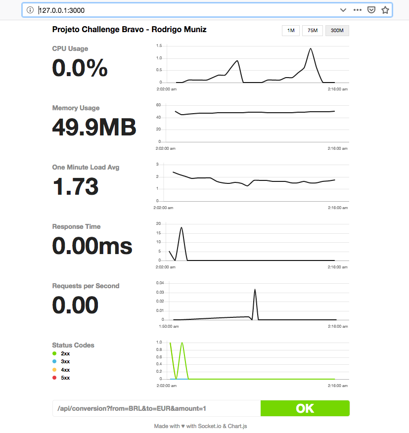

#  Desafio Bravo

API, que responda JSON, para conversão monetária. 

# Projeto

## Baixar, instalar e rodar:

1. Clonar o projeto:
```
git clone https://github.com/rodrigobmuniz/challenge-bravo.git
```

2. Acessar a pasta do projeto:
```
cd  challenge-bravo
```

3. Instalar dependências:
```
npm install
```
ou
```
yarn install
```

4. Rodar o projeto:

``` 
npm start 
```
ou
``` 
yarn start 
```

Feito. Projeto está rodando no endereço:
``` 
http://127.0.0.1:3000/ 
```

## Uso da API api/conversion

API, que responde JSON, para conversão monetária. 

### Principais características
- Moeda de lastro (USD)
- Faz conversões entre diferentes moedas com cotações reais e atuais.
- Taxa de câmbio atualizada de hora em hora.
- Tendo em vista que o ponto mais crítico da API é buscar a taxa na API de terceiros, temos redundância para as taxas de câmbio das moedas e cripto-moedas (2 para cada).
- Converter entre as seguintes moedas:
-> USD
-> BRL
-> EUR
-> BTC
-> ETH
- Sistema simples de LOG em arquivo para identificar possíveis erros.
- Monitoramento do sistema em tempo real no endereço `http://127.0.0.1:3000/`

Ex: 
Recebe como parâmetros: A moeda de origem, o valor a ser convertido e a moeda final.

#### Solicitação:
```
http://127.0.0.1:3000/api/conversion?from=BRL&to=EUR&amount=10.35
```

| Parâmetro | Tipo | Descrição |
|--|--|--|
| from | string | moeda do valor a ser convertido |
| to | string| moeda destino da conversão |
| amount | float | valor que deseja converter |

| Código da moeda para API | Moeda | 
|--|--|
| USD | Dólar americano |
|  BRL | Real |
| EUR | Euro |
| BTC | Bitcoin |
| ETH | Ethereum |


#### Resposta:
```json
{
    "error": false,
    "updateDate": "2018-12-19T04:02:17.093Z",
    "amountToBeConverted": 10.35,
    "from": "BRL",
    "to": "EUR",
    "convertedValue": "2.32"
}
```

| Parâmetro | Tipo | Descrição |
|--|--|--|
| error | boolean | indicativo se API retornou com sucesso |
| updateDate | string | data de atualização da taxa de conversão |
| amountToBeConverted | float | valor que deve ser convertido |
| from | string | moeda a ser convertida |
| to | string| moeda destino da conversão |
| convertedValue | string | valor convertido |


## LOG do sistema
Para acessar o arquivo de log, acessar a pasta `log` na raiz do projeto. O sistema vai gerar um arquivo de log por dia.

## Monitore o sistema
Utilize o endereço `http://127.0.0.1:3000/` para monitorar o sistema em tempo real

<p align="center">
  
</p>

## Teste de carga:

### Rodar o teste de carga:

1. Inciar o server:
``` 
npm start
```

2. Acessar a página de monitoramento do servidor
`http://127.0.0.1:3000/` para acompanhar o teste de carga

3. Rodar o comando para o teste de carga:
```
node_modules/.bin/loadtest http://127.0.0.1:3000/api/conversion\?from\=ETH\&to\=BRL\&amount\=100 -t 20 -c 10 --rps 1000
```

Exemplo do resultado do teste de carga:
```
[Wed Dec 19 2018 01:42:52 GMT-0200 (Brasilia Summer Time)] INFO Requests: 0, requests per second: 0, mean latency: 0 ms
[Wed Dec 19 2018 01:42:56 GMT-0200 (Brasilia Summer Time)] INFO Requests: 4532, requests per second: 907, mean latency: 2.9 ms
[Wed Dec 19 2018 01:43:01 GMT-0200 (Brasilia Summer Time)] INFO Requests: 9516, requests per second: 997, mean latency: 2.2 ms
[Wed Dec 19 2018 01:43:06 GMT-0200 (Brasilia Summer Time)] INFO Requests: 14373, requests per second: 971, mean latency: 73.5 ms
[Wed Dec 19 2018 01:43:12 GMT-0200 (Brasilia Summer Time)] INFO
[Wed Dec 19 2018 01:43:12 GMT-0200 (Brasilia Summer Time)] INFO Target URL:          http://127.0.0.1:3000/api/conversion?from=ETH&to=BRL&amount=100
[Wed Dec 19 2018 01:43:12 GMT-0200 (Brasilia Summer Time)] INFO Max time (s):        20
[Wed Dec 19 2018 01:43:12 GMT-0200 (Brasilia Summer Time)] INFO Concurrency level:   100
[Wed Dec 19 2018 01:43:12 GMT-0200 (Brasilia Summer Time)] INFO Agent:               none
[Wed Dec 19 2018 01:43:12 GMT-0200 (Brasilia Summer Time)] INFO Requests per second: 1000
[Wed Dec 19 2018 01:43:12 GMT-0200 (Brasilia Summer Time)] INFO
[Wed Dec 19 2018 01:43:12 GMT-0200 (Brasilia Summer Time)] INFO Completed requests:  17358
[Wed Dec 19 2018 01:43:12 GMT-0200 (Brasilia Summer Time)] INFO Total errors:        0
[Wed Dec 19 2018 01:43:12 GMT-0200 (Brasilia Summer Time)] INFO Total time:          20.08130635 s
[Wed Dec 19 2018 01:43:12 GMT-0200 (Brasilia Summer Time)] INFO Requests per second: 864
[Wed Dec 19 2018 01:43:12 GMT-0200 (Brasilia Summer Time)] INFO Mean latency:        52.4 ms
[Wed Dec 19 2018 01:43:12 GMT-0200 (Brasilia Summer Time)] INFO
[Wed Dec 19 2018 01:43:12 GMT-0200 (Brasilia Summer Time)] INFO Percentage of the requests served within a certain time
[Wed Dec 19 2018 01:43:12 GMT-0200 (Brasilia Summer Time)] INFO   50%      1 ms
[Wed Dec 19 2018 01:43:12 GMT-0200 (Brasilia Summer Time)] INFO   90%      7 ms
[Wed Dec 19 2018 01:43:12 GMT-0200 (Brasilia Summer Time)] INFO   95%      32 ms
[Wed Dec 19 2018 01:43:12 GMT-0200 (Brasilia Summer Time)] INFO   99%      2200 ms
[Wed Dec 19 2018 01:43:12 GMT-0200 (Brasilia Summer Time)] INFO  100%      4205 ms (longest request)
```

## Testes automatizados:
1. Acessar a raiz do projeto
2. Certifique-se que o `server` do projeto NÃO está rodando. Se estiver, finaliza o mesmo com `Ctrl + C`

3. Rode os testes:
```
npm test
```

Exemplo do resultado dos testes automatizados:

```
server running on 3000
  Teste unitário: currency-conversion.controller
    calculateExchange(from, to, amount)
      ✓ Deve realizar a conversão e retornar um json: { convertedValue: 10.00, error: false }
      ✓ Deve retornar ERROR pelo fato do valor de FROM ser menor ou igual ZERO
      ✓ Deve retornar ERROR pelo fato do valor de TO ser menor ou igual ZERO
      ✓ Deve retornar ERROR pelo fato do valor de AMOUT ser menor ou igual ZERO

  Teste de integração: API conversion - /api/conversion
    ✓ Deve retornar 417 e a mensagem de erro por faltar o parametro FROM na QUERY (124ms)
    ✓ Deve retornar 417 e a mensagem de erro por faltar o parametro TO na QUERY
    ✓ Deve retornar 417 e a mensagem de erro por faltar o parametro AMOUNT na QUERY
    ✓ Deve retornar 404 e a mensagem de erro por solicitar conversão de FROM para moeda não suportada
    ✓ Deve retornar 404 e a mensagem de erro por solicitar conversão de TO para moeda não suportada
    ✓ Deve retornar 417 e a mensagem de erro pois o parametro AMOUNT deve ser um número maior que ZERO e foi enviado 0
    ✓ Deve retornar 417 e a mensagem de erro pois o parametro AMOUNT deve ser um número maior que ZERO e foi enviado RIO
    ✓ Deve realzar a chamada com sucesso e receber o json com os dados da conversão de BRL para EUR
    ✓ Deve realzar a chamada com sucesso e receber o json com os dados da conversão de EUR para USD
    ✓ Deve realzar a chamada com sucesso e receber o json com os dados da conversão de ETH para BRL
    ✓ Deve realzar a chamada com sucesso e receber o json com os dados da conversão de BTC para EUR


  15 passing (305ms)
```
