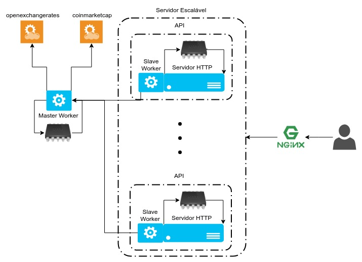
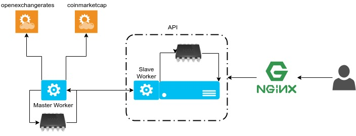
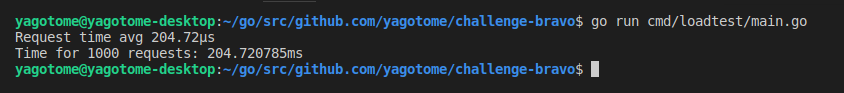
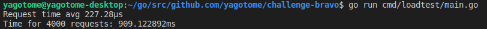

# Challenge Bravo

Este projeto é a solução do desafio explicado em [CHALLENGE.md](CHALLENGE.md)

Ele foi desenvolvido em [Go](https://golang.org/) com framework [echo](https://echo.labstack.com/) para HTTP

## Pré-requisitos

Você precisará de uma API Key da [openexchangerates](https://openexchangerates.org) para rodar. (No PR foi enviada uma para ser utilizada)

Você pode rodar a aplicação em containers docker ou sem containers buildando o projeto a partir do source.

### Com docker

Você precisa ter instalado:

- [Docker](https://www.docker.com/) versão 18.x
- [Docker Compose](https://docs.docker.com/compose/) versão 1.22+

### Sem docker

Você precisa ter instalado:

- [Go](https://golang.org/) v1.11

## Instalando e Rodando

Você precisará de setar uma variável de ambiente (`OXRAPIKEY`) ou, caso rodando em docker, criar arquivos de .env para passar a API Key.

Por padrão, serão usadas as configurações do ambiente `dev`, para você mudar, basta setar a variável `GOCONFIGPATH` para o caminho do json de configurações (dentro da pasta `config`).

Uma observação é que com o Go v1.11 as dependências do projeto (descritas em go.mod) serão baixadas e instaladas no momento do build.

### Com docker

Crie um arquivo na raiz do projeto com o nome `.env_masterworker`, e coloque nele a API Key da openexchangerates como no exemplo:

```
OXRAPIKEY=<aqui vai a API Key, sem os "<>">
```

Para buildar, levantar toda a infra e rodar:

```
$ sudo docker-compose up -d
```

Para descer o servidor:

```
$ sudo docker-compose down
```

### Sem docker

Caso tenha baixado o projeto dentro da sua `GOPATH`, antes de buildar, sete a variável de ambiente do Go 1.11:
```
$ export GO111MODULE=on
```

Para buildar o Master Worker:
```
$ go build -mod=vendor -o masterworker cmd/masterworker/main.go
```

Para buildar a API:
```
$ go build -mod=vendor -o server cmd/api/main.go
```

O Master Worker deve ser levantado primeiro, depois a API.

Para subir o Master Worker você precisará setar as variáveis de ambiente `OXRAPIKEY` e `GOCONFIGPATH` primeiro.

Então, basta rodar os binários já buildados:
```
$ export OXRAPIKEY=<sua API Key da openexchangerates>
$ export GOCONFIGPATH=config/config.dev.json
$ ./masterworker
```
Em outro terminal, sete a variável `GOCONFIGPATH` e rode a API:
```
$ export GOCONFIGPATH=config/config.dev.json
$ ./server
```

### Usando a API

Após levantar o servidor, basta acessar fazer um GET com seus parâmetros, como no exemplo:

http://localhost:8314/convert?from=BTC&to=BRL&amount=12.5


## Arquitetura

O projeto suporta 3 arquiteturas:

1. Com [nginx](https://www.nginx.com/) como load balancer



2. Com [nginx](https://www.nginx.com/) para caching



3. Sem [nginx](https://www.nginx.com/)


 
A implementação atual é escalável, mas não tem configurações feitas para auto-escalar ou subir múltiplos nós de API. Então, a arquitetura 2 tem um nginx na frente da API apenas para caching, não como load balancer.

No entanto, foi percebida uma perda de performance da mudança da arquitetura 3 (sem nginx) para a 2. Portanto, a arquitetura recomendada para rodar aplicação agora é a sem nginx. (Os benchmarks mostrados aqui foram feitos nela)

 ### Componentes da arquitura

 #### API

A API é um servidor HTTP contendo a rota `/convert` para conversão de moedas.

Para garantir uma resposta rápida, o servidor não faz nenhum acesso a recursos externos no tempo de um request, para evitar um possível gargalo de rede ou até do provedor do recurso externo (redis/memcached ou outra API). Ela possui as cotações das moedas (com relação a moeda lastro USD) em uma estrutura de dados in-memory sendo atualizada pelo Slave Worker. Portanto, em um request o servidor apenas consulta a RAM para fazer o cálculo da conversão e entregar uma resposta rápida.

Exemplo de request à API:

GET /convert?from=BTC&to=USD&amount=1

Resposta:
```
{
    "from": "BTC",
    "to": "USD",
    "amount": 1,
    "result": 6981.319336849224
}
```

#### Slave Worker

O Slave Worker é uma goroutine que roda dentro do servidor para atualizar as cotações do servidor. Ele consulta uma API do Master Worker para atualizar o estado do servidor.

#### Master Worker

O Master Worker consome 2 APIs de cotações ([openexchangerates](https://openexchangerates.org) e [coinmarketcap](https://api.coinmarketcap.com/)). Ele atualiza suas cotações em uma estrutura de dados in-memory e prover uma rota HTTP (`/prices`) para servir essas cotações ao Slave Worker.

Exemplo de request:

GET /prices

Resposta:
```
{
    "BRL": 4.15725,
    "BTC": 0.000135659526,
    "ETH": 0.003514403291365063,
    "EUR": 0.862571,
    "USD": 1
}
```

## Decisões

### Linguagem

Inicialmente, a linguagem escolhida foi Go pela performance que a mesma traz. O mesmo critério foi usado para a escolha do framework, o echo é um framework minimalista que atendia bem a demanda.

### Arquitetura

Sobre a arquitetura, foi decidido inicialmente que o servidor da API não poderia acessar nenhum recurso externo no tempo de um request, para garantir a entrega de 1000 requests por segundo.

Então, foi pensada uma abordagem inicial em que o servidor teria uma goroutine (light-weight process) com o papel de atualizar uma estrutura de dados in-memory para guardar as cotações das moedas suportadas. Portanto, para levantar o servidor esse worker teria que ter tido a primeira execução para que o servidor levantasse já possuindo dados. Então, caso uma das APIs externas consumidas para consultar as cotações tivesse down, o servidor não poderia subir, ou seja, não poderia escalar.

Por isso, foi introduzido o Worker Master, que vai ter a disponibilidade garantida/gerênciada internamente, podendo até ter redundância para garantir disponibilidade.

### TLS/SSL

Foi implementado TLS no servidor com certificado auto-assinado. Nos arquivos de configuração do sistema é possível habilitar esse recurso e o caminho do certificado e da key. (Foi decidido não commitar esses arquivos, mesmo que auto-assinado. Pois compreendo que por questões de segurança, certificado de criptografia não deve estar no source control)

### API Key da openexchangerates

Foi decidido, pelo mesmo motivo de não commitar os certificados da TLS, não commitar a API Key usada em desenvolvimento. O ideal é manter chaves de acesso em um vault.

### Pasta `vendor`

Foi commitada a pasta `vendor`, apesar de já ter o `go.mod` descrevendo as dependências fixadas nas versões usadas em desenvolvimento, porque caso uma das dependências deixe de existir, ou seja, o repositório do github dela seja removido ou renomeado, o build desse projeto seria quebrado.

### API e Master Worker no mesmo repositório

Para manter todo o código nesse repositório (oficial do desafio), foi mantido ambos nesse repositório. Não houve uma separação inicial de pastas para ganhar um reuso maior. Por exemplo, um único `Dockerfile` pode buildar a imagem para qualquer executável do projeto.


## Benchmarking

Foi feito um teste de carga com um [script]((cmd/loadtest/main.go)) que desenvolvi nesse projeto. Nele, é possível modificar alguns parâmetros para variar os testes.

Resultados obtidos:

1. ~205ms para responder 1000 requests quase simultâneos


2. ~909ms para responder 4000 requests quase simultâneos


Esse teste foi feito em sistema operacional Ubuntu.

Detalhes da máquina usada:

- AMD FX 4300 quad core
- 8GB de RAM
- HDD 500GB

Para rodar o script de teste de carga:
```
$ go run cmd/loadtest/main.go
```
