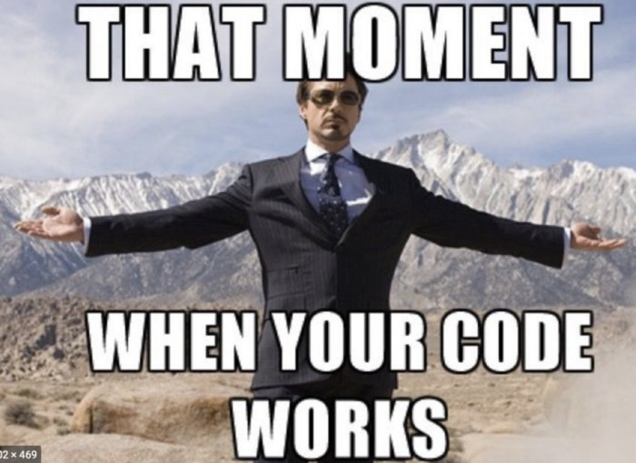

# Bravo Challenge

We solved the challenge of obtaining quotes for Fiduciary and Crypto coins, using 2 API's

- **Coinmarketcap**
- **Data fixer io**

Both provide a "Free" plan with real-time updates, with limited requests / day. As this is a challenge, it was programmed to obtain data updates every 2 hours. All data is saved in a cloud database, which in production will be used for quotation prediction. Quality USD based quotes were not found, **Data Fixer io** provides EUR based data but we convert this data to USD base before saving to the database.

The api's charge per requisition and part of the challenge was to be able to handle 1000 requisitions per minute, we saved the data of the currencies in the bank and provided the requisitions with the last quotation obtained, and in a future Feature the functionality of Currency History.

In the bank that is in the cloud, we have already registered the base coins of the challenge. <br>
To run the unit tests, you must run the script to register them

### EndPoints :

- Registration of new currencies <br>
  method: PUT => **_/update?add=LTH_**
- Coin removal <br>
  method: DELETE => **_/update?add=LTH_**

### Instructions

- In your shell. Download the repostorio:

```
git clone https://github.com/AurelioMarquesVulcao/challenge-bravo.git
```

- Enter the folder

```
cd challenge-bravo
```

- Turn on the application

```
docker-compose up -d
```

<h2> Everything is working!</h2>

<p align="center">
  
</p>

<br><br>

### Unitary tests

It will connect to the local bank started when docking UP

- Enter the folder

```
  cd app
```

- Install the dependencies

```
npm i
```

- Connect the application outside the docker

```
node services/getCoins/index.js
node server.js
```

- Run the unit test

```
npm test
```

- Make requests at Postman

**_http://localhost:1234/coin/?from=BTC&to=USD&amount=10_** <br>

**_http://localhost:1234/update?add=LTH_** <br>

**_http://localhost:1234/update?add=LTH_**

### Final considerations

I made the .env files available in order to facilitate the configurations. but we have a templete .env file as well. <br>
In the docker we use pm2 so that if the application crashes it is restarted. <br> <br>
May the force be with you Padwan

<p align="center">
  
</p>
