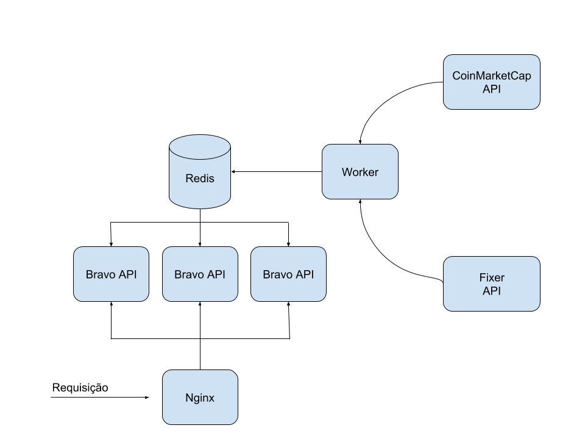
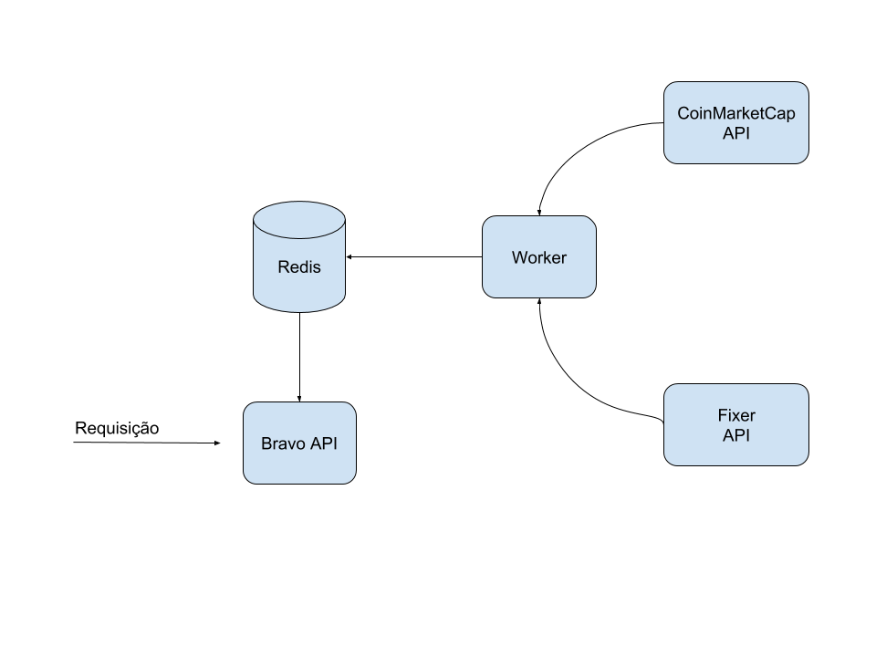

#  Desafio Bravo

## Arquitetura
APIs utilizadas para consulta de cotação:
- [Fixer](https://fixer.io/)
- [CoinMarketCap](https://coinmarketcap.com/api/)

Tecnologias utilizadas no desenvolvimento:
- Docker
- Golang
- Redis

Para suportar uma grande quantidade de requisições simultâneas a idéia foi cachear as informações de cotação em uma banco de dados em memória, no caso, um Redis.

Um worker é responsável por buscar as cotações nas APIs e atualizar de tempos em tempos os valores no banco de dados, deixando a API com a única função de buscar o dado e processar a requisição.

Para o deploy da API foram propostas duas abordagens, explicadas a seguir.

#### Com Nginx como proxy

O Nginx oferece muitos recursos de segurança e disponibilidade. A idéia de utilizar o Nginx como load balancer tem dois propósitos principais:
- Segurança: Estabelecer uma conexão segura entre os clientes e o servidor Nginx que repassa a requisição para os nós das aplicação.
- Disponibilidade: Manter mais de um nó de aplicação é interessante pois caso uma fique fora do ar, não acarretaria em falha para o usuário.

<p align="center">
  
</p>

A performance utilizando Nginx, no entanto, não atingiu o que o desafio requisitava (1000 requisições/s).

#### Sem Nginx

Sem o Nginx, uma única instancia da API é acessada diretamente, conforme mostra a figura abaixo:
<p align="center">
  
</p>

## Operação

#### Variáveis de ambiente
**FIXER_ENDPOINT**: endereço da API do Fixer
**FIXER_ACCESS_KEY**: chave de acesso a API do Fixer
**COINMARKET_ACCESS_KEY**: chave de acesso a API do CoinMarketCap
**COINMARKET_ENDPOINT**: endereço do CoinMarketCap
**CURRENCY_SYMBOLS**: lista de símbolos de moedas que serão buscadas na API de cotação, separadas por vírgula. Ex: "BRL,USD"
**CRYPTO_CURRENCY_SYMBOLS**: lista de símbolos de criptomoedas que serão buscadas na API de cotação, separadas por vírgula. Ex: "BTC,ETH"
**DB_HASH**: nome do hashset do redis
**DB_PORT**: porta do redis
**DB_ADDRESS**: endereço do redis
**ALLOW_ORIGINS**: esta variável pode ser definida caso a API seja utilizada por um sistema específico. Caso seja aberta, recomenda-se defini-la como "\*"
**API_PORT**: porta onde a API irá rodar
**REFRESH_INTERVAL**: intervalo de tempo para atualizar a cotação de moedas


**Obs:** Para que os avaliadores possam rodar o programa sem nenhum problema um arquivo app.env foi disponibilizado com estas variáveis definidas. Em um cenário real este arquivo não existiria em hipótese alguma.

#### Iniciando a aplicação
Para iniciar o sistema, clone este repositório:
```bash
git clone https://github.com/vitoriario2/challenge-bravo
```

Rode o seguinte comando a partir da raiz do projeto:
```bash
make install
```

Os containers poderão ser visualizados da seguinte forma:

```bash
$ docker ps

CONTAINER ID  IMAGE               COMMAND                  CREATED           STATUS          PORTS                    NAMES

d954bd5f0503  deployments_api     "go run cmd/api/main…"   5 seconds ago     Up 3 seconds    0.0.0.0:8083->8083/tcp   api

243c155c3df6  deployments_worker  "go run cmd/worker/m…"   6 seconds ago     Up 4 seconds                             deployments_worker_1

f8bf3f6058ea  redis               "docker-entrypoint.s…"   7 seconds ago     Up 5 seconds    6379/tcp                 redis_db
```

Neste ponto, a API já estará pronta para receber requisições na porta 8083.

Caso queira iniciar a aplicação com Nginx, rode o comando:

```bash
make install-loadbalancer
```

Neste caso, a API poderá receber requisições seguras na porta 3000 e inseguras na porta 3001.

## Interoperabilidade


### (GET) /healthcheck

#### Descrição
verifica o status da API

#### Resposta
Em caso de sucesso a API irá retornar uma simples resposta em texto claro "OK" com status code 200.

Qualquer retorno diferente do especificado significa que a API não está funcionando corretamente.

#### Exemplo
```bash
$ curl 'localhost:8083/healthcheck' -i

HTTP/1.1 200 OK
Access-Control-Allow-Origin: *
Content-Type: text/plain; charset=UTF-8
Vary: Origin
Date: Fri, 05 Apr 2019 15:34:23 GMT
Content-Length: 2

OK
```


### (GET) /convert

#### Descrição
Converte uma determinada quantia de uma moeda para outra

#### Parâmetros
Os seguintes parâmetros devem ser passados como parâmetros da url:
- **amount** - float: quantia que se deseja converter
- **from** - string: símbolo da moeda de origem
- **to** - string: símbolo da moeda de destino

#### Resposta

Em caso de sucesso a API retornará um JSON no seguinte formato com status code 200:
```json
{
	"success": true,
	"result": 123.45
}
```

Caso algum erro tenha ocorrido uma resposta JSON também será retornada com o status code 400:
```json
{
	"success": false,
	"message": "error on getting currency quotes"
}
```

As possíveis mensagens de erro são:
- **error on getting currency quotes**: Erro ao obter informações do banco de dados
- **currency symbol not found**: O símbolo passado não existe na base de dados


#### Exemplo
```bash
$ curl 'localhost:8083/convert?amount=1&from=BRL&to=ETH' -i

HTTP/1.1 200 OK
Access-Control-Allow-Origin: *
Content-Type: application/json; charset=UTF-8
Vary: Origin
Date: Fri, 05 Apr 2019 15:35:19 GMT
Content-Length: 32

{"result":33.67,"success":true}
```

## Benchmarking

Para os testes de performance foram utilizadas as ferramentas de benchmarking *ab* e *wrk*:

Utilizando o ab, com 100 conexões simultâneas, foi possível responder a 1000 requisições em 0.551s, conforme pode-se observar abaixo:

```shell
$ ab -n 1000 -c 100 'http://localhost:8083/convert?amount=123&from=BRL&to=BTC'
This is ApacheBench, Version 2.3 <$Revision: 1757674 $>
Copyright 1996 Adam Twiss, Zeus Technology Ltd, http://www.zeustech.net/
Licensed to The Apache Software Foundation, http://www.apache.org/


Benchmarking localhost (be patient)
Completed 100 requests
Completed 200 requests
Completed 300 requests
Completed 400 requests
Completed 500 requests
Completed 600 requests
Completed 700 requests
Completed 800 requests
Completed 900 requests
Completed 1000 requests
Finished 1000 requests

Server Software:
Server Hostname:  localhost
Server Port:  8083

Document Path:  /convert?amount=123&from=BRL&to=BTC
Document Length:  36 bytes


Concurrency Level:  100
Time taken for tests: 0.551 seconds
Complete requests:  1000
Failed requests:  0
Total transferred:  205000 bytes
HTML transferred: 36000 bytes
Requests per second:  1813.50 [#/sec] (mean)
Time per request: 55.142 [ms] (mean)
Time per request: 0.551 [ms] (mean, across all concurrent requests)
Transfer rate:  363.05 [Kbytes/sec] received


Connection Times (ms)
min  mean[+/-sd] median max
Connect:  3 20 9.7 22  43
Processing: 3 33  11.5 30  69
Waiting:  2 21  11.5 19  56
Total: 20 53 9.0 52  81

Percentage of the requests served within a certain time (ms)
50% 52
66% 56
75% 59
80% 61
90% 64
95% 68
98% 74
99% 75
100% 81 (longest request)
```

Com o wrk, foi possível responder a 4454 requisições com sucesso em 1 segundo mantendo 300 conexões abertas:

```shell
$ wrk -c 300 -d 1s 'http://localhost:8083/convert?amount=123&from=BRL&to=BTC'
Running 1s test @ http://localhost:8083/convert?amount=123&from=BRL&to=BTC
  2 threads and 300 connections
  Thread Stats Avg  Stdev Max +/- Stdev
    Latency  63.14ms 26.05ms 140.60ms 64.28%
    Req/Sec 2.19k 0.99k  4.39k  70.00%
  4454 requests in 1.08s, 0.87MB read
Requests/sec: 4138.16
Transfer/sec:  828.44KB
```


<p align="center">
  
</p>
