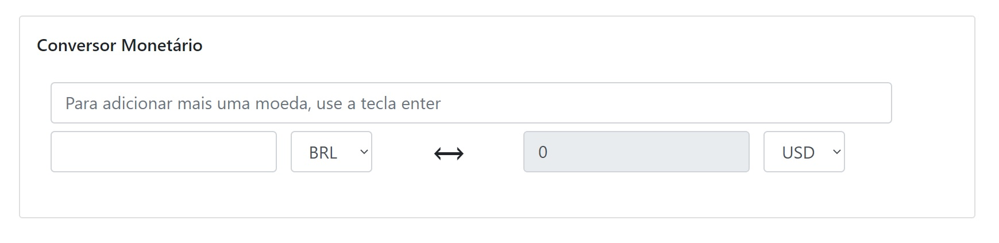

<!-- PROJECT LOGO -->
<br />
<p align="center">
  <a href="https://github.com/othneildrew/Best-README-Template">
    
  </a>

  <h3 align="center">Hurb Challenge</h3>

  <p align="center">
    API de conversão monetária.
    <br />
  </p>
</p>

## Autor
Flávio Roberto Leite de Sousa Junior

## Introdução 
Construa uma API, que responda JSON, para conversão monetária. Ela deve ter uma moeda de lastro (USD) e fazer conversões entre diferentes moedas com cotações de verdade e atuais.

### Interface:


## Instalação

```
No terminal, só digitar a sequencia abaixo, lembrando que a `porta do localhost é: 3000`
```
npm install
```
Continuando no terminal, para rodar a API seria:
```
npm start
```
## Tecnologias Utilizadas 

* React
* Boostrap 
* NodeJs
* Trazendo as informações de cotação da API: Crypto Compare