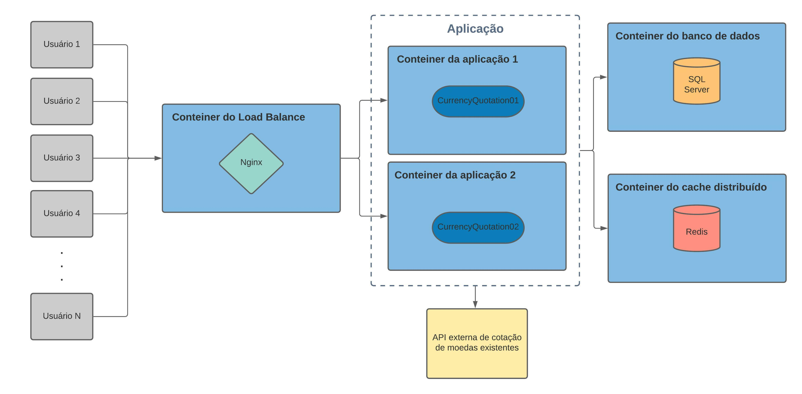
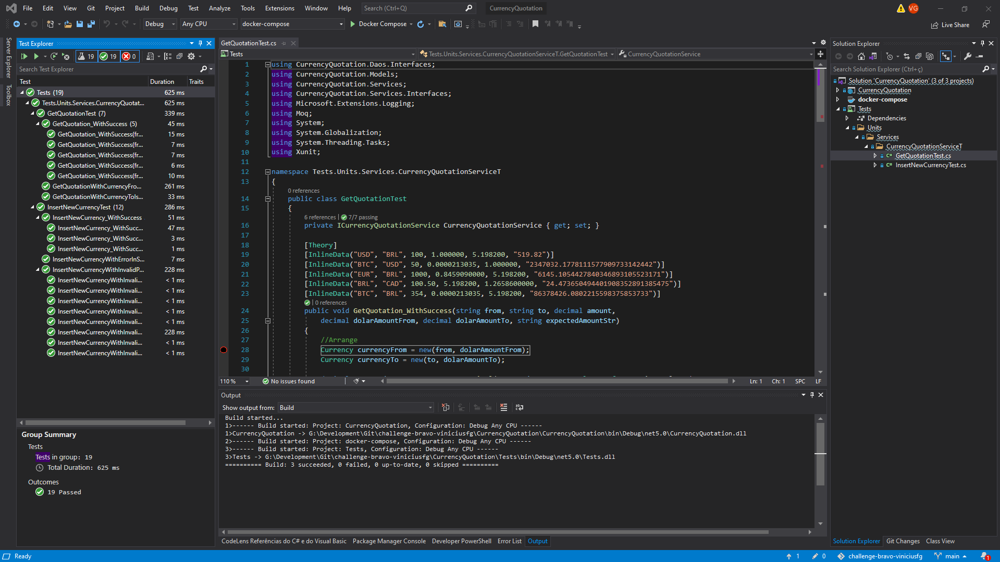

#  Desafio Bravo


## Pré-requisitos

Para conseguir rodar a aplicação na sua máquina você ter instalado na sua máquina os seguintos softwares:
- Docker - Para rodar a aplicação em conteineres (https://www.docker.com/)
- K6 - Para executar o teste de estresse (https://k6.io/)
- (Opcional) Postman - Usado para fazer requisições a api em caso de testes (https://www.postman.com/)

## Arquitetura

### Tecnologias utilizadas:
- **C# (.Net Core 5)** - Escolhi essa linguagem por possuir maior domínio e por ser uma linguagem muito robusta e performática, possui também uma boa documentação, atualizações recorrentes e uma grande comunidade. 
- **SQL Server** - Esse banco foi escolhido por ser uma opção simples pro que é necessário e por eu possuir maior experiência com o mesmo.
- **Redis** - Foi escolhido para fazer cache dos dados e distribuí-los entre as instências da aplicação permitindo maior escalabilidade da API.
- **Nginx** - Foi usado para criar um load balance, pois sua configuração básica é simples. Ele nos permite diminuir a carga de requisições na aplicação dividindo entre as instâncias, conseguindo manter a API em funcionamento no caso de uma das intâncias ficar fora do ar. 
- **Docker** - Foi Escolhido para permitir que a aplicação seja executada de forma isolada, evitando ter que ficar instalando e configurando cada tecnologia.

Foi projetada uma arquitetura para essa API para que pudesse ser executada independente do sistema operacional e de forma que não necessitasse de muitas configurações. Para isso, utilizamos o docker para gerar conteineres de acordo com as imagens necessárias para a execução da aplicação. A aplicação conta com um conteiner de banco de dados (SQL Server), um com o cache de dados distribuído (Redis), dois conteineres com a aplicação e um conteiner com o load balance (Nginx).

<p align="center">
  
</p>

Foi utilizado o cache com Redis para poder ganhar performance nas repostas das requisições e para poder compartilhar as informações entre as possíveis instâncias da aplicação que podemos executar. O Redis é um banco de dados NoSql de chave/valor. Ele roda em memória, por conta disso o acesso de escrita e leitura dele é muito mais rápido do que escrever no disco como o banco de dados relacional SQL Server que usamos para manter os dados das moedas guardados.

A aplicação possui um load balance com Nginx que serve como um proxy que recebe as requisições dos diversos usuários e vai repassando para as instâncias da aplicação de acordo com a quantidade de conexões que cada um tem no momento dividindo a carga entre eles.

Para manter as moedas existentes atualizadas a API possui um serviço hospedado (HostedService) que é executado a cada 1 hora, podendo ser alterado para o tempo que seja necessário. Esse serviço consume a API Open Exchange Rates (https://openexchangerates.org/) para conseguir o valor das contações das moedas reais. Ela foi escolhida por possuir uma grande variedade de moedas incluindo as criptomoedas, no plano gratuito consegue fazer 1000 requisições no mês e ela utiliza como base o dolar.

## Instruções para executar a aplicação

Para executar a aplicação é necessário que abra o cmd e entre na pasta raíz da solução CurrencyQuontation e dentro dela deve-se executar o comando `docker-compose up -d`. Esse comando irá criar os conteineres de acordo com as imagens configuradas, se não existir na máquina elas serão baixadas na hora. Após fazer isso podemos ter uma visualização dos endpoints que a Currency API fornece pelo link http://localhost:5000/swagger/index.html. Isso é possível porque foi instalada uma biblioteca chamada Swagger que nos fornece uma documentação da nossa API, facilitando para quem for consumi-la quais endpoints nós temos e como devemos usa-los. É possível até mesmo realizar testes por essa UI.

<p align="center">
  
</p>

Caso queria, também adicionei o json `currency_api.postman_collection.json` que pode ser importado no Postman com todas as requisições prontas para serem usadas. 


## Documentação da API


### Endpoint de conversão da moeda

`GET /api/Currencies/convert`

Converte o valor de uma moeda para outra. A Api utiliza o tipo decimal que no .Net significa um tipo primitivo de ponto flutuante com alta precisão, sendo ideal para valores monetários.

Ex: `http://localhost:5000/api/Currencies/convert?from=BTC&to=USD&amount=50`

- Em caso de sucesso ele irá retornar a conversão de forma bem precisa. Ex: 2264033.8971155076133799875252
- Em caso de não encontrar uma das moedas passadas, irá retornar erro 500 e exibir a mensagem "A moeda XPTO ou a moeda XPTO2 não foi encontrada"

### Endpoint que retorna todas as moedas

`GET /api/Currencies`

Retorna todas as moedas que estão registradas na base

Exemplo de retorno de sucesso:
```
[{"Id":1,"Name":"AED","DolarAmount":3.67296,"CreationDate":"2021-09-11T23:56:20.3193625+00:00","LastUpdate":"2021-09-11T23:56:20.3193625+00:00"},{"Id":2,"Name":"NPR","DolarAmount":117.469115,"CreationDate":"2021-09-11T23:56:20.4350083+00:00","LastUpdate":"2021-09-11T23:56:20.4350083+00:00"},{"Id":3,"Name":"NZD","DolarAmount":1.405778,"CreationDate":"2021-09-11T23:56:20.4350281+00:00","LastUpdate":"2021-09-11T23:56:20.4350281+00:00"},{"Id":4,"Name":"OMR","DolarAmount":0.385029,"CreationDate":"2021-09-11T23:56:20.4350476+00:00","LastUpdate":"2021-09-11T23:56:20.4350476+00:00"},{"Id":5,"Name":"PAB","DolarAmount":1,"CreationDate":"2021-09-11T23:56:20.4350801+00:00","LastUpdate":"2021-09-11T23:56:20.4350801+00:00"},{"Id":6,"Name":"PEN","DolarAmount":4.104062,"CreationDate":"2021-09-11T23:56:20.4351011+00:00","LastUpdate":"2021-09-11T23:56:20.4351011+00:00"}]
```
- Em caso de falha irá retornar erro 500 e a mensagem "Erro ao retornar todas as moedas".

### Endpoint que insere uma nova moeda

`POST /api/Currencies`

Insere uma nova moeda a partir de um nome, uma quantia e uma base de cotação (Opcional). Tendo a base como valor default o dolar caso não seja preenchida.

Ex de body:
```
{
    "Name": "XPTO",
    "Amount": "100",
    "BaseQuotation": "BRL"
}
```
ou

```
{
    "Name": "XPTO",
    "Amount": "100"
}
```
Neste segundo caso ele irá colocar como base o dolar. Na base de dados a cotação é salva sempre em dolar então caso seja passado uma base diferente é feita a conversão antes.

- Em caso de sucesso ele retornará a mensagem "A moeda XPTO foi criada com sucesso".
- Em caso de falha será retornado erro 400 bad request com a mensagem "Erro ao criar a moeda XPTO"

### Endpoint que atualiza uma moeda

`PUT /api/Currencies/{name}`

Atualizar o valor de cotação de uma moeda existente na base. É passado via query o nome da moeda que se deseja alterar e no body a quantia nova em dolar.

Ex: http://localhost:5000/api/Currencies/XPTO

```
{
    "dolarAmount": 500
}
```
- Em caso de sucesso ele retornará a mensagem "Moeda atualizada com sucesso".
- Caso ele não encontre a moeda ele irá retornar o erro 404 Not Found e a mensagem "A moeda XPTO não foi encontrada na base".
- Caso aconteça qualquer outro erro durante a operação irá retornar o erro 500 e a mensage "Erro ao atualizar a moeda XPTO".

### Endpoint que exclui uma moeda

`DELETE /api/Currencies/{name}`

Remove uma moeda existente na base de acordo com nome passado via query

Ex: http://localhost:5000/api/Currencies/XPTO

- Em caso de sucesso ele retornará a mensagem "Moeda deletada com sucesso".
- Caso ele não encontre a moeda ele irá retornar o erro 404 Not Found e a mensagem "A moeda XPTO não foi encontrada na base".
- Caso aconteça qualquer outro erro durante a operação irá retornar o erro 500 e a mensage "Erro ao deletar a moeda XPTO".

## Testes

### Testes Unitários

Para realizar os testes unitários eu utilizei a bibliotece xUnit que já vem no C#.

<p align="center">
  
</p>

### Teste de estresse

Para realizar o teste de estresse utilizei a ferramenta chamada K6 pela facilicadade de configuração e execução. Para executar o teste deve-se entrar na pasta CurrencyQuotation, abrir o cmd e executar o arquivo script.js com o comando `k6 run script.js`. O teste será iniciado e ele começará a mandar várias requisições de conversão para a API. Configurei o script de teste para criar 3000 VUs (máquinas) para ficarem mandando requisições para a API durante 30s. Ele me retornou as seguintes estatíticas de resultado:

```
scenarios: (100.00%) 1 scenario, 3000 max VUs, 1m0s max duration (incl. graceful stop):
     * default: 3000 looping VUs for 30s (gracefulStop: 30s)

running (0m31.2s), 0000/3000 VUs, 82465 complete and 0 interrupted iterations
default ✓ [======================================] 3000 VUs  30s

     data_received..................: 18 MB 561 kB/s
     data_sent......................: 11 MB 350 kB/s
     http_req_blocked...............: avg=28.9ms   min=0s     med=0s      max=2.02s    p(90)=0s       p(95)=506.29µs
     http_req_connecting............: avg=28.85ms  min=0s     med=0s      max=2.02s    p(90)=0s       p(95)=0s
     http_req_duration..............: avg=74.27ms  min=2.63ms med=55.74ms max=454.77ms p(90)=158.45ms p(95)=197.24ms
       { expected_response:true }...: avg=74.27ms  min=2.63ms med=55.74ms max=454.77ms p(90)=158.45ms p(95)=197.24ms
     http_req_failed................: 0.00% ✓ 0           ✗ 82465
     http_req_receiving.............: avg=58.44µs  min=0s     med=0s      max=15.04ms  p(90)=0s       p(95)=526µs
     http_req_sending...............: avg=169.63µs min=0s     med=0s      max=118.35ms p(90)=0s       p(95)=0s
     http_req_tls_handshaking.......: avg=0s       min=0s     med=0s      max=0s       p(90)=0s       p(95)=0s
     http_req_waiting...............: avg=74.04ms  min=2.14ms med=55.65ms max=454.77ms p(90)=157.66ms p(95)=196.41ms
     http_reqs......................: 82465 2644.199512/s
     iteration_duration.............: avg=1.1s     min=1s     med=1.05s   max=3.04s    p(90)=1.17s    p(95)=1.24s
     iterations.....................: 82465 2644.199512/s
     vus............................: 295   min=295       max=3000
     vus_max........................: 3000  min=3000      max=3000
```

**Como podemos ver acima foram respondidas 82.465 requisições com uma média de 2.644 por segundo. Mantendo como média de duração em 74.27ms e em p(95) com 197.24ms.**

## Melhorias futuras

- Pode se pensar em configurar a aplicação para escalar de acordo com a necessidade. Ao invés de se criar uma quantidade de instâncias fixas, subir uma nova instância quando precisar.
- Aumentar a quantidade de testes unitários para garantir que tudo está certo e melhorando a manutenibilidade do código
- Fazer análises do código com o Sonar para garantir a qualidade e a segurança da API.
- Criação de um healthCheck que pode ser usado em ferramentas de monitoramento de disponibilidade/performance.


