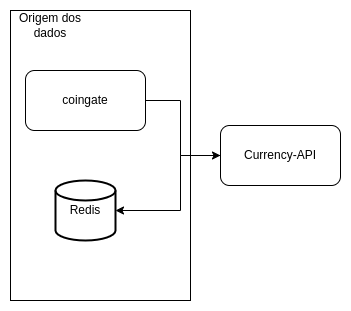
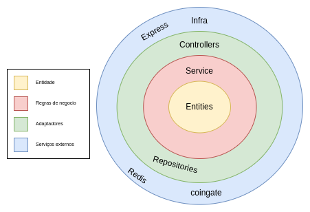
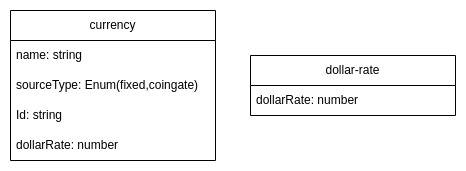
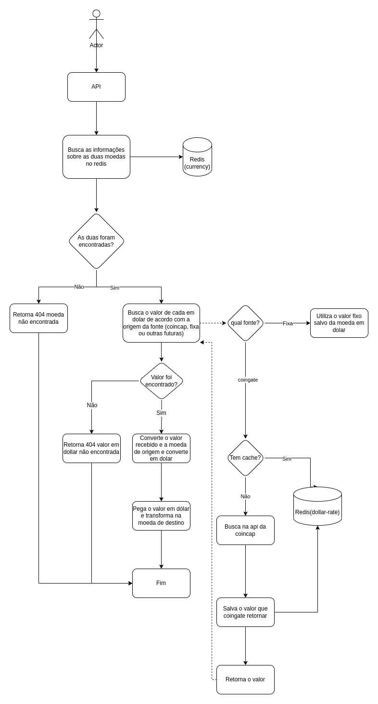
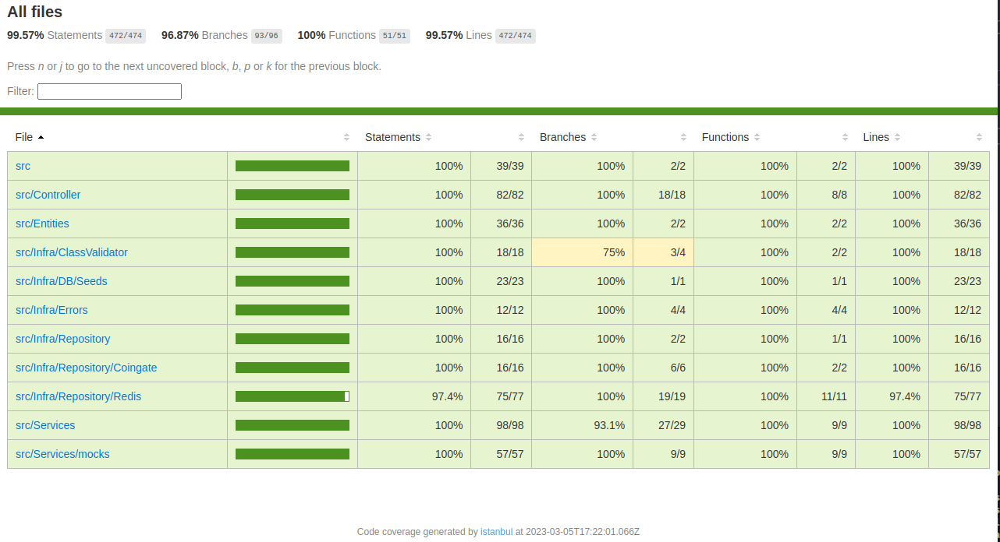
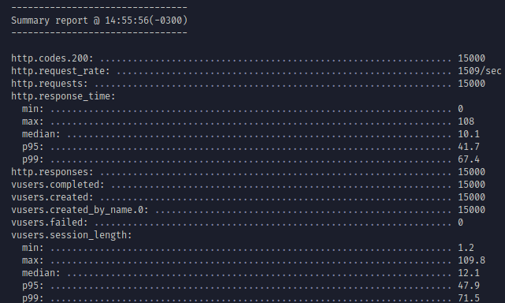

#  Bravo Challenge

# Menu
- [Como rodar o projeto?](#como-rodar-o-projeto?)
    - [Pre-requisito](#Pre-requisito)
    - [Comandos para instalar os pacotes](#Comandos-para-intalar-os-pacotes)
    - [Comandos para rodar em dev](#Comandos-para-rodar-em-dev)
    - [Comandos para rodar em Prod](#Comandos-para-rodar-em-prod)
- [Endpoints](#Endpoints)
    - [Conversão da moeda(GET)](#Conversão-da-moeda(GET))
    - [Adição de moeda(POST)](#Adição-de-moeda(POST))
    - [Remoção de moeda(DELETE)](#Remoção-de-moeda(DELETE))
- [O Problema](#O-Problema)
- [A Solução](#A-Solução)
    - [Escolhas técnicas](#Escolha-tecnicas)
    - [Arquitetura do projeto](#Arquitetura-do-projeto)
    - [Clean Architecture Layers](#Clean-Architecture-Layers)
    - [As Entidades](#As-Entidades)
    - [Fluxograma da conversão](#Fluxograma-da-conversão)
    - [Testes](#Testes)
    - [Teste de estresse](#Teste-de-estresse)

# Como rodar o projeto?
## Pre-requisito
E preciso ter o Redis rodando antes de iniciar o projeto.

Podemos rodar com o comando do docker-compose, na pasta raiz do projeto:

```sh
docker-compose up redis
```
## Comandos para instalar os pacotes
Instalar os pacotes:
```sh
npm i
```
## Comandos para rodar em dev
Rodar:
```sh
npm run dev
```
## Comandos para rodar em prod
Build:
```sh
npm run build
```
Rodar:
```sh
npm run start
```
# Endpoints
## Conversão da moeda(GET)
Utiliza esse endpoint com método GET para obter a conversão de um valor de uma moeda para outra, exemplo: Saber qual o valor em Reais de 10 BTC.

Na query manda essas 3 propriedade, todas são obrigatórias:
- from: Moeda de origem, no caso BTC.
- to: Moeda final, no caso BRL.
- amount: Quantidade da moeda de origem, no caso 10.

```
(GET) http://localhost:3000/currency?from=BTC&to=BRL&amount=10
```

```sh
curl --location 'http://localhost:3000/currency?from=BTC&to=BRL&amount=10
```

## Adição de moeda(POST)
Esse endpoint tem como finalidade adicionar uma moeda além das já cadastrada, exemplo: Adicionar a moeda HURB com o valor de 1 HURB = 0,5 USD, sendo um valor fixo.

A moeda tem 4 propriedade:
- id: seria o nome/simbolo da moeda, precisa ser único, é obrigatório (HURB)(String)
- sourceType: o tipo da origem é obrigatório e pode ter um desses desses valores:
    - fixed: é uma moeda que cadastramos com o valor fixo em dolar americano(USD), precisando preencher o campo "dollarRate".
    - coingate: Utiliza esse tipo quando queremos que o valor da moeda em USD seja buscado no coingate(API Externa) dinamicamente, com isso, não precisando preencher o campo "dollarRate".
- dollarRate: Valor da moeda em USD (0.5).
- name: O nome da moeda (Hurb coin).

```
(POST) http://localhost:3000/currency
```

```sh
curl --location 'http://localhost:3000/currency' \
--header 'Content-Type: application/json' \
--data '{
    "id": "HURB",
    "sourceType": "fixed",
    "dollarRate": 0.5,
    "name": "Hurb coin"
}'
```
## Remoção de moeda(DELETE)
Remover uma moeda criada, basta adicionar o ID da moeda no params: exemplo remover HURB.

```
(DELETE) http://localhost:3000/currency/HURB
```

```sh
curl --location --request DELETE 'http://localhost:3000/currency/HURB'
```
# O Problema
- Adicionar um endpoint para fazer a conversar de um valor em uma moeda de origem para outra final, utilizando dólar como moeda de lastro e utilizar, quando necessário, uma API externa para ter o valor atualizado da moeda em USD.
- Ter um endpoint para adicionar novas moeda que não estão previamente cadastradas.
- Ter essas moedas previamente cadastradas:
    -   USD
    -   BRL
    -   EUR
    -   BTC
    -   ETH
- Ter um endpoint de remoção de moedas cadastrada.
- A API deve suportar mais de 1000 requestes por segundo.
- Ter Testes com uma boa taxa de cobertura
- Rodar em docker

# A Solução
## Escolhas técnicas
### Banco de dados:
Para tentar atingir a capacidade de 1000 req/seg optei por usar um banco de rápido acesso/leitura (chave-valor) como redis.

Tento em vista a simplicidade da estrutura de dados do projeto não seria necessário ter dados com relacionamento, evitando o uso de um banco SQL como Postgres, sendo o Redis um banco não relacional chave-valor.

### Linguagem
Tenho Javascript/Nodejs como minha stack principal e acredito que o mesmo se encaixa para esse projeto por ser um projeto pequeno com alta escalabilidade, o que conseguimos com certa facilidade com o nodejs.
### Framework web
Ao utilizar express busquei um projeto mais enxuto, um menor consumo de RAM, com menos coisas "já pronta" e um framework menos "opinado", assim tendo mais liberdade de escolher os melhores padrão de projeto para um sistema de pequeno porte como esse.

### Linters e typescript
Usando o eslint + pritter + typescript busco ter uma melhor qualidade de código e ajuda em encontrar problemas mais cedo.

### Inversion of control
Como nesse projeto busco utilizar o conceito de inversão de controle, optei por utilizar o invesify, uma lib que facilita a gerenciar a inversão de controle.
## Arquitetura do projeto
Visão geral da comunicação do sistema:


## Clean Architecture Layers
Utilizando o padrão de camadas da arquitetura limpa busco alcançar essa abstração, onde as camadas mais externas são "detalhes" que mudam com mais frequência com evolução do projeto. Enquanto as internas são regras de negócio, mais abstratas, com menos dependência externas e alterações durante o desenvolvimento do projeto.


## As Entidades
As duas principais estruturas de dados do sistema:


## Fluxograma da conversão
O ponto mais desafiador do projeto era criar um sistema de conversão utilizando uma api externa para pegar o valor da moeda em dólar e conseguir atingir os 1000 req/seg, com isso em mente busquei estabelecer alguns pontos, como, não depender 100% da api externa para ter esse dado, pois podia acabar tomando um bloqueio da mesma ou ela não responder na quantidade necessária por segundo.

Tendo isso em mente, optei por consultar a api poucas vezes e guardar em cache(Redis) esse valor, evitando várias requisições desnecessárias e diminuindo a duração da minha requisição.

Porém, da forma que foi desenvolvido, a primeira requisição do serviço pode demorar mais que o normal, pois o mesmo solicitará a API externa primeiro. Com o intuito de amenizar esse processo, assim que o sistema se inicia ele tenta busca o valor em dólar de todas as moedas cadastradas.

Segue o fluxograma de como é feita a conversão das moedas para entender melhor:

## Testes
Para os teste utilizei o jest como suite de teste, supertest para teste de integração(e2e) e redis-memory-server para criar um redis na memória para testar durante os teste de integração.

Por utilizar uma abordagem de Injeção de Dependências ganho mais facilidades com os teste unitários.

Como rodar os Testes:
```sh
npm run test
```
### Cobertura de Teste


## Teste de estresse

Utilizei o artillary para poder fazer esse teste, utilizando esse cenário de teste:

```yaml
config:
  target: "http://localhost:3000"
  phases:
    - duration: 10
      arrivalRate: 1500
scenarios:
  - flow:
    - get:
        url: "/currency?from=BRL&to=EUR&amount=500"
```
Comando:
```sh
npm run test:stress
```

### Resultado


Com esse resultado o sistema conseguiu atingir 1500 req/s com ótimas taxas de duração, não fui muito mais além desse valor por já ter atingindo o esperado. 