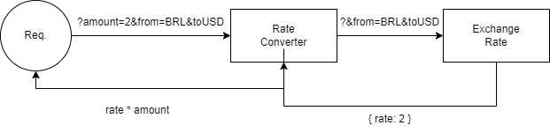
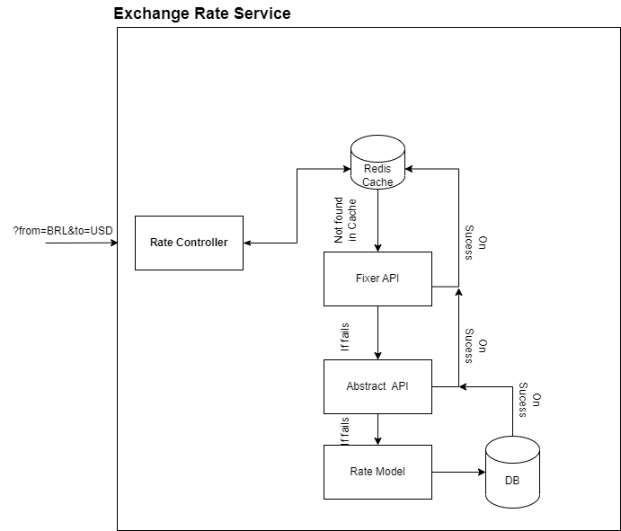

# Currency Conversion Service
The Currency Conversion Service is a combination of two main components: the Exchange Rate Service and the Rate Conversion Service. The Exchange Rate Service retrieves current exchange rates from a reliable source, while the Rate Conversion Service handles converting a given amount from one currency to another.


.

API Documentation is on [Postman](https://documenter.getpostman.com/view/7473147/2s935iskfh)

The idea of two differents services is to make easy to scale and build different products. For example, the exchange rate service could be exposed through an API Gateway and allow for only getting the rates, instead of the conversion. This idea can be extended to different use cases.

## Exchange Rate Service
The Exchange Rate Service, written in Rails, provides up-to-date exchange rates for various currencies. It obtains exchange rates from a reliable source, such as an API, and updates them regularly to ensure accuracy.


The service works in three stages:

* Tries to retrieve rates from (Fixer API)[https://fixer.io/]
* If Fixer API is unavailable or doesn't have the rates, it requests from (Abstract API)[https://app.abstractapi.com/]
* If both external APIs fail, it searches its own database, a Postgres database.

The service uses Redis cache to store the result. The flow and architecture of the Exchange Rate Service are illustrated in the following image:

.

For more information on the configuration of the Exchange Rate Service, refer to the[Exchange Rate README](exchange-rate/README.md)

Important to notice hera that the order is considering that external API will have most of the results, but it can be easily changed.

##  Rate Conversion Service
The Rate Conversion Service handles converting a given amount from one currency to another. The conversion is based on the exchange rates obtained from the Exchange Rate Service. To convert an amount, provide the following information:


* From currency: the currency to be converted from
* To currency: the currency to be converted to
* Amount: the amount to be converted
The rate conversion service will then return the converted amount.

## Running
To use the Currency Conversion Service, simply make a request to the Rate Conversion Service endpoint with the required information. The request should look like this:


```
curl --location --request GET 'localhost:8000/api/convert?amount=2&from=BRL&to=USD'
```

You can start everything by running `make dev`.

## Running tests

To run tests for both the Exchange Rate Service and the Rate Conversion Service, run `make test`. To test each service individually, run:

```
make test-exchange-rate
make test-rate-converter

```


## Possible improvements

Possible improvements include adding an API Gateway with authentication and network security configurations (such as DOS guard clauses). This solution is designed with scalability in mind, so it can be deployed in a Kubernetes environment within a Service Mesh scenario. For scalability purposes, requests could be handled by Kafka, although some latency may be introduced. gRPC could also be an option, but REST and Kafka have an advantage in terms of interoperability and development effort.

#  Bravo Challenge

[[English](README.md) | [Portuguese](README.pt.md)]

Build an API, which responds to JSON, for currency conversion. It must have a backing currency (USD) and make conversions between different currencies with **real and live values**.

The API must convert between the following currencies:

-   USD
-   BRL
-   EUR
-   BTC
-   ETH

Other coins could be added as usage.

Ex: USD to BRL, USD to BTC, ETH to BRL, etc...

The request must receive as parameters: The source currency, the amount to be converted and the final currency.

Ex: `?from=BTC&to=EUR&amount=123.45`

Also build an endpoint to add and remove API supported currencies using HTTP verbs.

The API must support conversion between FIAT, crypto and fictitious. Example: BRL->HURB, HURB->ETH

"Currency is the means by which monetary transactions are effected." (Wikipedia, 2021).

Therefore, it is possible to imagine that new coins come into existence or cease to exist, it is also possible to imagine fictitious coins such as Dungeons & Dragons coins being used in these transactions, such as how much is a Gold Piece (Dungeons & Dragons) in Real or how much is the GTA$1 in Real.

Let's consider the PSN quote where GTA$1,250,000.00 cost R$83.50 we clearly have a relationship between the currencies, so it is possible to create a quote. (Playstation Store, 2021).

Ref:
Wikipedia [Institutional Website]. Available at: <https://pt.wikipedia.org/wiki/Currency>. Accessed on: 28 April 2021.
Playstation Store [Virtual Store]. Available at: <https://store.playstation.com/pt-br/product/UP1004-CUSA00419_00-GTAVCASHPACK000D>. Accessed on: 28 April 2021.

You can use any programming language for the challenge. Below is the list of languages ​​that we here at Hurb have more affinity:

-   JavaScript (NodeJS)
-   Python
-   Go
-   Ruby
-   C++
-   PHP

## Requirements

-   Fork this challenge and create your project (or workspace) using your version of that repository, as soon as you finish the challenge, submit a _pull request_.
    -   If you have any reason not to submit a _pull request_, create a private repository on Github, do every challenge on the **main** branch and don't forget to fill in the `pull-request.txt` file. As soon as you finish your development, add the user `automator-hurb` to your repository as a contributor and make it available for at least 30 days. **Do not add the `automator-hurb` until development is complete.**
    -   If you have any problem creating the private repository, at the end of the challenge fill in the file called `pull-request.txt`, compress the project folder - including the `.git` folder - and send it to us by email.
-   The code needs to run on macOS or Ubuntu (preferably as a Docker container)
-   To run your code, all you need to do is run the following commands:
    -   git clone \$your-fork
    -   cd \$your-fork
    -   command to install dependencies
    -   command to run the application
-   The API can be written with or without the help of _frameworks_
    -   If you choose to use a _framework_ that results in _boilerplate code_, mark in the README which piece of code was written by you. The more code you make, the more content we will have to rate.
-   The API needs to support a volume of 1000 requests per second in a stress test.
-   The API needs to include real and current quotes through integration with public currency quote APIs

## Evaluation criteria

-   **Organization of code**: Separation of modules, view and model, back-end and front-end
-   **Clarity**: Does the README explain briefly what the problem is and how can I run the application?
-   **Assertiveness**: Is the application doing what is expected? If something is missing, does the README explain why?
-   **Code readability** (including comments)
-   **Security**: Are there any clear vulnerabilities?
-   **Test coverage** (We don't expect full coverage)
-   **History of commits** (structure and quality)
-   **UX**: Is the interface user-friendly and self-explanatory? Is the API intuitive?
-   **Technical choices**: Is the choice of libraries, database, architecture, etc. the best choice for the application?

## Doubts

Any questions you may have, check the [_issues_](https://github.com/HurbCom/challenge-bravo/issues) to see if someone hasn't already and if you can't find your answer, open one yourself. new issue!

Godspeed! ;)

<p align="center">
  
</p>
