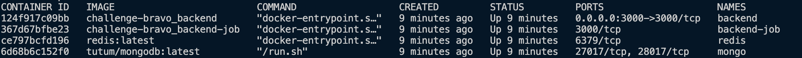

#  Desafio Bravo

A API de conversão pega suas informações do site https://br.investing.com/ através de um crawler. Utilizei um job em js para recuperar essas informações periodicamente.
Utilizei o redis para cachear as informações do site e fazer a api ser performática. 
Para salvar os dados das moedas fictícias, usei o mongodb.

Devido ao tempo de carregamento do site, para executar o primeiro request da api depois de subi-lá é preciso aguardar alguns segundos (em média 20 seg) para ela funcionar normalmente.

# INSTALAR E EXECUTAR

Para executar a aplicação, basta rodar o comando do docker-compose.

```
docker-compose -f docker-compose.yml up -d
```

Devem subir 4 containers:

<p align="center">
  
</p>

# TESTAR

Para testar a aplicação basta importar o arquivo challenge-bravo-collection na raiz para o seu postman, lá estão mapeadas as 5 rotas:

GET - api/coin

Query
```
    ticket:LUCY
```

DEL - api/coin

Query
```
    ticket:LUCY
```

POST - api/coin

Body
```
    {
        "ticket": "LUCY",
        "currency": 1000
    }
```

PATCH - api/coin

Body
```
    {
        "ticket": "LUCY",
        "currency": 8
    }
```

GET - api/exchange

Query
```
    from:BTC
    to:EUR
    amount:1
```

As moedas válidas para a api/exchange além das fictícias são: USD, EUR, BTC E ETH.
