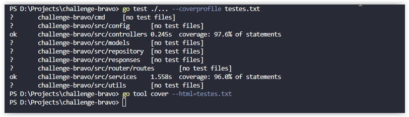
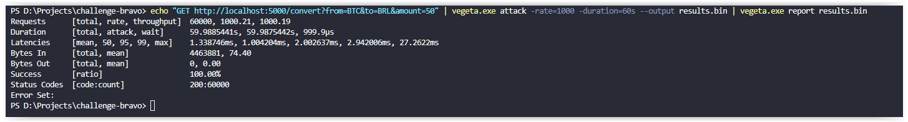

#  Bravo Challenge

## Funcionalidades da API 
-   Consultar todas as moedas cadastradas;
-   Criar uma nova Moeda;
-   Consultar uma Moeda pelo Nome;
-   Apagar uma Moeda pelo Nome;
-   Converter duas moedas;

## Funcionalidade extra solicitada
-   As moedas (USD, BRL, EUR, BTC, ETH) são cadastradas/atualizadas automaticamente a cada 30 segundos após o incio da api;

## Tecnologias utilizadas
- Linguagem GO
- Banco de Dados MongoDb
- Docker

## Pré requisitos para rodar o projeto
- É necessário ter instalado previamente o Docker, podendo baixá-lo através do link: https://www.docker.com/

## Como instalar e rodar o Projeto
- Para subir as imagens de BD e App, bastar rodar, na raiz do projeto, dentro do arquivo "challenge-bravo":
   
  <pre><code>docker-compose up</code></pre>
## Endpoints

-   Retorna todas as moedas cadastradas:
  <pre><code>curl http://localhost:5000/currency</code></pre>

-   Retorna uma moeda cadastrada pelo nome:
  <pre><code>curl http://localhost:5000/currency/USD</code></pre>

-   Adiciona a moeda "CAM", com a taxa de conversão igual a 100 (Taxa de Conversão calculada em relação ao dólar americano):
  <pre><code>curl --header "Content-Type: application/json" -d "{\"code\":\"CAM\", \"bid\":100" http://localhost:5000/currency</code></pre>

-   Remove uma moeda cadastrada pelo nome:
  <pre><code>curl -X DELETE http://localhost:5000/currency/CAM</code></pre>

-   Conversão entre duas moedas:
  <pre><code>curl "http://localhost:5000/convert?from=USD&to=BRL&amount=5"</code></pre>

## Api Externa   
  Foi utilizada a api "https://min-api.cryptocompare.com/data/" para a consulta e atualização das moedas descritas acima.

## Cobertura de Testes
  Realizei testes automatizados para os pacotes services e controllers, com cobertura de 96.0% para os services e 97.6% para os controllers
  #  

  Para executar os testes, acessar a pasta de Services e rodar, conforme necessidade:
    
    go test -v ./... --cover
      - Mostra os testes que passaram ou falharam com a porcentagem de cobertura.
  
    go test --coverprofile testes.txt
      - Gera o arquivo de cobertura para ser lido no próximo comando.

    go tool cover --html=testes.txt
      - Abre em um navegador, separado por cada arquivo testado, uma visibilidade de todas as linhas cobertas pelos testes e a porcentagem de cobertura de cada arquivo.

## Testes de stress - Vegeta
  Realizei o teste de stress na funcionalidade de maior complexidade da aplicação, Converter valores entre moedas. Todas as requisições foram atendidas com sucesso e rapidamente.

  Comando utilizado para o teste de estresse foi:
  <pre><code> echo "GET http://localhost:5000/convert?from=BTC&to=BRL&amount=50" | vegeta.exe attack -rate=1000 -duration=60s --output results.bin | vegeta.exe report results.bin </code></pre>

  O resultado se encontrar na raiz do projeto: results.bin
  Teste efetuado dia 25/01/2023 com o cronJob rodando simultaneamente a cada 30s.
  
  Segue o print do resultado:
  #  

## Oportunidades de Melhoria
  - Gerar os outros métodos REST (UPDATE currency) para a currency.
  
  - Criar um método para atualizar automaticamente as moedas que forem cadastradas no banco e que existirem na api externa.

  - Incluir autenticação para utilização da API.
 

  

