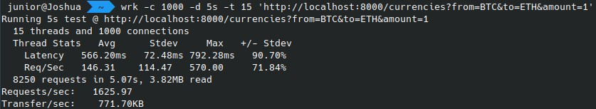

#  Hurb - Challenge Bravo

## Indíce
* [Sobre](#about)
* [Requisitos](#requirements)
* [Docker Setup](#docker-setup)
* [Setup](#setup)
* [Funcionamento](#work)
    * [Converter Moeda](#work-currency-convert)
    * [Login](#work-login)
    * [Adicionar Moeda](#work-currency-add)
    * [Remover Moeda](#work-currency-remove)
* [Comandos NPM](#npm-commands)
* [Estrutura do Projeto](#filesystem)
* [Endpoints](#endpoints)
* [Teste de Estresse](#stress-test)
* [Informações Adicionais](#details)

<a name="about"></a>
## Sobre
---
Este projeto foi criado através do desafio proposto pelo hurb, seu objetivo é fazer conversão monetária entre duas moedas.

Moedas iniciais suportadas:
- USD
- BRL
- EUR
- BTC
- ETH

<a name="requirements"></a>
## Requisitos
---
- Node 13 ou mais recente
- npm
- mongo
- [docker-compose](https://docs.docker.com/compose/install) (caso use container)

<a name="docker-setup"></a>
## Docker Setup
---

Suba o container:
```sh
npm run docker
```

Configure o banco:
```sh
docker-compose exec node npm run migrate
```

Configure o arquivo .env com base no .env.example (opcional).

<sub>Ao alterar o arquivo .env, será necessário reinicar a aplicação.</sub>
```sh
docker-compose restart node
```

A aplicação estará disponível no endereço: http://localhost:8000.

<a name="setup"></a>
## Setup
---
Crie e configure o arquivo .env com base no .env.example:
```sh
cp .env.example .env && nano .env
```

Instale as dependências:
```sh 
npm i
```

Configure o banco:
```sh
npm run migrate
```

Inicie a aplicação:
```sh
npm start
```

A aplicação estará disponível no endereço: http://localhost:8000.

<a name="work"></a>
## Funcionamento
---
<a name="work-currency-convert"></a>
### Converter Moeda
Requisição para realizar a conversão entre 2 moedas:
- **from**: Moeda de origem.
- **to**: Moeda para qual o valor será convertido.
- **amount**: Valor da moeda de origem que será convertido.
```sh
curl 'http://localhost:8000/currencies?from=USD&to=BRL&amount=30'
```

<a name="work-login"></a>
### Login
Requisição para obter um token de acesso que permite usar as rotas para adicionar e remover moedas:
- **username**: usuário cadastrado no banco (padrão do .env.example é: **admin**).
- **password**: senha do usuário (padrão do .env.example é: **HuRbCh4113ng3#bR4v0**).

<sub>OBS.: Se alguma dessas informações for mudada no .env, será necessário mudar na requisição também.</sub>
```sh
curl 'http://localhost:8000/login' -d 'username=admin&password=HuRbCh4113ng3#bR4v0'
```

<a name="work-currency-add"></a>
### Adicionar Moeda
Requisição para adicionar moeda:
- **currency**: Moeda a ser adicionada.
- **usd_value**: Valor da moeda equivalente a 1 dólar americano (USD).
- **{token}**: Token gerado no endpoint /login.
```sh
curl 'http://localhost:8000/currencies' -X 'POST' -d 'currency=CAD&usd_value=1.26' -H 'Authorization: Bearer {token}'
```

<a name="work-currency-remove"></a>
### Remover Moeda
Requisição para remover moeda:
- **{currency}**: Código da moeda a ser removida.
- **{token}**: Token gerado no endpoint /login.
```sh
curl 'http://localhost:8000/currencies/{currency}' -X 'DELETE' -H 'Authorization: Bearer {token}'
```

<a name="npm-commands"></a>
## Comandos NPM
---
Rodar testes:
```sh
npm test
```

Iniciar projeto:
```sh
npm start
```

Configurar/Limpar banco (com as taxas de câmbio atualizadas):
```sh
npm run migrate
```

Iniciar container:
```sh
npm run docker
```

<a name="filesystem"></a>
## Estrutura do Projeto
---
```
├── database - Arquivos de banco de dados.
│
├── src - Arquivos do sistema.
│   ├── controllers - Controladores do sistema.
│   ├── middlewares - Middlewares do sistema.
│   ├── models - Modelos do sistema.
│   ├── routes - Rotas do sistema.
│   └── services - Classes de serviços para auxiliar na lógica extra.
│
├── sync - Arquivos de sincronização.
|
├── tests - Testes do sistema.
│   ├── API - Testes dos endpoints da API.
│   └── Unit - Testes unitários com componentes do sistema.
```

<a name="endpoints"></a>
## Endpoints
---
```
GET /docs (HTML)
POST /login
GET /currencies
POST /currencies
DELETE /currencies/{currency}
```

<a name="stress-test"></a>
## Teste de Estresse
---


<a name="details"></a>
## Informações adicionais
---

#### A atualização das taxas de câmbio está acontecendo de hora em hora. Não é possível aumentar, pois a API utilizada para consulta é gratuita, e só disponibiliza 1000 requisições por mês. O cálculo feito foi: 1000/31 = 32 requisições por dia (arredondando pra baixo), então 24 requisições por dia seria um número seguro.

---

#### O sistema de autenticação está usando JWT (Json Web Token), os tokens gerados na rota /login tem um prazo de expiração de 5 horas por padrão.
---