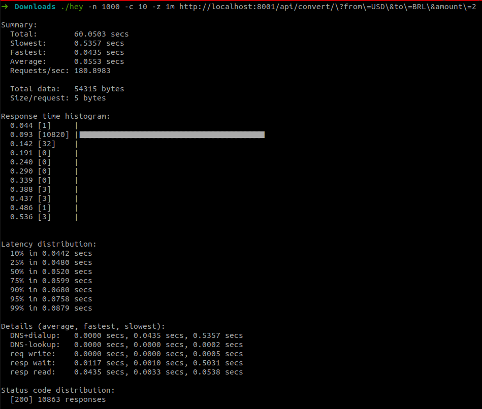
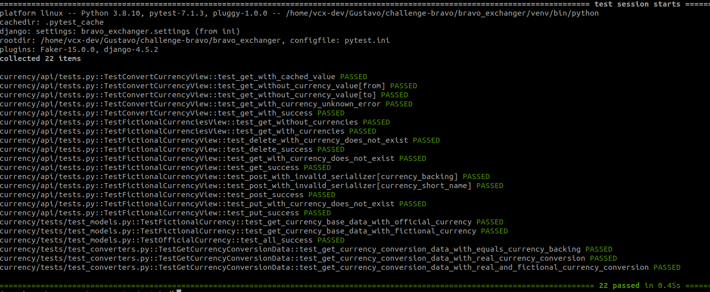

#  Bravo Challenge

### Serviços criados

Para este projeto dois serviços foram criados:
- API Rest para conversão de moedas reais ou fictícias com capacidade para criação, edição e remoção
de novas moedas.
- Aplicação front-end que utiliza os endpoints expostos pela API de conversão de moedas para
alimentar com dados uma interface fácil, simples e intuitiva.

#### API para conversão de moedas

Responsável por fazer conversões entre moedas (oficiais ou fictícias).

A API possui capacidade para converter valores entre moedas:

- fiduciárias
- crypto
- fictícias

Além disso, outras moedas fictícias podem ser adicionadas, removidas e editadas.

Endereço: [http://localhost:8001/api/](http://localhost:8001/api/)

#### Dashboard (Aplicação com front-end)

Esta aplicação tem como intuito principal apresentar para o usuário final uma página web para
converter de moedas e gerenciar moedas fictícias.

Principais funcionalidades:

- Interface para listagem de moedas fictícias
- Conversão de moedas através de um layout simples e intuitivo
- Formulário para adição e edição de moedas fictícias

Endereço: [http://localhost:8000/](http://localhost:8000/)

### Tecnologias

- Python 3.8.10
- Django 4.1.2
- Docker 20.10.7
- Docker Compose 1.26.0

- ##### API
  - Redis 4.3.4
  - Django Rest Framework 3.14.0
  - PostgeSQL

- ##### Dashboard (Aplicação com front-end)
  - HTML5
  - CSS
  - Javascript
  - Jquery 3.3.1
  - Bootstrap 5.1.3
  - sweetalert2

### Testes

#### Teste de carga

Para o teste de carga foi utilizado o [Hey](https://github.com/rakyll/hey).

> hey is a tiny program that sends some load to a web application.

Os seguintes resultados foram obtidos:

  

#### Testes unitários

Para os testes unitários foi utilizado o [Pytest](https://docs.pytest.org/en/7.1.x/).

  

### Endpoints

#####__convert/__
- __GET__: Retorna o valor da conversão entre duas moedas.
``
http://localhost:8001/api/convert/?amount=10&from=USD&to=BRL
``
#####__official-currencies/__
- __GET__: Retorna todas as moedas reais armazenadas.

``
http://localhost:8001/api/official-currencies/
``

#####__fictional-currencies/__
- __GET__: Retorna todas as moedas fictícias existentes no banco de dados.

``
http://localhost:8001/api/fictional-currencies/
``

#####__fictional-currency/__
- __POST__: Cria uma nova moeda fictícia.
``
http://localhost:8001/api/fictional-currency/{currency_short_name}/
``

#####__fictional-currency/{currency_short_name}/__
- __GET__: Retorna uma moeda fictícia.
- __PUT__: Atualiza os dados de uma moeda fictícia.
- __DELETE__: Remove uma moeda fictícia.

``
http://localhost:8001/api/fictional-currency/{currency_short_name}/
``

### Como utilizar

1. Ao rodar pela primeira vez

``
docker-compose up --build
``

2. Acessar a pasta bravo_exchanger e acessar o container challenge-bravo_backend_1

``
cd bravo_exchanger
``

``
docker exec -it challenge-bravo_backend_1 bash
``

3. Rodar migrações. Este comando irá executar as migrações do Django.
``
python manage.py migrate
``

__Tudo pronto!__

### Usabilidade

Ao executar os passos citados acima você poderá acessar a aplicação web através do endereço
[http://localhost:8000/](http://localhost:8000/). Todos os recursos da API estarão disponíveis para
uso dentro desta aplicação.

Em relação a criação de novas moedas fictícias, apenas moedas oficiais poderão ser utilizadas como
moeda de lastro. Esta regra de negócio tem como objetivo viabilizar a conversão de moedas fictícias
para reais (o contrário também é válido) ou a conversão entre duas moedas fictícias.

A cotação de moedas é feita externamente através da [Coinbase API](https://docs.cloud.coinbase.com/sign-in-with-coinbase/docs/api-exchange-rates). Para evitar um número excessivo de requisições sendo
feitas, foi decidido utilizar cache na operação de conversão de moedas.

Para o cache foi utilizado o [Redis](https://redis.io/), que possui ligação nativa com o Django.

No banco de dados foi utilizado PostgreSQL rodando em um container Docker.

Para facilitar a correção, a SECRET_KEY foi deixada exposta, podendo ser considerado isso uma falha
de segurança.
