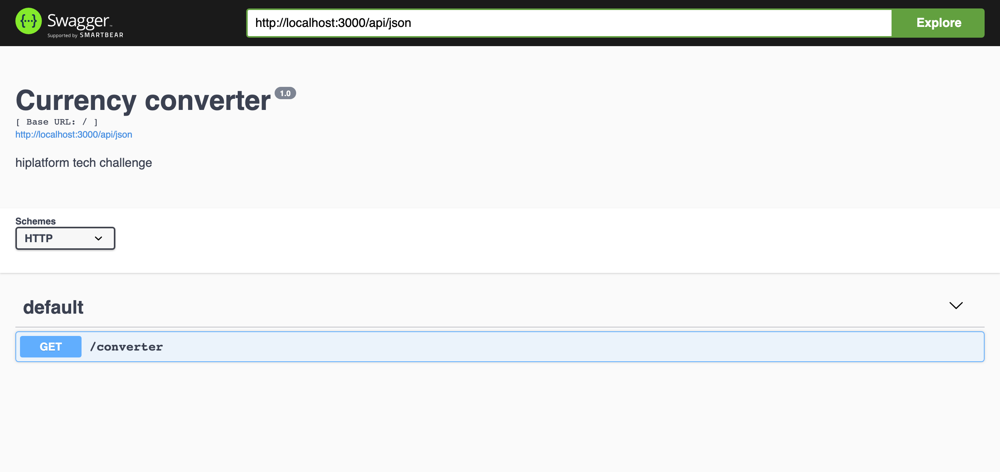
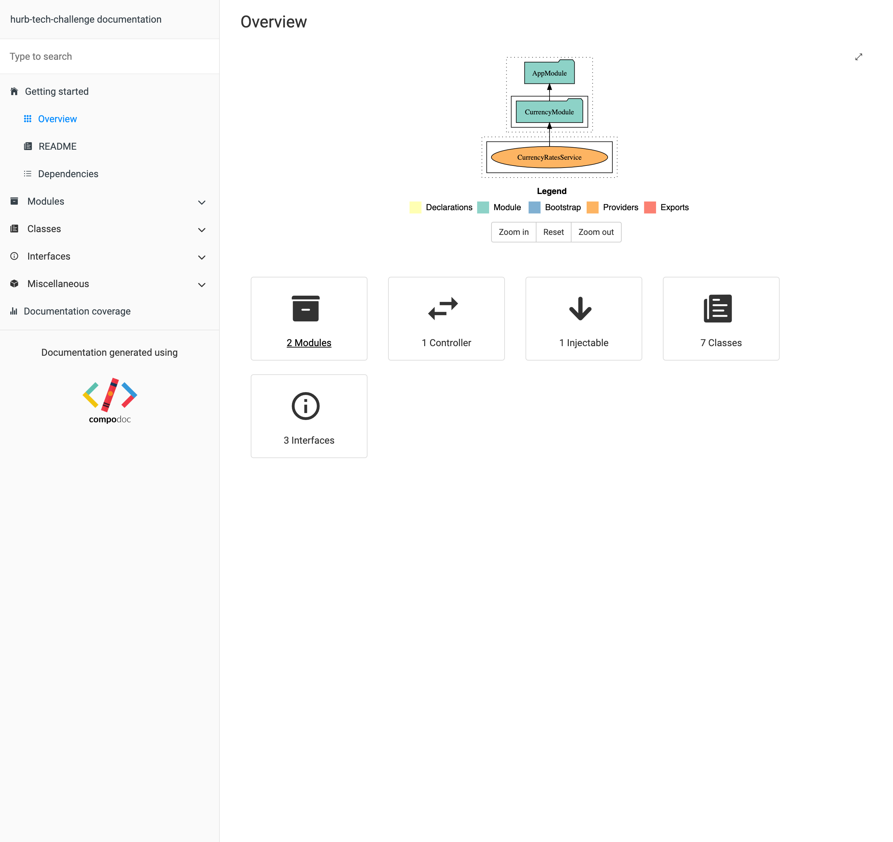

# Hurb Currency Converter(HCC)

HCC is a currency converter api developed by the [hurb](https://www.hurb.com/) team.

## Architecture


## Project structure

```
.
├── Dockerfile
├── README.md
├── docker-compose.yml
├── docs
│   └── api-workflow.png
├── nest-cli.json
├── nodemon-debug.json
├── nodemon.json
├── package-lock.json
├── package.json
├── src
│   ├── app.module.ts
│   ├── currency
│   │   ├── controllers
│   │   │   └── converter
│   │   │       ├── converter.controller.spec.ts
│   │   │       └── converter.controller.ts
│   │   ├── currency.module.ts
│   │   ├── definitions
│   │   │   └── currency.ts
│   │   ├── dto
│   │   │   └── currency.dto.ts
│   │   ├── exceptions
│   │   │   └── bad-request.exception.ts
│   │   ├── interfaces
│   │   │   └── currency-converter.interface.ts
│   │   ├── providers
│   │   │   └── currency.ts
│   │   ├── services
│   │   │   ├── currency-converter
│   │   │   │   ├── currency-converter.service.spec.ts
│   │   │   │   └── currency-converter.service.ts
│   │   │   └── currency-rates
│   │   │       ├── currency-rates.mock.ts
│   │   │       └── currency-rates.service.ts
│   │   ├── transformers
│   │   │   ├── bad-request-exception
│   │   │   │   └── bad-request-exception.transformer.ts
│   │   │   └── rates
│   │   │       ├── rates.transformer.spec.ts
│   │   │       └── rates.transformer.ts
│   │   └── validators
│   │       └── is-not-equal-to
│   │           ├── is-not-equal-to.constraint.ts
│   │           └── is-not-equal-to.validator.ts
│   └── main.ts
├── test
│   ├── app.e2e-spec.ts
│   └── jest-e2e.json
├── tsconfig.build.json
├── tsconfig.json
└── tslint.json

19 directories, 33 files
```

## Getting Started

These instructions will get you a copy of the project up and running on your local machine for development and testing purposes. See deployment for notes on how to deploy the project on a live system.

## Requirements

First of all you need to have nodejs + npm installed in your local machine.
You can follow a google tutorial and make sure you have everything installed.

## Installing

### Docker

```
docker-compose up
```

## Without Docker

```
# To install packages
npm install

# To starting the api
npm run start
```

## Tests

### With docker

First you need the container running.

```
# unit tests
docker exec -it app npm run test

# e2e tests
docker exec -it app npm run test:e2e
```

### Without docker

```
# unit tests
npm run test

# e2e tests
npm run test:e2e
```


## Latency / Performance

To measure performance, follow these steps:

```
# to build application into javascript instead of typescript
npm run build

# to start the application in javascript mode
node dist/main.js

# in another console/tab/window
node_modules/.bin/loadtest http://127.0.0.1:3000/converter\?from\=USD\&to\=BRL\&amount\=100 -t 20 -c 10 --rps 1000
```

### Performance logs

```shell
node_modules/.bin/loadtest http://127.0.0.1:3000/converter\?from\=USD\&to\=BRL\&amount\=100 -t 20 -c 10 --rps 1000
[Wed Apr 03 2019 12:03:37 GMT+0100 (WEST)] INFO Requests: 0, requests per second: 0, mean latency: 0 ms
[Wed Apr 03 2019 12:03:42 GMT+0100 (WEST)] INFO Requests: 4470, requests per second: 895, mean latency: 3.7 ms
[Wed Apr 03 2019 12:03:47 GMT+0100 (WEST)] INFO Requests: 9470, requests per second: 1000, mean latency: 2.9 ms
[Wed Apr 03 2019 12:03:52 GMT+0100 (WEST)] INFO Requests: 14471, requests per second: 1000, mean latency: 2.8 ms
[Wed Apr 03 2019 12:03:57 GMT+0100 (WEST)] INFO
[Wed Apr 03 2019 12:03:57 GMT+0100 (WEST)] INFO Target URL:          http://127.0.0.1:3000/converter?from=USD&to=BRL&amount=100
[Wed Apr 03 2019 12:03:57 GMT+0100 (WEST)] INFO Max time (s):        20
[Wed Apr 03 2019 12:03:57 GMT+0100 (WEST)] INFO Concurrency level:   10
[Wed Apr 03 2019 12:03:57 GMT+0100 (WEST)] INFO Agent:               none
[Wed Apr 03 2019 12:03:57 GMT+0100 (WEST)] INFO Requests per second: 1000
[Wed Apr 03 2019 12:03:57 GMT+0100 (WEST)] INFO
[Wed Apr 03 2019 12:03:57 GMT+0100 (WEST)] INFO Completed requests:  17881
[Wed Apr 03 2019 12:03:57 GMT+0100 (WEST)] INFO Total errors:        0
[Wed Apr 03 2019 12:03:57 GMT+0100 (WEST)] INFO Total time:          20.001925518 s
[Wed Apr 03 2019 12:03:57 GMT+0100 (WEST)] INFO Requests per second: 894
[Wed Apr 03 2019 12:03:57 GMT+0100 (WEST)] INFO Mean latency:        3.1 ms
[Wed Apr 03 2019 12:03:57 GMT+0100 (WEST)] INFO
[Wed Apr 03 2019 12:03:57 GMT+0100 (WEST)] INFO Percentage of the requests served within a certain time
[Wed Apr 03 2019 12:03:57 GMT+0100 (WEST)] INFO   50%      2 ms
[Wed Apr 03 2019 12:03:57 GMT+0100 (WEST)] INFO   90%      4 ms
[Wed Apr 03 2019 12:03:57 GMT+0100 (WEST)] INFO   95%      6 ms
[Wed Apr 03 2019 12:03:57 GMT+0100 (WEST)] INFO   99%      23 ms
[Wed Apr 03 2019 12:03:57 GMT+0100 (WEST)] INFO  100%      177 ms (longest request)
```

## Documentation

You can explore the swagger documentation to debug endpoints or you can explore the compodoc to learn about the project structure.

### Swagger

Go to `http://localhost:3000/api` after api is initialized to work with swagger:



### Compodoc

Run `npm run compodoc` to have a full overview of project structure.




## Style

This project is using prettier + linter.

```
# To apply linter and search for issues
npm run lint

# To apply prettier and format the code
npm run format
```

## Backlog

-   Improve chart workflow
-   Improve swagger documentation
-   Quick explanation how currencies works

## Built With

-   [nestjs](https://docs.nestjs.com) - Base framework used to create the api
-   [jest](https://jestjs.io) - Framework for tests
-   [chai](https://www.chaijs.com/) - Second option for tests
-   [swagger](https://swagger.io) - Swagger documentation
-   [prettier](https://prettier.io) - Code formatter
-   [tslint](https://palantir.github.io/tslint) - Linter

## Authors

-   **Lucas Silva** - _Developer_ - [github](https://github.com/luqezman)

See also the list of [contributors](https://github.com/luqezman/challenge-bravo/contributors) who participated in this project.

## Acknowledgments

-   Self-Motivation
-   Inspiration
-   Coffee
