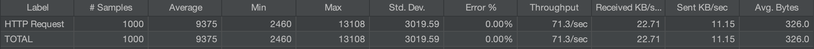

#  Desafio Bravo

Construa uma API, que responda JSON, para conversão monetária. Ela deve ter uma moeda de lastro (USD) e fazer conversões entre diferentes moedas com **cotações de verdade e atuais**.

A API precisa converter entre as seguintes moedas:

-   USD
-   BRL
-   EUR
-   BTC
-   ETH

Outras moedas podem ser adicionadas conforme o uso.

Ex: USD para BRL, USD para BTC, ETH para BRL, etc...

A requisição deve receber como parâmetros: A moeda de origem, o valor a ser convertido e a moeda final.

Ex: `?from=BTC&to=EUR&amount=123.45`

Construa também um endpoint para adicionar e remover moedas suportadas pela API, usando os verbos HTTP.

A API deve suportar conversão entre moedas fiduciárias, crypto e fictícias. Exemplo: BRL->HURB, HURB->ETH

"Moeda é o meio pelo qual são efetuadas as transações monetárias." (Wikipedia, 2021).

Sendo assim, é possível imaginar que novas moedas passem a existir ou deixem de existir, é possível também imaginar moedas fictícias como as de Dungeons & Dragons sendo utilizadas nestas transações, como por exemplo quanto vale uma Peça de Ouro (D&D) em Real ou quanto vale a GTA$ 1 em Real.

Vamos considerar a cotação da PSN onde GTA$ 1.250.000,00 custam R$ 83,50 claramente temos uma relação entre as moedas, logo é possível criar uma cotação. (Playstation Store, 2021).

Ref:
Wikipedia [Site Institucional]. Disponível em: <https://pt.wikipedia.org/wiki/Moeda>. Acesso em: 28 abril 2021.
Playstation Store [Loja Virtual]. Disponível em: <https://store.playstation.com/pt-br/product/UP1004-CUSA00419_00-GTAVCASHPACK000D>. Acesso em: 28 abril 2021.

Você pode usar qualquer linguagem de programação para o desafio. Abaixo a lista de linguagens que nós aqui do Hurb temos mais afinidade:

-   JavaScript (NodeJS)
-   Python
-   Go
-   Ruby
-   C++
-   PHP

# Solução -> API REST em Node.JS

Para tal, foi desenvolvido uma API REST em Node.JS onde foi usado o Express como web framework, MongoDB como banco de dados NoSQL e Jest para os testes unitários e integrados. O motivo da utilização dessas tecnologias foram pela familiaridade do desenvolvedor com elas, pela vasta comunidade e pelo potencial que possuem para suportar 1000 requisições por segundo.

Então, a API recebe os dados fornecidos por um client, trata-os e fornece um JSON como resposta. O valor da moeda tida como base, o dólar, é atualizada a cada 3 minutos, mediante a requisição do usuário. E após esse tempo, o valor é atualizado no banco de dados caso a moeda não seja fiduciária ou fictícia.

Tecnologias utilizadas:

- **Node.Js** com ECMAScript modules;
- **Express** como framework web;
- **Mongoose** para **MongoDB**;
- **Eslint** e **Prettier** (JavaScript Standard como Style guide);
- **Jest** para os testes unitários e integrados;
- **Winston** para os logs;
- **Yup** para as validações dos dados de entrada do client;
- **Axios** para fazer requisições a API de Cotações de Moedas ([AwesomeAPI](https://docs.awesomeapi.com.br/api-de-moedas));
- **Babel** para auxiliar o Jest na hora de executar os testes por conta da utilização do ECMAScript modules.

## Modelo de Endidade

### Currency
```
code: <string>
name: <string>
inDollar: <float>
isFiatOrFictitious: <boolean>
```

## Funcionalidades da API

- Criação de moeda;
- Listagem de todas as moedas;
- Conversão de moeda desejada;
- Deleção de moeda.

### Rotas

#### Criação de moeda

```
Endpoint: /currency

Method: POST

Headers: {
    "Content-Type": "application/json"
}

Query: {}

Params: {}

Body: {
    "code": "USD",
	"name": "Dólar Americano",
	"inDollar": 1,
	"isFiatOrFictitious": false
}
}

Response: {
    status: 200,
    body: {
        "code": "USD",
        "name": "Dólar Americano",
        "inDollar": 1,
        "isFiatOrFictitious": false,
        "_id": <id_mongo>,
        "createdAt": <data_criação>,
        "updatedAt": <data_última_atualização>
    }
}
```
#### Listagem de todas as moedas

```
Endpoint: /currency

Method: GET

Headers: {}

Query: {}

Params: {}

Body: {}

Response: {
    status: 200,
    body: [
        {
            "code": "USD",
            "name": "Dólar Americano",
            "inDollar": 1,
            "isFiatOrFictitious": false,
            "_id": <id_mongo>,
            "createdAt": <data_criação>,
            "updatedAt": <data_última_atualização>
        }
    ]
}
```
#### Conversão de moeda desejada

```
Endpoint: /currency/conversion

Method: GET

Headers: {}

Query: {
    "from": "USD"
    "to": "BRL",
    "amount": 1
}

Params: {}

Body: {}

Response: {
    status: 200,
    body: [
        {
            "from": "USD"
            "to": "BRL",
            "convertedAmount": 5,60
        }
    ]
}
```
#### Deleção de moeda

```
Endpoint: /currency/:currencyCode

Method: DELETE

Headers: {}

Query: {}

Params: {
    "currencyCode": "USD"
}

Body: {}

Response: {
    status: 200,
    body: [
        {
            "deletedCount": 1
        }
    ]
}
```


## Vulnerabilidade

Como a API é pública, o usuário consegue realizar todas as funções sem a necessidade de um token de acesso.

## Execução do projeto

Para a execução do projeto é necessário ter instalado na máquina o `Docker e docker-compose`.

### Comandos

#### Executar localmente

- `git clone <url_repositorio>` : clonar o repositório;
- `docker-compose up`: rodar a aplicação.

Para acessar a API diretamente é preciso acessar http://localhost:8888 + o endpoint.

Ex: http://localhost:8888/heath

#### Para executar os testes

Para rodar os testes unitários e integrados é preciso seguir os seguintes comandos abaixo:

- Alterar a variável de ambiente chamado `NODE_ENV` dentro do arquivo [docker-compose.yml](docker-compose.yml) de development para `test`;
- `docker-compose up` para rodar a aplicação;
- Abra uma nova aba no terminal e execute `docker ps` para obter `id` do container da API REST;
- `docker exec -it <container_id> bash` para executar o bash e "entrar" no container da aplicação principal;
- `yarn test` para executar os testes.

## Performance

Como um dos requisitos foi que a API suportasse 1000 requisições por segundo, foi utilizado uma ferramente chamado [Jmeter](https://jmeter.apache.org/) para a realização dos testes localmente.

Conforme a imagem abaixo, a API suportou as 1000 requisições com sucesso, sem nenhum erro.


