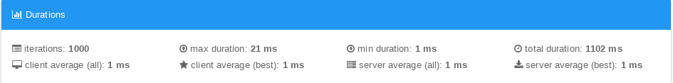

#  Desafio Bravo

Construa uma API, que responda JSON, para conversão monetária. Ela deve ter uma moeda de lastro (USD) e fazer conversões entre diferentes moedas com cotações de verdade e atuais.

A API deve converter entre as seguintes moedas:
- USD
- BRL
- EUR
- BTC
- ETH


Ex: USD para BRL, USD para BTC, ETH para BRL, etc...

A requisição deve receber como parâmetros: A moeda de origem, o valor a ser convertido e a moeda final.

Ex: `?from=BTC&to=EUR&amount=123.45`

# Resposta ao Desafio Bravo
Foi elaborada uma API, respondendo JSON, utilizando a linguagem de programação **PHP** com consulta externa em **GmbH**.

## Fontes de cotação on-line
 - http://apilayer.net

### Funcionamento:
- Inicialmente é executado o arquivo json.php para buscar as informações das moedas via JSON de uma API externa que é salva em um arquivo .txt
- Através de um cron os valores são atualizados a cada 30 min.
- Ao clicar no botão **PESQUISAR** um jquery é executado passando os parâmetros informados pelo usuário no formulário para o arquivo json.php que é responsável por pegar as informações do TXT e realizar o cálculo dando retorno para o Javascript.

### API:
- Foi desenvolvida uma API em **PHP**, sendo que contem dois arquivos o primeiro é o **job.php** é responsável pela captura de informação do servidor externo a cada 30 mim e o **json.php** realiza a comunicação com a solicitação o **JavaScript**.

## EXECUTANDO
- Pré-requisitos: Apache, PHP e o cron
```bash
  $> crontab -e
```
  inserir o seguinte comando dentro do cron:
  - */30 * * * * curl --request GET 'http://localhost/challenge-bravo/job.php'

  ```bash
  $> service cron restart
  $> cd /var/www/html
  $> git clone https://github.com/dougrhishu/challenge-bravo.git
  $> cd challenge-bravo
```
Ex: `http://localhost/challenge-bravo`

## TESTES DE ESTRESSE
- Após realizar do teste de estresse, obteve o resultado esperado nas 1000 requisições por segundo.
<p align="center">
  
</p>
