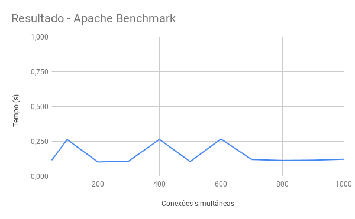

#  Desafio Bravo


## Arquitetura
APIs utilizadas para consulta de cotação:
- [Fixer](https://fixer.io/)
- [CoinMarketCap](https://coinmarketcap.com/api/)

Tecnologias utilizadas no desenvolvimento:
- [Docker](https://www.docker.com/)
	- [docker-compose](https://docs.docker.com/compose/)
- [Golang](https://golang.org/)
- [Redis](https://redis.io/)
- [Nginx](https://www.nginx.com/)

#### Obtenção dos dados de cotação

Duas APIs de cotação foram utilizadas como consulta para a API principal de conversão: **Fixer**, utilizada para buscar dados de moedas comuns, e **CoinMarketCap**, para obter dados de criptomoedas. Estas APIs foram selecionadas por terem um bom grau de confiabilidade, sendo utilizadas por muitas empresas.

No entanto, as APIs são pagas para acesso ilimitado - a versão grátis permite uma quantidade limitada de requisições mensais. Para este desafio, chaves de testes serão disponibilizadas.

#### Armazenamento de dados

Para suportar uma grande quantidade de requisições simultâneas a idéia foi cachear as informações de cotação em uma banco de dados em memória, no caso, um Redis.

Um worker é responsável por buscar os dados nas APIs de cotação e atualizar de tempos em tempos os valores no banco de dados, deixando a API com a única função de buscar os valores e processar a requisição.

#### Processamento

A moeda base para consulta nas duas APIs e armazenada no Redis é o Euro. Isso se deve ao fato de que, na versão gratuita do Fixer, a única opção de base é esta.

Como todas as moedas estão na mesma base, o cálculo da conversão é feito da seguinte forma:

(to/from) * amount

Onde *to* é a moeda origem, *from* a moeda destino e *amount* o valor que se deseja converter.

#### Nginx como load balancer

A idéia de utilizar o Nginx como *load balancer* tem dois propósitos principais:
- **Segurança:** Estabelecer uma conexão segura entre os clientes e o servidor Nginx que repassa a requisição para os nós das aplicação. Além disso, pode ser possível implementar outros serviços de segurança como WAF.
- **Disponibilidade:** Manter mais de um nó de aplicação é interessante pois caso um fique fora do ar, não acarretaria em falha para o usuário.


Para estabelecer uma conexão segura foi configurado no Nginx a utilização de um certificado auto-assinado, gerado para propósitos de teste. Desta forma, a máquina não poderá reconhecê-lo e um erro de conexão será retornado ao não se conseguir completar o handshake, como mostrado a seguir:

```
$ curl 'https://localhost:3000/convert?amount=123&from=BRL&to=ETH'
curl: (60) SSL certificate problem: Invalid certificate chain
More details here: https://curl.haxx.se/docs/sslcerts.html

curl failed to verify the legitimacy of the server and therefore could not
establish a secure connection to it. To learn more about this situation and
how to fix it, please visit the web page mentioned above.

```
Para resolver isso, adicione o parâmetro *-k* a cada requisição feita com o *curl*. Esta opção ignora o não reconhecimento da autoridade certificadora do certificado passado.

Exemplo:
```
$ curl 'https://localhost:3000/convert?amount=123&from=BRL&to=ETH' -k
{"result":4134.92,"success":true}

```
A performance utilizando Nginx é um pouco inferior a opção de acessar diretamente a API, mas, levando em consideração os pontos mencionados acima, a arquitetura foi mantida.

A arquitetura completa pode ser vista na imagem a seguir:

<p align="center">
  
</p>


## Operação

Esta sessão contém instruções de como iniciar o sistema.

#### Variáveis de ambiente
 - **FIXER_ENDPOINT**: endereço da API do Fixer
 - **FIXER_ACCESS_KEY**: chave de acesso a API do Fixer
 - **COINMARKET_ACCESS_KEY**: chave de acesso a API do CoinMarketCap
 - **COINMARKET_ENDPOINT**: endereço do CoinMarketCap
 - **CURRENCY_SYMBOLS**: lista de símbolos de moedas que serão buscadas na API de cotação, separadas por vírgula. Ex: "BRL,USD"
 - **CRYPTO_CURRENCY_SYMBOLS**: lista de símbolos de criptomoedas que serão buscadas na API de cotação, separadas por vírgula. Ex: "BTC,ETH"
 - **DB_HASH**: nome do hashset do redis
 - **DB_PORT**: porta do redis
 - **DB_ADDRESS**: endereço do redis
 - **ALLOW_ORIGINS**: esta variável pode ser definida caso a API seja utilizada por um sistema específico. Caso seja aberta, recomenda-se defini-la como "\*"
 - **API_PORT**: porta onde a API irá rodar
 - **REFRESH_INTERVAL**: intervalo de tempo para atualizar a cotação de moedas


#### Iniciando a aplicação
Para iniciar o sistema, clone este repositório:
```bash
git clone https://github.com/vitoriario2/challenge-bravo
```

Rode o seguinte comando a partir da raiz do projeto:
```bash
make install
```

Os containers poderão ser visualizados da seguinte forma:

```bash
$ docker ps

CONTAINER ID  IMAGE              COMMAND                 CREATED          STATUS          PORTS                                      NAMES

e49f1f5e3e60  deployments_api3   "go run cmd/api/main…"  29 minutes ago   Up 28 minutes                                              api3

159307ca6b3f  deployments_api2   "go run cmd/api/main…"  29 minutes ago   Up 28 minutes                                              api2

09d1e32af1ee  deployments_api    "go run cmd/api/main…"  29 minutes ago   Up 28 minutes                                              api

1ad25c89b4dc  deployments_worker "go run cmd/worker/m…"  29 minutes ago   Up 29 minutes                                              deployments_worker_1

a1b9be303ccd  redis              "docker-entrypoint.s…"  29 minutes ago   Up 29 minutes                                              redis_db

a0bc383a81ac  nginx              "nginx -g 'daemon of…"  29 minutes ago   Up 28 minutes   80/tcp, 0.0.0.0:3000-3001->3000-3001/tcp   deployments_nginx_1
```

Neste ponto, a API já estará pronta para receber requisições nas portas 3000 (tls) e 3001.

**Obs:** dependendo de como está a instalação do docker, pode ser necessário executar os comandos acima como root. Para isso basta adicionar o comando sudo antes de cada um deles.


## Interoperabilidade

Nesta sessão encontra-se a descrição das rotas da API.

### (GET) /healthcheck

#### Descrição
verifica o status da API.

#### Resposta
Em caso de sucesso a API irá retornar uma simples resposta em texto claro "OK" com status code 200.

Qualquer retorno diferente do especificado significa que a API não está funcionando corretamente.

#### Exemplo
```bash
$ curl 'https://localhost:3000/healthcheck' -k -i
HTTP/1.1 200 OK
Server: nginx/1.15.10
Date: Sat, 06 Apr 2019 08:18:01 GMT
Content-Type: text/plain; charset=UTF-8
Content-Length: 2
Connection: keep-alive
Access-Control-Allow-Origin: *
Vary: Origin

OK
```


### (GET) /convert

#### Descrição
Converte uma determinada quantia de uma moeda para outra.

#### Parâmetros
Os seguintes parâmetros devem ser passados como parâmetros da url:
- **amount** - float: quantia que se deseja converter
- **from** - string: símbolo da moeda de origem
- **to** - string: símbolo da moeda de destino

#### Resposta

Em caso de sucesso a API retornará um JSON no seguinte formato com status code 200:
```json
{
	"success": true,
	"result": 123.45
}
```

Caso algum erro tenha ocorrido uma resposta JSON também será retornada com o status code 400:
```json
{
	"success": false,
	"message": "error on getting currency quotes"
}
```

As possíveis mensagens de erro são:
- **error on getting currency quotes**: Erro ao obter informações do banco de dados
- **currency symbol not found**: O símbolo passado não existe na base de dados
- **invalid parameters**: Um ou mais parâmetros passados estão em um formato inválido


#### Exemplo
```bash
$ curl 'https://localhost:3000/convert?amount=123&from=BRL&to=ETH' -k -i
HTTP/1.1 200 OK
Server: nginx/1.15.10
Date: Sat, 06 Apr 2019 08:17:04 GMT
Content-Type: application/json; charset=UTF-8
Content-Length: 34
Connection: keep-alive
Access-Control-Allow-Origin: *
Vary: Origin

{"result":4134.92,"success":true}
```

## Benchmarking

#### Ambiente de testes
- **Processador:** Intel Core i7-4790 CPU 3.60GHz x 8
- **Sistema operacional:** Debian GNU/Linux 9 (stretch) 64-bit
- **Memória RAM:** 16 GiB


Para os testes de performance foi utilizada as ferramenta de benchmarking [ApacheBench](https://httpd.apache.org/docs/2.4/programs/ab.html).


Esta ferramenta calcula o tempo para se realizar um determinado número de requisições utilizando um número de conexões simultâneas, ambos parâmetros podendo ser definidos.

Os testes foram feitos sempre com 1000 requisições, porém variando o número de conexões simultâneas.  A seguir um exemplo de um caso de teste e a saída do programa:

```shell
$ ab -n 1000 -c 700 'http://localhost:3001/convert?amount=123&from=BTC&to=BRL'
This is ApacheBench, Version 2.3 <$Revision: 1757674 $>
Copyright 1996 Adam Twiss, Zeus Technology Ltd, http://www.zeustech.net/
Licensed to The Apache Software Foundation, http://www.apache.org/

Benchmarking localhost (be patient)
Completed 100 requests
Completed 200 requests
Completed 300 requests
Completed 400 requests
Completed 500 requests
Completed 600 requests
Completed 700 requests
Completed 800 requests
Completed 900 requests
Completed 1000 requests
Finished 1000 requests

Server Software: nginx/1.15.10
Server Hostname: localhost
Server Port: 3001

Document Path: /convert?amount=123&from=BTC&to=BRL
Document Length: 31 bytes

Concurrency Level: 700
Time taken for tests: 0.120 seconds
Complete requests: 1000
Failed requests: 2
(Connect: 0, Receive: 0, Length: 2, Exceptions: 0)
Total transferred: 241516 bytes
HTML transferred: 30938 bytes
Requests per second: 8346.13 [#/sec] (mean)
Time per request: 83.871 [ms] (mean)
Time per request: 0.120 [ms] (mean, across all concurrent requests)
Transfer rate: 1968.48 [Kbytes/sec] received

Connection Times (ms)
min mean[+/-sd] median max
Connect: 0 9 5.4 11 17
Processing: 4 53 34.4 64 96
Waiting: 0 52 34.9 64 96
Total: 7 62 38.2 81 109

Percentage of the requests served within a certain time (ms)
50% 81
66% 97
75% 101
80% 102
90% 103
95% 104
98% 105
99% 106
100% 109 (longest request)
```

O gráfico a seguir ilustra resumidamente os resultados obtidos para os demais testes:

<p align="center">
  
</p>

É importante destacar que partir de 900 conexões simultâneas, algumas requisições podem falhar.

## Considerações finais

- Para que os avaliadores possam rodar o programa sem nenhum problema, arquivos de configuração foram disponibilizados com informações em texto claro no repositório. Em um cenário real estes arquivo nãos existiriam em hipótese alguma dentro do repositório. Esles são:
	- deployments/app.env - contendo os valores das variáveis de ambiente.
	- deployments/data - contendo chave e certificado para configuração tls.  
- A porta 3001 foi mantida aberta pois o Apache Benchmark não possui a opção de não verificar a cadeia de certificados, portanto o teste não poderia ser feito. Em ambiente de produção esta porta não deveria estar exposta ou, em melhor caso, haveria um redirecionamento para a porta 3000.
- A conexão segura poderia ser feita também no caso onde a API é acessada diretamente, ao utilizar a chave e o certificado gerado como parâmetros ao iniciar o servidor. Neste caso, seria uma criptografia fim-a-fim, porém perderia-se em escalabilidade e disponibilidade. Desta forma, considero que não vale a pena.


<p align="center">
  
</p>
