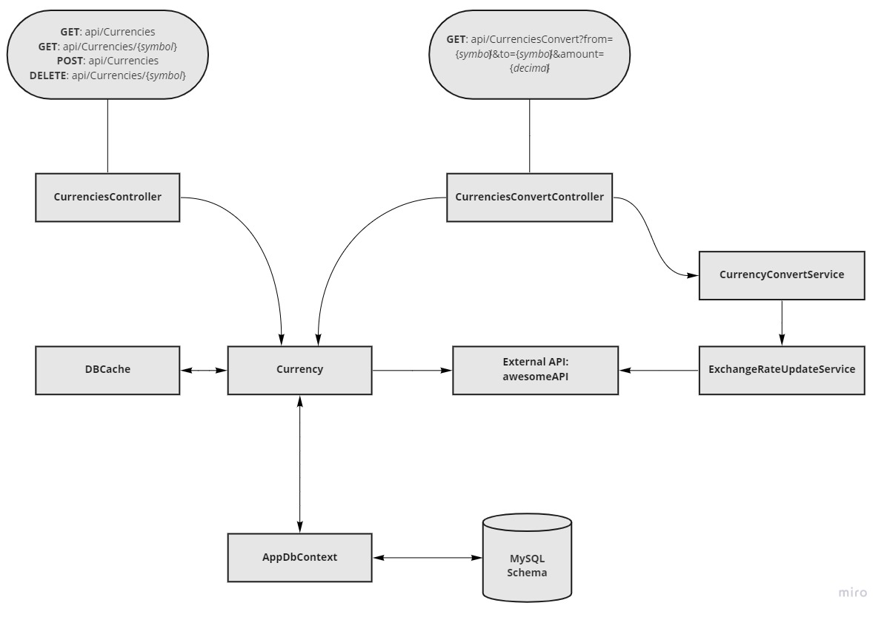
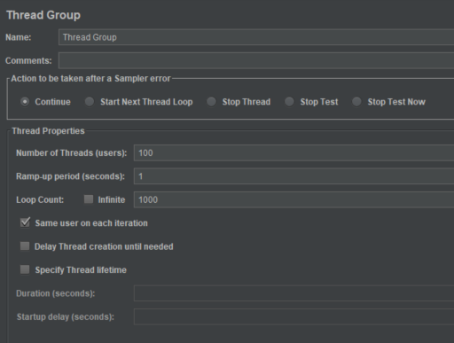
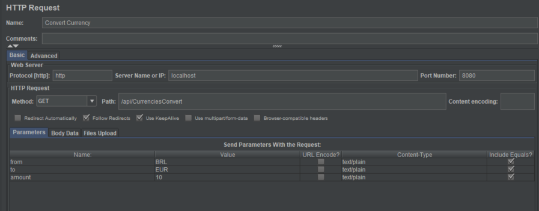
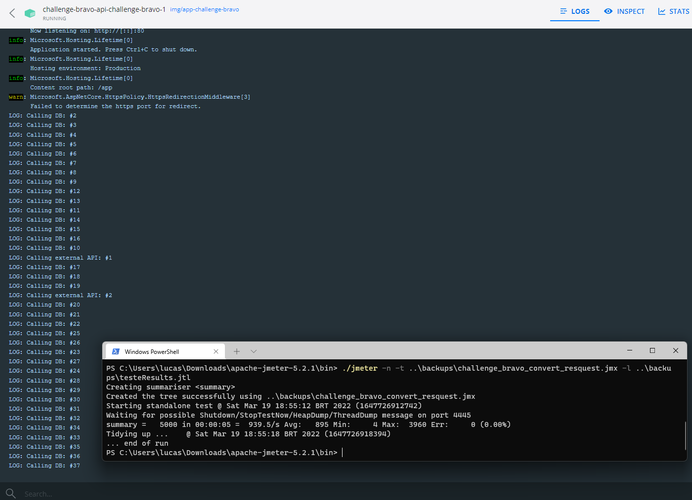
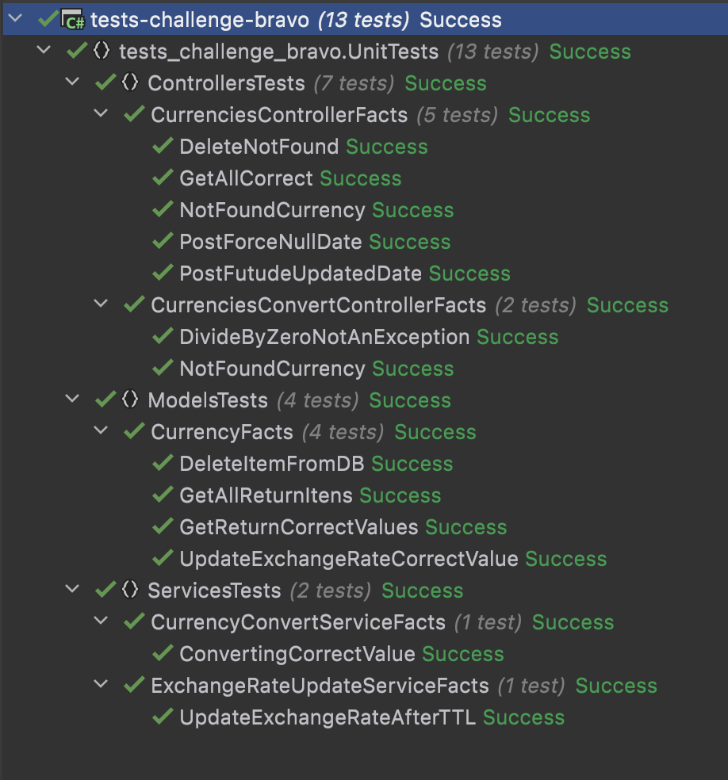
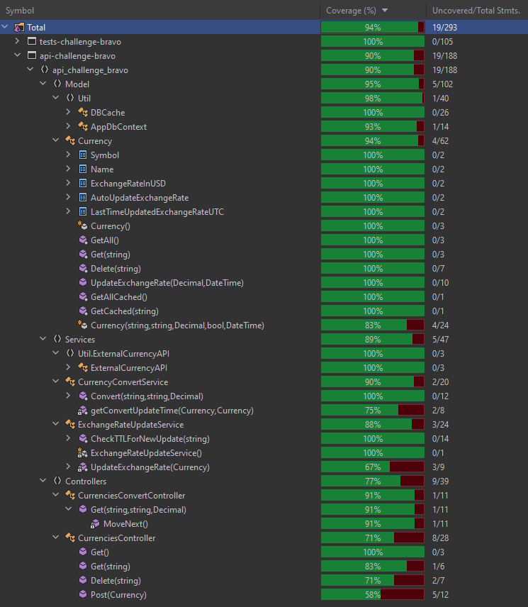

#  Bravo Challenge
## Arquitetura do código

  

### Funcionalidades

- Armazenamento em banco de dados da taxa de câmbio e da data de sua atualização;
- Cada moeda possui um flag que indica se aquela moeda deve ou não ter sua taxa de câmbio atualizada automaticamente via API externa;
- No momento de inclusão de nova moeda, caso seja marcado o flag de auto-atualização, a API externa é consultada para confirmar se se trata de uma moeda disponivel para auto-atualização, caso contrario o flag é automaticamente marcado como falso;
- Utilização de um TTL(Time to Live) de 30 segundos após cada atualização da taxa de câmbio de uma moeda;
- Toda requisição de conversão checa se a última atualização das moedas envolvidas foi em menos de 30 segundos, caso negativo busca as taxas de câmbio atualizadas;
- Utilização de caching do BD de 1 segundo, evitando gargalo no banco de dados em situações de muitas requisições simultâneas

## Endpoints

Retornar todas as Moedas:
<pre><code>curl -X 'GET' \
  'http://localhost:8080/api/Currencies' \
  -H 'accept: text/plain'
</code></pre>

Adicionar nova Moeda:
<pre><code>curl -X 'POST' \
  'http://localhost:8080/api/Currencies' \
  -H 'accept: text/plain' \
  -H 'Content-Type: application/json' \
  -d '{
  "symbol": "BRL",
  "name": "Real Brasileiro",
  "exchangeRateInUSD": 0.199,
  "autoUpdateExchangeRate": true,
  "lastTimeUpdatedExchangeRate": "2022-03-19T02:41:17.365Z"
}'

</code></pre>
Retornar Moeda específica:
<pre><code>curl -X 'GET' \
  'http://localhost:8080/api/Currencies/BRL' \
  -H 'accept: text/plain'
</code></pre>

Deletar Moeda específica:
<pre><code>curl -X 'DELETE' \
  'http://localhost:8080/api/Currencies/BRL' \
  -H 'accept: text/plain'
</code></pre>

Converter valor entre Moedas:
<pre><code>curl -X 'GET' \
  'http://localhost:8080/api/CurrenciesConvert?from=BRL&to=EUR&amount=42.10' \
  -H 'accept: text/plain'
</code></pre>

## Libs e Ferramentas
- [Pomelo.EntityFrameworkCore.MySql](https://github.com/PomeloFoundation/Pomelo.EntityFrameworkCore.MySql)
- [xUnit](https://xunit.net/)
- [CacheManager.Core](https://cachemanager.michaco.net/)
- [Swashbuckle.AspNetCore](https://github.com/domaindrivendev/Swashbuckle.AspNetCore)
- [JMeter](https://jmeter.apache.org/)
- [AwesomeAPI](https://docs.awesomeapi.com.br/api-de-moedas)

## Testes

### Teste de Carga

- Realizar o download do JMeter: https://jmeter.apache.org/download_jmeter.cgi
- Arquivo Jmeter em: `challenge-bravo/src/tests-challenge-bravo/LoadTests/challenge_bravo_convert_resquest.jmx`
- Na pasta LoadTests, executar novo teste com o comando: `<PATH_JMETER>/bin/jmeter -n -t challenge_bravo_convert_resquest.jmx -l LoadTestResult.jtl`

#### Execução prévia

  

  

  

Setup:

- Threads/Users: 100
- Counts per User: 1000
- Ramp-up: 1s

Summary:

- Total Requests: 100.000
- Duration: 13s
- Response Time avg: 12s
- Requests/second: 7.463.8/s
- Errors: 1 (0.00%)

Hardware de teste:
- CPU: Intel(R) Core(TM) i5-8250U CPU @ 1.60GHz   1.80 GHz
- RAM: 8,00 GB

### Testes unitários

Estrutura de testes

  

Cobertura de testes

  

Arquivos e pastas ignorados para calculo de cobertura de testes:
- Migrations/
- InitDB.cs
- AwesomeAPI.cs
- Program.cs
- Startup.cs

#### Execução dos testes unitários

Linux ou macOS
- `$ cd src`
- `$ docker build -f ./api-challenge-bravo/Dockerfile --pull --target test -t challenge-bravo-test .` 
- `$ docker run --rm -v ${pwd}/TestResults:/source/tests-challenge-bravo/TestResults challenge-bravo-test`

Windows
- `$ cd src`
- `$ docker build -f .\api-challenge-bravo\Dockerfile --pull --target test -t challenge-bravo-test .`
- `$ docker run --rm -v ${pwd}\TestResults:/source/tests-challenge-bravo/TestResults challenge-bravo-test`

## Execução

- `$ cd src`
- `$ docker-compose -p "challenge-bravo" up -d`
- Aguardar os containers subirem completamente, o BD leva mais tempo e o App só ficara disponível após o BD subir completamente.
- Acessar Swagger: http://localhost:8080/index.html

## Limitações e Possíveis Melhorias

- Delay da cotação: Em sua configuração atual o sistema possui um atraso máximo de até 31 segundos em relação à fonte externa de atualização;
- Dependência de apenas uma API externa: Na versão atual o sistema é dependente de uma única API, uma melhoria interessante seria adicionar redundância com outras APIs de cotação;
- Autenticação: Em uma futura versão a implementação de autenticação de usuários seria uma melhoria interessante.

  

