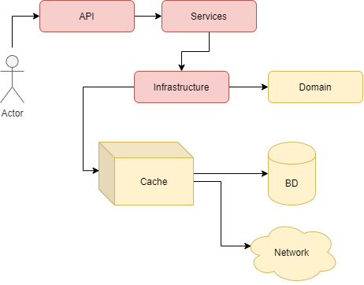

#  Desafio Bravo

API construída em resposta ao desafio Bravo. Sua função é fazer conversões monetárias com retorno JSON.
A intenção é demonstrar arquitetura seguindo padrões SOLID, de fácil manutenção, escalabilidade, testável, dockerizavel e com desempenho superior ao exigido na proposta.
A linguagem escolhida foi C#. Caso eu utilizasse a stack sugerida no desafio talvez eu entregasse um produto simples e possivelmente com desempenho aquém do que este oferece.

# Objetivos
- Implementar o back-end da aplicação
- Implementar testes de unidade (xUnit)
- Implementar uma  solução para o problema de 1000 request por segundo

# Tecnologias
- Dotnet Core C#
- Redis
- MySql
- xUnit
- Docker
- HangFire

# Sobre a Infraestrutura de início automatizada
Para subir toda a aplicação basta executar o scrip setup_Currency.PS1 (Windows) ou setup_Currency.SH (Linux).
O script executa os testes unitários presentes na camada de Teste.
Ao finalizar a subida pro Docker a aplicação cria suas tabelas automaticamente se baseando na camada de Domínio.
São gravadas as moedas iniciais conforme sugerido pelo desafio (USD, BRL, EUR, BTC, ETH), ao mesmo tempo que seus valores atuais são buscados pela integração externa.
Após atualização dos valores de cada moeda, eles são enviados ao cache.
Uma tarefa recorrente para atualização dos preços de cada moeda é criada baseada no tempo em minutos contido no domínio de configuração (a cada 20 minutos).
Ao final temos 3 containers (Banco, Cache e API)

# Instalação e execução da aplicação
Para instalar a aplicação pela linha de comando:

- **com docker**
    - Clone o repositório: `git clone https://github.com/carvrodrigo/challenge-bravo.git`
    - Acesse a pasta `cd challenge-bravo`
    - Inicie instalação em `setup_Currency` (.ps1 ou .sh)
  
- **sem docker**
    - Clone o repositório: `git clone https://github.com/carvrodrigo/challenge-bravo.git`
    - Acesse a pasta `cd challenge-bravo`
    - Instale a dependência `dotnet core runtime 2.1`
    - Inicie instalação em `dotnet run --project .\CurrencyConverter.API\CurrencyConverter.API.csproj`

# Testes manuais
Os testes rodam automaticamente ao iniciar a instalação automatizada. Os resultados são exibidos em tela. Caso seja necessário rodar novamente:
- Na pasta raiz da aplicação, digite: `Dotnet test CurrencyConverter.Tests/CurrencyConverter.Tests.csproj`

# Endpoints da API
A API por padrão estará rodando na porta 8090, seus endpoints são:

### Conversor de moedas

- `GET` converte entre as moedas sugeridas via parâmetro.
Parâmetros: 
    - MoedaOrigem: Moeda inicial que irá ser convertida (Ex.: BRL).
    - MoedaDestino: Moeda Final que receberá a conversão (Ex.: EUR).
    - Valor: Montante em moeda inicial para ser convertido, (Ex.: 1,99). Os valores não inteiros devem utilizar ',' para parte decimal.
    - Exemplo completo: localhost:8090/Converter?from=BRL&to=EUR&amount=1,99
    
    http://localhost:8090/Converter?from={MoedaOrigem}&to={MoedaDestino}&amount={Valor}

### Auto-Documentação Swagger

- Contem documentação dinâmica da API com acesso direto aos dados:
    http://localhost:8090/Swagger

### Diagnostico e Hearthbeat

- `GET` útil para Kubernetes e clusters, mostra a saúde da API e roda um check para todos os sistemas:
    http://localhost:8090/Diagnostics
Resposta:
```
{
    "system": "Is system fully alive?",
    "swagger": "/swagger",
    "date": "2020-06-04 10:03:56",
    "external_integration": true,
    "background_worker": true,
    "cache_server": true,
    "database": true
}
```

### Adicionar, Remover ou exibir moedas

- `POST` para adicionar uma moeda, usando o nome da moeda no corpo da requisição: "USD".
    http://localhost:8090/Currency

- `DELETE` para remover uma moeda, usando o nome da moeda no corpo da requisição: "USD".
    http://localhost:8090/Currency

- `GET` para receber todas as moedas cadastradas.
    http://localhost:8090/Currency

# Teste de carga
Foi utilizado o Artillery para realizar o estresse da API no endpoint de conversão. 
O conversor de moedas está buscando diretamente no cache para realizar os cálculos.
Devido ao cache a performance ultrapassou a marca de 1000 req/s. Em todos os testes a API respondeu 200.
Os seguintes testes foram realizados:

**Teste 1)** 1.000 requests/s durante 60 segundos (total: 60.000)
    Resposta na máquina 1 (windows de alta performance): 1000 processados por segundo (tempo de processamento: 1min)
    Resposta na máquina 2 (linux xubuntu doméstica de baixa desempenho): 1000 processados por segundo (tempo de processamento: 1min)
 
**Teste 2)** 6.000 requests/s durante 60 segundos (total: 360.000)
    Resposta na máquina 1: 1180/s (tempo: 5min:10sec)
    Resposta na máquina 2: 1509/s (tempo: 3min:55sec)

# Sobre a arquitetura
Vou usar esse tópico para comentar os porquês de cada escolha no projeto.
No começo ficou nítido a necessidade de gerênciar manutenção de Moeda de Acesso ao conversor, motivo pelo qual ele fala diretamente como o cache.
O projeto ficou separado em 4 camadas + Teste + Docker-Compose

<p align="center">
  
</p>

### Domínio
Essa camada ficou bem simples somente com as entidades. Todas possuem uma interface em comum, com isso é possível expandir e adicionar outros tipo de conversor (Temperatura, por exemplo) com facilidade.

### Infraestrutura
Essa camada contém todos os acessos a dados e externos a API. Além disso ela cuida de toda inicialização de infra caso necessário, como criar base de dados, ler migrations, criar tabelas e garantir acesso a ferramentas externas.
Na pasta de repositório temos um acesso a dados genético, bem útil para suportar qualquer nova entidade criada na camada de domínio. O método GetAll possui um filtro por lambda o que o deixa versátil suficiente para lidar com qualquer tipo de acesso a coleções pelos serviços. A classe de cache só abstrai o Redis, útil caso se deseje migrar o tipo de cache.
Nas Integrações externas temos uma classe mãe que realiza o acesso externo para todos, útil para garantirmos que qualquer nova ferramenta externa acesse o exterior da mesma forma, e assim podemos sempre garantir logs e o mesmo tratamento para todos.
A única ferramenta externa plugada no integrador é o CryptoCompare (api com o curreny rate).

### Serviço
Essa camada é a única que acessa dados e chamadas externas. A ideia aqui é oferecer serviços que serão consumidos pela camada API, fazendo um funil para dentro do sistema, permitindo fácil manutenção, escalonamento e extensão. No momento os serviços oferecidos são Atualização de preços, Manutenção de moedas e Conversão de Moedas.

### API
Camada de entrada no sistema, aqui a entrada do usuário é filtrada, os serviços correspondentes são chamados e o retorno da informação ao usuário não expõe o domínio, pois cada resposta é mapeada para um DTO.
Aqui também temos os serviços que rodam em background para atualizar as taxas das moedas.

### Teste e Docker
Aqui temos as camadas com os testes unitários utilizando o moq e a montagem dos conteiners, pois banco, cache e API rodam de diferentes locais.

# Melhorias
 - Implementar segurança na parte administrativa.
 - Mover o swagger para ser acessível somente development
 - Criar uma pipe para deploy para remover as senhas (Produção já possui token)

# Dúvidas
Estou disponível para qualquer dúvida ou sugestão.

Rodrigo Dias de Carvalho -
carvrodrigo@gmail.com


<p align="center">
  
</p>
