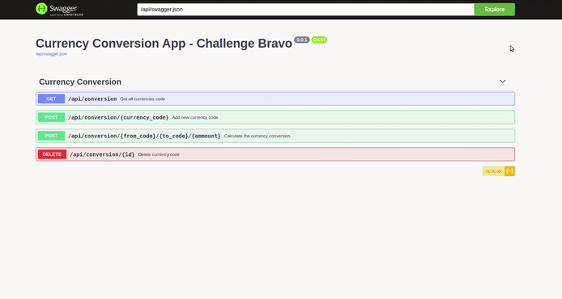
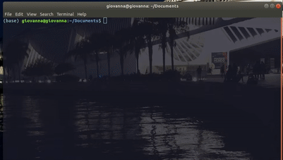
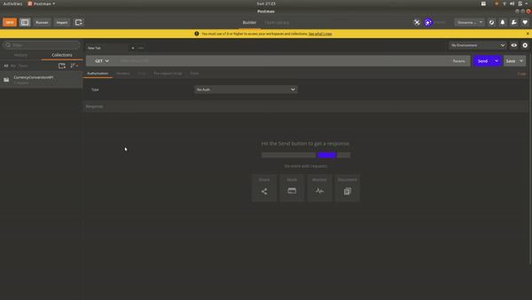
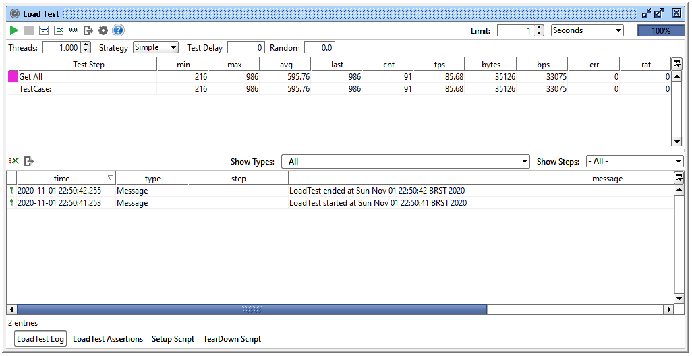
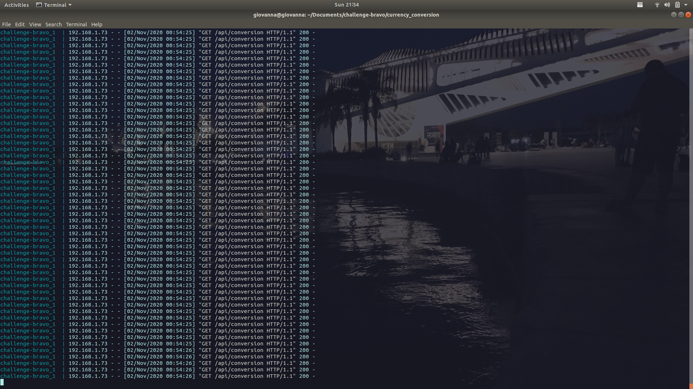

#  Desafio Bravo

<p align="center">

</p>

<h4 align="center">Currency Converse API</h4>
<p align="center">API de conversão monetária</p>

----

## Menu

* [Sobre o projeto](#about)
    * [Tecnologias Utilizadas](#libraries)
    * [Estrutura do projeto](#structure)
    * [Awesome API - Coletagem da cotação](#api_integration)
* [Iniciando](#start)
    * [Pré-Requisitos](#pre-requisits)
* [Rodando a api](#usage)
    * [Acessando o documentação](#api_docs)
* [Teste](#test)

<a id="about"></a>
## Sobre o projeto 

O projeto tem como objetivo efetuar conversão monetária em tempo real, utilizando como moeda lastro o dólar americano (USD), possibilitando a conversão em diferentes moedas como: BRL(Real), EUR(Euro), BTC(Bitcoin), ETH(Ethereum), etc.

<a id="libraries"></a>
### Tecnologias Utilizadas

Para a construção da API, foram utilizados as seguintes tecnologias:

* [Flask](https://flask.palletsprojects.com/en/1.1.x/): Microframework escrito em python utilizado para a construção da API. A escolha foi por ser um modelo simples e mais enxuto, sendo o necessário para a implementação.
* [Requests](https://requests.readthedocs.io/en/master/) : Biblioteca utilizada para efetuar requisições para a integração com a api externa (Awesome API)
* [apispec](https://apispec.readthedocs.io/en/latest/): Um gerador de especificação de api utilizado para a implementação da documentação, suportando o [OpenAPI Specification](https://github.com/OAI/OpenAPI-Specification)
* [Flask-SQLAlchemy](https://flask-sqlalchemy.palletsprojects.com/en/2.x/): Uma extensão do microframework Flask que suporta a comunicação com [SQLAlchemy](https://www.sqlalchemy.org/), utilizado para criação e comunicação com o banco de dados(no projeto foi utilizado o SQLite).
* [Flask-Marshmallow](https://flask-marshmallow.readthedocs.io/en/latest/): Integração com o Flask e o [Marshmallow](https://marshmallow.readthedocs.io/en/stable/) (biblioteca de serialização/desserialização de objetos Python)

<a id="structure"></a>
### Estrutura do Projeto

A estrutura do projeto foi organizada da seguinte forma
```bash
├── currency_conversion          # Diretório principal
│   ├── src                      #
│   │   ├── bussiness            # Lógica de negócio
│   │   ├── endpoints            # Definição dos endpoints da api e swagger                  
│   │   ├── models               # Classes modelo para o DB
│   │   ├── schemas              # Schemas utilizados para serialização     
│   │   ├── service              # Integração com a API externa de cotação e lógica de conversão
│   │   ├── templates            # Template para o index da API   
│   │   ├── test                 # Teste unitário e colection de tests para o Postman 
│   │   ├── utils                # Definição da lógica para status_code personalizados
│   │   ├── __init__.py          #
│   │   ├── apispec.py           # Configuração da APISpec para documentação da API
│   │   ├── app.py               # Arquivo principal com os setups gerais da api
│   │   ├── currency_converse.db # Banco de dados
│   │   ├── db.py                # Configurações do banco de dados 
└── docker-compose.yml           # Configurações do docker compose 
└── Dockerfile                   # Configurações do container docker  
└── requirements.txt             # Arquivo com todas libs necessárias para a api 
└── wsgi.py                      # Configuração do entry point da aplicação.
```

<a id="api_integration"></a>
### Awesome API - Coletagem da cotação

Para coletar a cotação atual, foi utilizada a [Awesome API](https://docs.awesomeapi.com.br/api-de-moedas), que, além de ser gratuita, nos fornece a cotação das principais moedas propostas para a conversão monetária. Existem algumas limitações, como: O número de moedas suportadas, moeda lastro da api, etc. Todas essas limitações foram tratadas devidamente com mensagens de erro personalizadas e cálculos de conversão da moeda lastro da api de cotação para a moeda lastro da api construída.

<a id="start"></a>
## Iniciando

A API atualmente é implementada em um container Docker, e para o start da aplicação são necessários os seguintes pré-requisitos:

<a id="pre-requisits"></a>
### Pré-Requisitos

* [Docker](https://docs.docker.com/get-docker/) : Utilizado para o encapsulamento de aplicações utilizando o conceito de containerização.
* [Docker Compose](https://docs.docker.com/compose/install/): Utilizado para orquestrar e automatizar a criação de um container.

<a id="usage"></a>
## Rodando a API

Todas as configurações de ambiente, instalações de libs e subida da API foram abstraídas nos arquivos ```Dockerfile ``` e  ```docker-compose.yml ```, com isso é necessário executar os seguintes comandos:

```bash
    $ git clone git@github.com:anacletogiovanna/challenge-bravo.git
    $ cd challenge-bravo/currency_conversion
    $ sudo docker-compose up
```

Com isso o docker reconhece o container, configura as variáveis de ambiente, instala as dependências do projeto e sobe a API disponibilizada na porta ``` 5000 ```

<a id="api_docs"></a>
### Acessando a documentação

Com o container e a aplicação "de pé", é possível o acesso da documentação da API e teste dos endpoints disponibilizado em ```http://localhost:5000/api/docs/ ```




<a id="test"></a>
## Teste

Para os testes unitários, foi utilizado o framework ``` pytest ```, que torna fácil a escrita de pequenos testes, porém, escaláveis. Os seguintes comandos são necessários para a execução dos testes unitários:
```bash
    $ cd challenge-bravo/currency_converse/src/test
    $ pytest
```
<p align="center">

</p>

Também foi utilizado o [Postman](https://www.postman.com/) com criação de uma coleção que contém o teste de todas os endpoints da API. A coleção se encontra na pasta ``` /test ``` do projeto que pode ser importado em qualquer postman e testado:



E para os testes de carga(load test) foi utilizado o [SoapUI](https://www.soapui.org/), instalado em um computador com o sistema operacional Windows 10, acessando a api pela porta disponibilizada (``` 5000 ```), que estava "*startada*" em um computador com sistema operacional Ubuntu 18.04 no container docker:

(SoapUI configurado para 1000 requisições em 1s)

(Container docker atendendo as requisições)


##### That's all Folks! 

