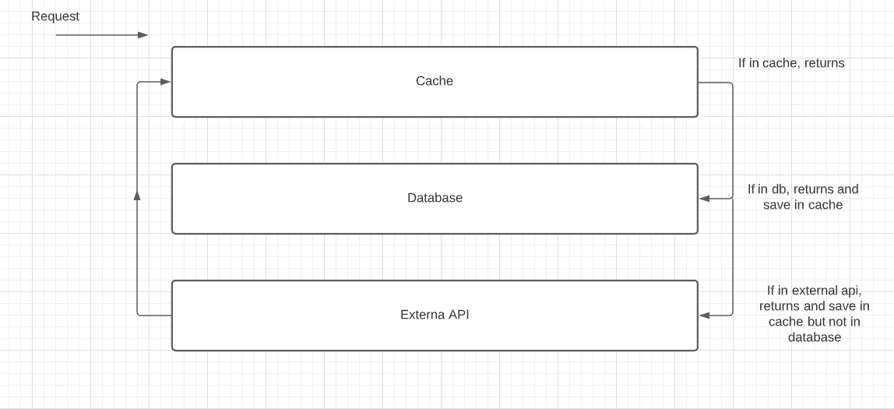

#  Desafio Bravo

Olá, eu sou o Goku :) (na verdade, Eduardo)

Primeiramente gostaria de elogiar o teste proposto (#puxaSaco), é bem diferente dos demais que já realizei.

##Projeto
Sem mais delongas, o sistema desenvolvido consistem em uma API de conversão de moedas. Dando suporte a moedas existentes e a novas moedas (fictícias ou não).

##Tecnologias

Node+Redis+MongoDB+Docker+Jest+Insomnia

Optei por utilizar NodeJS pela familiaridade como lingaguem, além de ser bem performática.

Utilizei Redis para o sistema de cache da aplicação, evitando requests desnecessárias a api externa.

Utlizei MongoDB para persistir novas moedas a API, neste caso, optei por utilizar um banco externo, realizei deploy do mesmo através da MongoDB Cloud.

Utilizei Jest para realizar testes unitários e de integração.

Utilizei Insomnia como ferramenta de desenvolvimento, facilitando acesso aos endpoint's da aplicação.

E também utilizei Docker para dar suporte à diversos tipos de OS.

##Arquitetura

Optei por desenvolvedor uma arquitetura baseada em camadas e com controle com base em middlewares para fazer as validações necessárias. acredito que seja uma maneira simples e prática de entender como tudo está funcionando.

Abaixo, tentei exemplificar o fluxo de entrada e saída do sistema:

<p align="center">
  
</p>

A api externa utlizada foi a [Awesome API](https://docs.awesomeapi.com.br/api-de-moedas), acredito que a mesma entrega de forma satifatória os dados necessários.

## Instalação e execução da API

Primeiramente, instale as depências do projeto:
```
npm install
```

Os scripts de execução foram feitos no arquivo docker-composer.yml, mas para facilitar, utilizo a dependência [make](https://www.npmjs.com/package/make).

Navegue até a raíz do projeto e então digite o comando abaixo no terminal:
```
make up
```

Caso ocorra erro de comando não encontrado, por favor, instale a depência de forma global e reinicie o terminal (fecha e abre :)), digite o comando abaixo para instalar, não se esqueça da flag -g:

```
npm install make -g
```


Caso queira rodar fora do Docker, basta digitar:

```
npm run start
```
OU

```
npm run dev
```

Para rodar os testes:

```
npm run start
```
OU

```
npm run dev
```

##Rotas da API

As rotas da api estão dispostas da seguinte maneira:

```
{url}/                                     |    GET   | Retorna legenda para as respostas da API

{url}/all                                  |    GET   | Retorna todas as moedas suportadas.

{url}/add                                  |    PUT   | Adiciona uma nova moeda.

{url}/delete                               |  DELETE  | Remove uma moeda selecionada.

{url}/conversion?to=BRL&from=HURB&amount=5 |    GET   | Retorna a cotação da moeda e o valor convertido. (parâmetros passados como exemplo)

```

A API recebe e retorna os dados em formato JSON.

Obs.: Deixei um arquivo com a configuração de requests no [insomnia](https://insomnia.rest/) para facilitar o uso.

```
Insomnia-challenge-bravo.json
```

#Possíveis falhas

Por não utilizar um sistema de autenticação, qualquer um pode remover uma moeda adicionada.

Por utilizar um banco de dados externo, caso o serviço fique indisponível, será necessário intervir.


<p align="center">
  
</p>
