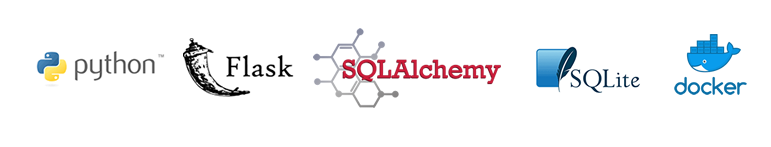
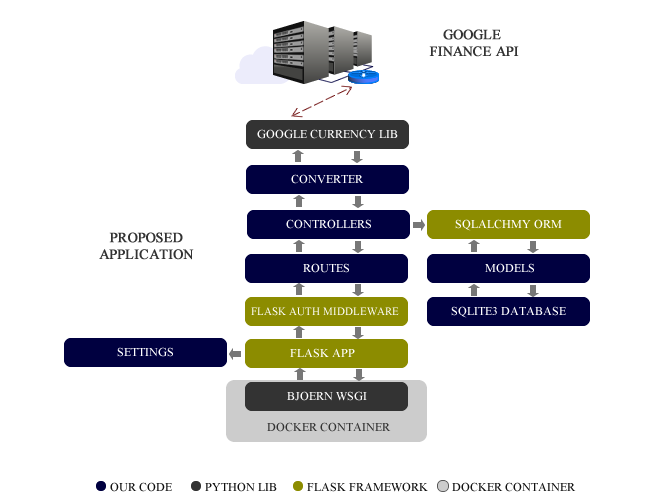

## Quick Start

1 - Clone this repo.
2 - In terminal go to the root directory
3 - Build the docker image (it will install all dependencies):
```bash
docker build -t hurb_challenge_bravo ./
```
4 - Run API:
```bash
docker-compose up
```

## About This Project
This project is part of the Bravo challenge proposed by Hurb, which consists in developing an API for currency conversion.
The proposed solution is an API is based on the RESTFull standards and was implemented using the following technologies:
<p align="center">
  
</p>

User can converte values using a GET request to the fallow route
```bash
/currency/convert?from=<SOURCE>&to=<DESTINY>&amount=<VALUE>
```
# Solution Architecture
The following figure presents the architecture and data flow within the proposed application:

<p align="center">
  
</p>

# How this Works
The google currency library was used to fetch the updated values from the google finance service.

<!-- docker run -p 8080:80 -it -e APP_MODULE="server:api" myimage -->


**It is not possible to perform the conversion between two fictitious currencies because this use case is not covered by the challenge specification. Please check the challenge description at: https://github.com/hurbcom/challenge-bravo#-desafio-bravo**


python -m pytest --cov --cov-report=html:tests/reports/html --cov-report=xml:tests/reports/coverage.xml


