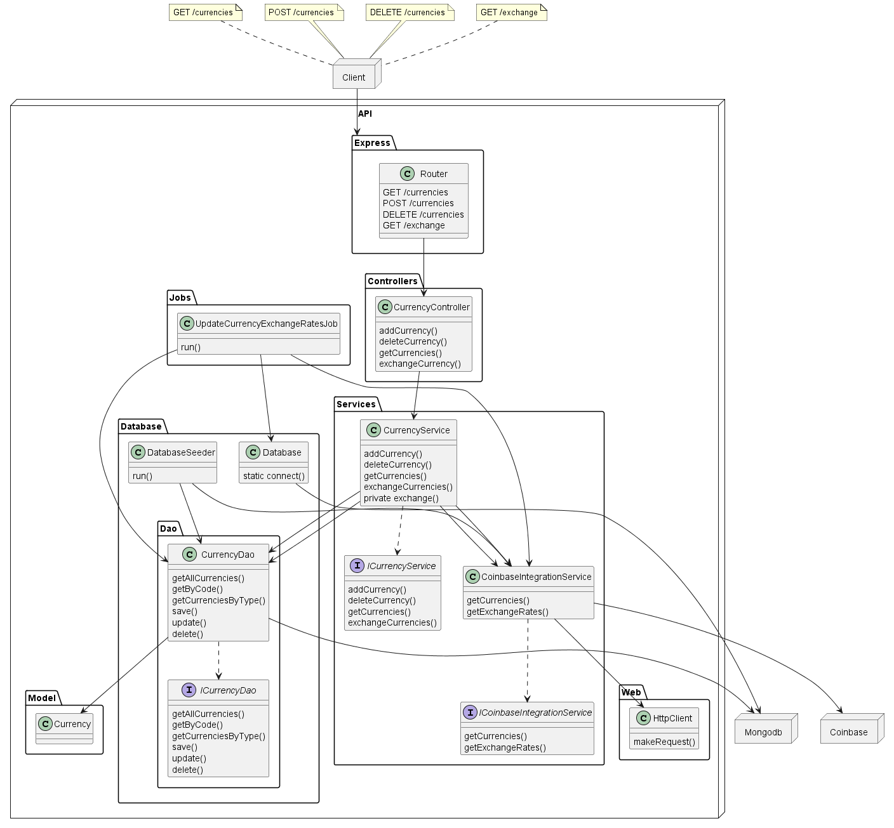

#  Bravo Challenge

## Challenge-Bravo

API para conversão de valores entre moedas e/ou criptomoedas

Para a construção deste projeto foram utilizadas as seguintes ferramentas, bibliotecas e frameworks:

- NodeJS (Typescript)
- Express
- Axios
- Mongodb
- Docker
- Jest

## Configuração e instalação

```
docker-compose build && docker-compose up
```

## Endpoints

### Cadastrar uma moeda

Método: `POST`

Rota: `/currencies`

#### Validações

- `code`: é obrigatório e deve ter, no mínimo, 3 caracteres e, no máximo, 5 caracteres.
- `exchangeRate`: não é obrigatório, mas quando enviado, deve ser um número positivo e utilizar o ponto (.) como separador decimal.

Exemplo de corpo da requisição para adição de uma moeda real:

```
{
	"code": "AUD"
}
```

Exemplo de corpo da requisição para adição de uma moeda fictícia:

```
{
	"code": "LOTR",
    "exchangeRate": "1.78"
}
```

Exemplo de retorno:

```
{
	"data": {
		"code": "HURB",
		"exchangeRate": 1.78,
		"type": "FICTITIOUS",
		"_id": "627ee445c8ef98758671d672",
		"createdAt": "2022-05-13T23:05:41.126Z",
		"updatedAt": "2022-05-13T23:05:41.126Z",
		"__v": 0
	},
	"error": null
}
```

### Listar Moedas Cadastradas

Método: `GET`

Rota: `/currencies`

Exemplo de retorno:

```
{
	"data": [
		{
			"code": "USD",
			"exchangeRate": 1,
			"type": "REAL"
		},
		{
			"code": "HURB",
			"exchangeRate": 1.5,
			"type": "FICTITIOUS"
		},
	],
	"error": null
}
```

Existe a possibilidade de filtramos a lista de moedas pelo tipo:

- REAL
- FICTITIOUS

Para isso, basta adicionarmos o parâmetro `type` na URL

Exemplo de requisição para moedas do tipo REAL:

`/currencies?type=REAL`

Exemplo de requisição para moedas do tipo FICTITIOUS:

`/currencies?type=FICTITIOUS`

### Deletar uma moeda

Método: `DELETE`

Rota: `/currencies?currency={currency}`

#### Validações

- `currency` deve ter, no mínimo, 3 caracteres e, no máximo, 5 caracteres e deve estar cadastrada no banco de dados.

Exemplo de requisição:

`/currencies?currency=HURB`

Exemplo de retorno:

```
{
	"data": {
		"_id": "627ee445c8ef98758671d672",
		"code": "HURB",
		"exchangeRate": 1.78,
		"type": "FICTITIOUS",
		"createdAt": "2022-05-13T23:05:41.126Z",
		"updatedAt": "2022-05-13T23:24:01.037Z",
		"__v": 0
	},
	"error": null
}
```

### Conversão de moedas

Método: `GET`

Rota:`/exchange?from={currency}&to={currency}&amount={amount}`

#### Validações

- `from`: é obrigatório e deve ter, no mínimo, 3 caracteres e, no máximo, 5 caracteres.
- `to`: é obrigatório e deve ter, no mínimo, 3 caracteres e, no máximo, 5 caracteres.
- `amount`: é obrigatório e deve ser um número positivo e utilizar o ponto (.) como separador decimal.

Exemplo de requisição:
`/exchange?from=BRL&to=USD&amount=10.5`

Exemplo de retorno:

```
{
	"data": {
		"to": "USD",
		"amount": "2.08"
	},
	"error": null
}
```

## Jobs

### Update Currency Exchange Rates

Job responsável por atualizar a taxa de câmbio das moedas que estão cadastradas no banco.

## Testes

Para a execução dos testes basta executar o comando abaixo:

`yarn test`

## TODO

- Criar rota de HealthCheck para monitorar o status da aplicação
- Adicionar Redis (cache) à aplicação para melhorar a performance da aplicação

<!-- <figure align="center">
  
  <figcaption>Diagrama de classes da API</figcaption>
</figure> -->
