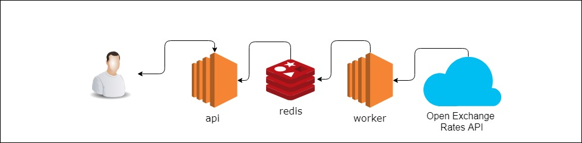
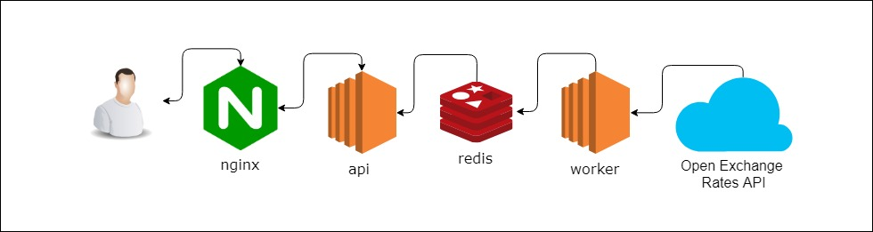
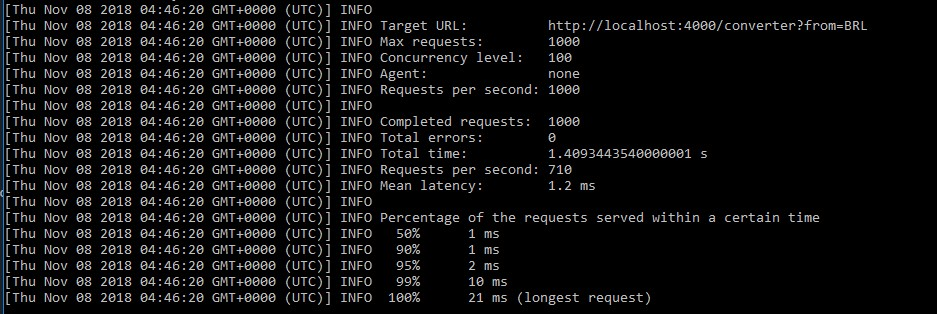

# Bem vindo - Solução Challenge Bravo

Segue a aplicação para resolver o [Challenge Bravo](https://github.com/hurbcom/challenge-bravo) desenvolvida com [Node.js](nodejs.org) utilizando a API de cotações da [Open Exchange Rates](https://openexchangerates.org).

## Requisitos

- API Key da [openexchangerates](https://openexchangerates.org).
- [Docker](https://www.docker.com/) versão 18.x
- [Docker Compose](https://docs.docker.com/compose/) versão 1.22+

## Iniciando

Para iniciar o projeto basta clonar o repositório e mover até a branch develop.

    $ git clone https://github.com/EmanoelFaria/challenge-bravo.git
    $ cd challenge-bravo/
	$ git checkout develop

Crie um arquivo chamado `.env` na raiz do projeto e adicione a chave da API da Open Exchanges Rates.
	
	API_KEY_OEX=<sua chave aqui, apenas numeros>

Para iniciar o serviço de conversão basta executar o seguinte comando na raiz do projeto:

    $ docker-compose up -d 

Para parar o serviço basta executar o seguinte comando:

	$ docker-compose down

### Utilizando a API 

A aplicação disponibiliza um serviço de conversão de valores entre seguintes moedas: `USD,BRL,EUR,BTC,ETH`. Tem como moeda de lastro o Dólar `(USD)`.

O serviço de conversão é feito por um request do tipo `GET` no path `/converter` passando os parâmetros abaixo por query string

| Parâmetro  | Descrição |
|--|--|
| amount | valor que deseja converter |
| from | moeda do valor a ser convertido |
| to | moeda destino da conversão |


Exemplo de requisição - *GET* 

```
http://localhost:4000/converter?from=BRL&to=ETH&amount=10
```

Exemplo de resposta:

    
	{
	    "from": "BRL",
	    "to": "ETH",
	    "amount": 10,
	    "result": 0.012122772371989152
	}
	

# Arquitetura
### Modelo 1


### Modelo 2


A arquitetura escolhida para solução do challenge foi a primeira, mas também está pronta para atender o segundo modelo.

## Componentes da arquitetura

#### Worker
O worker é o componente responsável por manter os dados de cotações do redis atualizados com os dados da API da Open Exchange.

Ele tem uma rotina de atualização baseada em tempo(minutos), que pode ser alterado nas configurações da aplicação.

Como este não é um processo que precisa se escalado baseado na quantidade de requisições/usuários, é aconselhavel que se tenha pelo menos 2 processos do worker rodando para garantir a disponibilidade dos dados sempre atualizados para nossa API, mesmo que um dos processos sofra falha. (conforme o Modelo 2).

#### Redis
Para criar uma solução que possa ser escalada futuramente, foi utilizando o Redis como banco de dados e servidor cache de nossas cotações. Assim garantimos que com o aumento do número de usuários/requisições teremos uma base sólida para disponibilizar os dados sempre atualizados, sem ter que fazer requisições diretamente API da Open Exchange sempre que consultarem nosso serviço. 

#### API
A api foi desenvolvida pensando em atender no mínimo 1000 requisições por nó, podendo ser escalada quando necessário. 

Ela também tem uma rotina de atualização de dados, só que diferente do worker não consulta diretamente a API da Open Exchanges e sim o REDIS. 

Para garantir a velocidade de resposta das requisições ela guarda em memória o valor das ultimas cotações, assim ela também não precisa consultar o REDIS sempre que uma nova consulta é feita.


#### Nginx - Load Balancer 

Escolhi utilizar o [*Nginx*](https://www.nginx.com/) como Load Balancer pois é uma solução gratuita ja validada que atenderia muito bem a aplicação. Apesar disso poderiamos utilizar aplicações de terceiros como [*AWS Elastic Load Balancer*](https://aws.amazon.com/pt/elasticloadbalancing/) ou o prório [*Swarm*](https://docs.docker.com/engine/swarm/) do Docker.


# Testes de unidade

Para rodar os testes basta excutar o seguinte comando:
	
	$ cd <raiz do projeto>
	$ npm install
	$ npm test


# Teste de Stress

Foi executado um teste de stress, utilizando o [*LoadTest*](https://www.npmjs.com/package/loadtest) em uma EC2 da AWS do tipo `C4.4xlarge`

### LoadTest
Para rodar o teste de stress com o LoadTest basta executar os seguintes comandos:

	$ sudo npm install -g loadtest
	$ loadtest -n 1000 -c 100 --rps 100 http://localhost:4000/converter?from=BRL&to=ETH&amount=10

#### Resultados:



