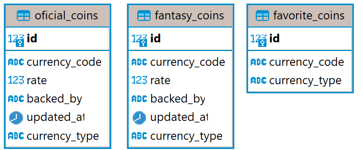

# Bravo challenge

* [Descrição](#about)
* [Estrutura do projeto](#estrutura)
* [Tecnologias utilizadas](#tecnologias)
* [Como executar a API](#como-executar)
    * [Requisitos](#requisitos)
    * [Comandos](#comandos)
* [Usabilidade](#usabilidade)
    * [Moedas presentes na API](#moedas)
    * [Docs](#docs)
    * [Postman](#postman)
* [Endpoints](#endpoints)
    * [/quote](#quote)
    * [/favorite](#favorite)
    * [/convert](#convert)
* [Database](#database)
    * [PgAdmin](#pgadmin)
    * [Tabelas](#tabelas)
    * [Campos](#campos)
* [Testes](#testes)
    * [Testes unitários](#unit-tests)
    * [Testes de carga](#load-tests)


<a id="about"></a>
## Descrição

O projeto tem como objetivo entregar uma API que realiza conversão de moedas (USD, BRL, EUR, ETH, BTC), além de criação e exclusão de moedas fictícias.

<a id="estrutura"></a>
## Estrutura do projeto
```bash
currency-converter
├── alembic/                # database migration
├── app                     # API
│   ├── operators/          # operation handlers
│   │   ├── convert.py
│   │   ├── currency.py
│   ├── routers/            # API routes
│   │   ├── convert.py
│   │   ├── favorite.py
│   │   ├── quote.py
│   ├── schemas/            # pydantic schemas for data validation
│   │   ├── convert.py
│   │   ├── favorite.py
│   │   ├── quote.py
│   ├── config.py           # global configs
│   ├── database.py         # database connection
│   └── main.py             # API main file
│   ├── models.py           # database models
├── assets/                 # files used in readme
├── updater/                # database updater script
│   ├── config.py
│   ├── Dockerfile.updater
│   ├── models.py
│   ├── requirements.txt
│   ├── schemas.py
│   ├── script.py
├── tests/
│   ├── load_tests/         # API load test using k6
│   ├── postman/            # postman collection JSON file
│   ├── unit_tests/         # API unit tests using pytest
├── .env                    # environment variables
├── .env.example            # .env file example
├── requirements.txt
├── Dockerfile.api
├── docker-compose.yml
├── .gitignore
├── logging.ini
└── alembic.ini
```

<a id="tecnologias"></a>
## Tecnologias utilizadas

No desenvolvimento dessa API foram utilizados:

-   **[FastAPI](https://github.com/tiangolo/fastapi)**: Framework utilizado para a construção da API.
-   **[Pydantic](https://pydantic-docs.helpmanual.io/)**: Validação de dados enviados pelo usuários, response models, gerenciamento de variáveis de ambiente e type hints.
-   **[SwaggerUI](https://github.com/swagger-api/swagger-ui)**: Criação de documentação interativa através do framework FastAPI.
-   **[Requests](https://requests.readthedocs.io/en/latest/)**: Permite o envio de chamadas HTTP.
-   **[SQLAlchemy](https://www.sqlalchemy.org/)**: Object Relational Mapper que garante acesso e manipulação do banco de dados (PostgreSQL).
-   **[Alembic](https://github.com/sqlalchemy/alembic)**: Ferramenta de migração de banco da dados que mapeia todas as mudanças realizadas com a possibilidade de realizar um _downgrade_ ou _upgrade_ caso necessário.

<a id="como-executar"></a>
## Como executar a API

<a id="requisitos"></a>
### Requisitos

- Instalar na sua máquina:
    -   **[Docker](https://docs.docker.com/get-docker/)**
    -   **[docker-compose](https://docs.docker.com/compose/install/)**
-   Criar um arquivo `.env` a partir do arquivo `.env.example` e o preencha com as informações abaixo:
    ```
    DATABASE_HOSTNAME=postgres
    DATABASE_USERNAME=postgres
    DATABASE_PASSWORD=password123
    DATABASE_PORT=5432
    DATABASE_NAME=currency_converter
    POSTGRES_DB=currency_converter
    POSTGRES_PASSWORD=password123
    PGADMIN_DEFAULT_EMAIL=admin@admin.com
    PGADMIN_DEFAULT_PASSWORD=root
    ```
<a id="comandos"></a>
### Comandos

1.  `git clone https://github.com/gabrielrnascimento/challenge-bravo.git`
2.  `cd challenge-bravo`
4.  `docker-compose up -d --build`


<a id="usabilidade"></a>

## Usabilidade
<p align="center">
  
</p>

A API roda no endereço [](http://localhost:8000/docs)[http://localhost:8000/](http://localhost:8000/)

Foi utilizada a [API pública da Coinbase](https://docs.cloud.coinbase.com/sign-in-with-coinbase/docs/api-exchange-rates) que suporta um grande número de moedas. A fim de reduzir o tempo de resposta e um excessivo número de requisições à API pública, os dados disponibilizados são armazenados na tabela `oficial_coins` e as operações relacionadas a moedas e conversão se referem a essa tabela.

É possível converter moedas fictícias mesmo que a sua moeda de lastro não seja USD, nesses casos, as moedas que tem moeda de lastro diferente de USD são convertidas primeiramente para USD, após essa etapa, são convertidas para a moeda alvo.

Com o objetivo de manter os dados mais atualizados quanto possível, foi criado um script que atualiza a tabela `oficial_coins` a cada 30 segundos com as cotações mais recentes. Esse script também está _dockerizado._
<a id="endpoints"></a>

<a id="moedas"></a>
#### Moedas presentes na API

É possível conferir a lista de moedas que a API suporta [aqui](/assets/lista-moedas.md)
<a id="docs"></a>
### Docs

[FastAPI](https://github.com/tiangolo/fastapi) proporciona uma documentação interativa gerada automaticamente no browser, graças a utilização de [SwaggerUI](https://github.com/swagger-api/swagger-ui). Para verificar a documentação basta acessar [](http://localhost:8000/docs)[http://localhost:8000/docs](http://localhost:8000/docs)

### Postman

É possível testar todos endpoints da API via Postman importando o arquivo JSON `tests/postman/currency-converter.postman_collection.json`

## Endpoints

Existem 3 rotas na API:
### /quote

-   **GET** `quote/` Retorna todas as moedas fornecidas.

    ```bash
    curl -L -X GET 'http://localhost:8000/quote/'
    ```

-   **GET** `quote/{currency_code}/` Retorna uma moeda específica.

    ```bash
    curl -L -X GET 'http://localhost:8000/quote/HURB'
    ```

-   **POST** `quote/{currency_code}/` Cria uma moeda (fictícia) específica.
Esse endpoint aceita dois tipos de body.

    ```bash
    curl -L -X POST 'http://localhost:8000/quote/' \
    -H 'Content-Type: application/json' \
    --data-raw '{
        "currency_code": "HURB",
        "rate": 4,
        "backed_by": "BRL"
    }'
    ```

    ```bash
    curl -L -X POST 'http://localhost:8000/quote/' \
    -H 'Content-Type: application/json' \
    --data-raw '{
        "currency_code": "HURB",
        "amount": 4,
        "backed_by": "BRL",
        "backed_currency_amount": 1
    }'
    ```

-   **PUT** `quote/{currency_code}/` Altera uma moeda (fictícia) específica.
Esse endpoint aceita dois tipos de body.

    ```bash
    curl -L -X PUT 'http://localhost:8000/quote/HURB' \
    -H 'Content-Type: application/json' \
    --data-raw '{
        "currency_code": "HURB",
        "rate": 2,
        "backed_by": "BRL"
    }'
    ```

    ```bash
    curl -L -X PUT 'http://localhost:8000/quote/HURB' \
    -H 'Content-Type: application/json' \
    --data-raw '{
        "currency_code": "HURB",
        "amount": 2,
        "backed_by": "USD",
        "backed_currency_amount": 1
    }'
    ```

-   **DELETE** `quote/{currency_code}/` Remove uma moeda (fictícia) específica. Esse endpoint aceita dois tipos de body.
    ```bash
    curl -L -X DELETE 'http://localhost:8000/quote/HURB' \
    --data-raw ''
    ```
### /favorite

-   **GET** `favorite/` Retorna todas as moedas adicionadas como favorito.
    ```bash
    curl -L -X GET 'http://localhost:8000/favorite/'
    ```

-   **GET** `favorite/{currency_code}` Retorna uma moeda específica adicionada como favorito.
    ```bash
    curl -L -X GET 'http://localhost:8000/favorite/HURB'
    ```

-   **POST** `favorite/{currency_code}` Adiciona uma moeda (fictícia ou oficial) específica como favorito.
    ```bash
    curl -L -X POST 'http://localhost:8000/favorite/HURB' \
    --data-raw ''
    ```

-   **DELETE** `favorite/{currency_code}` Remove uma moeda (fictícia ou oficial) específica dos favoritos.
    ```bash
    curl -L -X DELETE 'http://localhost:8000/favorite/HURB' \
    --data-raw ''
    ```


### /convert

-   **GET** `convert/` Realiza a conversão entre duas moedas (fictícias ou oficiais).
    ```bash
    curl -L -X GET 'http://localhost:8000/convert/?source=BRL&target=USD&amount=1'
    ```

<a id="database"></a>
## Database

<p align="center">
  
</p>

Para o banco de dados, foi utilizado PostgreSQL rodando em um container Docker na porta 5432.

É possível interagir com o banco de dados através do PgAdmin, também em um container Docker, no endereço [](http://localhost:5050)[http://localhost:5050](http://localhost:5050).
### PgAdmin

**Login**

-   **Email Address / Username**: [admin@admin.com](mailto:admin@admin.com)
-   **Password**: root

**Registre o servidor**:

-   _Object_ → _Register → Server… → General_
-   **Name**: challenge-bravo
-   → Connection
-   **Host**: postgres
-   **Port**: 5432
-   **Maintenance database**: postgres
-   **Username**: postgres
-   **Password**: password123

### Tabelas

-   `oficial_coins`: Armazena os dados recebidos via request da API pública.
-   `fantasy_coins`: Armazena os dados de moedas fictícias criadas pelos usuários.
-   `favorite_coins`: Armazena os dados de moedas classificadas como favoritas.

### Campos

-   `currency_code`: Código da moeda (e.g. BRL, USD, BTC).
-   `rate`: Cotação da moeda em relação à moeda de lastro (USD).
-   `backed_by`: Moeda de lastro (nos casos de moeda oficial, esse valor será USD).
-   `updated_at`: Data e hora da última atualização.
-   `currency_type`: Identificador entre moedas fictícias e moedas oficiais (e.g. oficial e fantasy).

Para realizar migrações no banco de dados via alembic (atualizar schema) é necessário o seguinte processo:

1.  `docker-compose up -d`
2.  `docker-compose exec api alembic revision --autogenerate -m "revision-name"`
3.  `docker-compose restart`

<a id="testes"></a>
## Testes
Foram realizados testes unitários e testes de carga.

<a id="unit-tests"></a>
### Testes unitários

Os testes validam:
- `/quote`
- `/favorite`
- `/convert`
- API pública atendendo as 5 moedas obrigatórias

Para executar os testes unitários, é necessário estar com os _services_ online e utilizar o comando:

`$ docker-compose exec api pytest -v`
<p align="center">
  
</p>

<a id="load-tests"></a>
### Testes de carga

Para realizar o teste de carga foi utilizado o [k6](https://k6.io/docs/), uma ferramenta de teste open-source, _conteinerizada_ na aplicação.

O teste de estresse foca no endpoint de conversão e tem duração de 1 minuto:
1.  Realiza o request: `/convert/?source=BRL&target=USD&amount=1`
2.  Aumento gradativo de _virtual users_ até 1000 nos primeiros 10 segundos.
3.  Manter 1000 VUs por 30 segundos.
4.  Reduzir VUs até 0 nos últimos 10 segundos.

Para executar o teste, é necessário estar com os _services_ online e utilizar o comando:

`$ docker-compose run k6 run //load_tests//stress.js`
<p align="center">
  
</p>