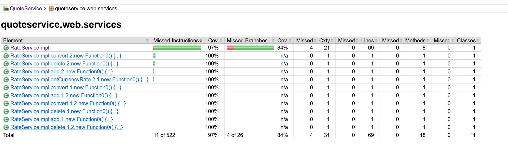
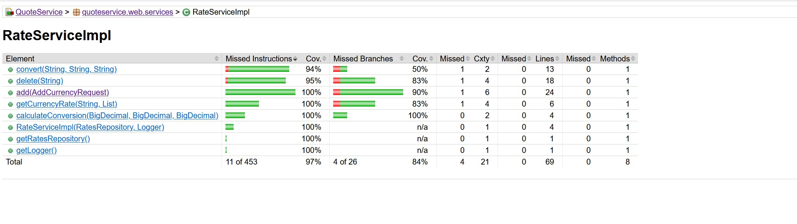
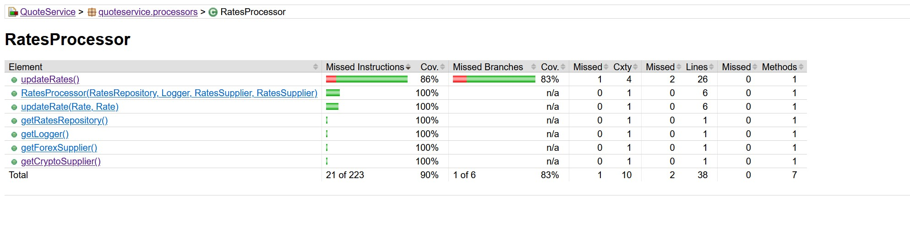

[[English](README.md) | [Portuguese](README.pt.md)]

<h2>QuoteService</h2>

<h3>About</h3>

This API purpose is to convert between fiat, crypto and imaginary/non-standard currencies. It is built using Spring Boot
and Kotlin.

The API offers initial support to conversion between the following currencies:

- USD
- BRL
- EUR
- BTC
- ETH
- D&D (Dungeons & Dragons Gold Coins which is an imaginary currency)

The basic idea of this API is to retrieve data from open quotes/exchange APIs and use them to calculate the conversions.
As these supplier allow open use of the public APIs the implementation uses a routine to retrieve data from them at a
configurable via environment variable delay in millis in order to avoid overtaxing them with requests and passing the
rate limit. The data is then converted to the pattern defined in the code and then persisted on the database to usage in
conversions afterwards. **Please note that conversions may differ from other engines like google or APIs due to
the different rate sources.**

<h3>Setup</h3>

The API is dockerized which means that it should be relatively easy for to get it up and running. For you to get it
running first clone this git repository to your machine. Open terminal and navigate to the root of the cloned repo,
the use the following command:

``` docker-compose up --build ```

The process may take a while but eventually the service will be up and running. If you get any error regarding missing
images just use the following command to each missing image:

``` docker pull <missing_image> ```

<h3>Usage</h3>

Currently, QuoteService offers 3 endpoints. One to convert between currencies, one to add a new currency and other to
remove a currency.

</h2>Conversion Endpoint</h2>

Verb: GET

This endpoint is used to convert an amount in a base currency to a target currency

The conversion endpoint route (locally) is:
``` http://localhost:8080/currency/convert?from=<BaseCurrency>&to=<TargetCurrency>&amount=<Amount> ```

ex: ``` http://localhost:8080/currency/convert?from=ETH&to=BRL&amount=1 ```

You must add the following mandatory header: Header: ``` Authorization: <API-Key> ```

Below is the curl for calling the conversion endpoint (locally):

curl --location 'http://localhost:8080/currency/convert?from=ETH&to=BRL&amount=1' \
--header 'Authorization: c4bf1743-1725-4a47-acbc-69668962fcdc'

</h2>Add Currency Endpoint</h2>

This endpoint is used to add new currencies to the API

Verb: POST

The add currency endpoint route (locally) is:
``` http://localhost:8080/currency/add ```

You must add the following mandatory header: Header: ``` Authorization: <API-Key> ```

Body:

{

    "symbol": <Currency-Symbol>,

    "from_usd": <Conversion-Rate-From-USD>,

    "to_usd": <Conversion-Rate-To-USD>

}

Parameters:
- symbol: Oficial currency symbol (USD, BRL, EUR, BTC, ETH, etc...);
- from_usd: Value resulting of the conversion of $1 USD to the currency being added
(ex: How much is 1 US dollar in USD);
- to_usd: Value resulting of the conversion of $1 of the currency being added to USD (ex: How much is 1 yen in USD).

Below is the curl for calling the add currency endpoint (locally):

curl --location 'http://localhost:8080/currency/add' \
--header 'Authorization: c4bf1743-1725-4a47-acbc-69668962fcdc' \
--header 'Content-Type: application/json' \
--data '{
"symbol": "BRL",
"from_usd": "5.14723",
"to_usd": "0.194279"
}'

Notice: Please observe that the more numbers after the dot the more precise the calculations will be.
(the recommended scale is of 6 numbers after the dot.).

</h2>Delete Currency Endpoint</h2>

This endpoint is used to logically remove currency support from the API

Verb: DELETE

The delete currency endpoint route (locally) is:
``` http://localhost:8080/currency/delete?currency=<CurrencySymbol> ```

You must add the following mandatory header: Header: ``` Authorization: <API-Key> ```

ex: ``` http://localhost:8080/currency/delete?currency=BRL ```

Below it the curl for calling the add currency endpoint (locally):

curl --location --request DELETE 'http://localhost:8080/currency/delete?currency=BRL' \
--header 'Authorization: c4bf1743-1725-4a47-acbc-69668962fcdc'

**Important Notice: The default value for the Authorization Header is c4bf1743-1725-4a47-acbc-69668962fcdc**

<h3>Important Notice</h3>

Currently, coverage in jacoco is relatively low due to the fact that I couldn't get the exclusion of classes to
work properly yet. Basically jacoco is considering all classes in its report as can be seen in the images below:


<p align="center">
  
</p>

However, the classes that contain the most important code are well covered as can be seen
below:

Services:

<p align="center">
  
</p>

RateService:

<p align="center">
  
</p>

Processors:

<p align="center">
  
</p>

RateProcessor:

<p align="center">
  
</p>