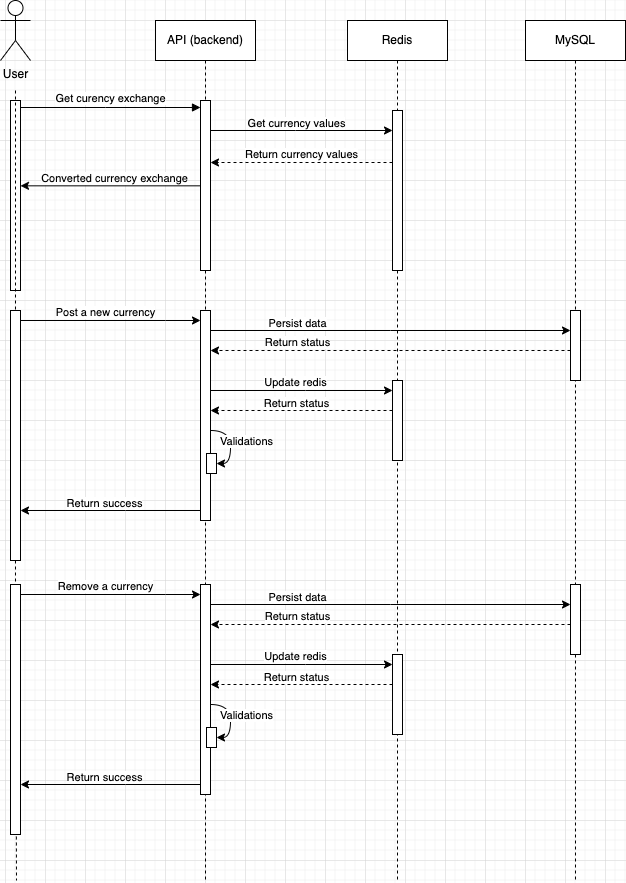

#  Bravo Challenge

Para esse desafio foi usada a seguinte arquitetura:

<p>
    
</p>

## Diagramas de sequência

### Worker

<p>
    
</p>

### API

<p>
    
</p>

## Contâiners (docker):

### db

Banco de dados MySQL responsável por persistir os dados em um estado sólido.

### redis

Banco de dados em memória (volátil) que dará melhor desempenho e velocidade em nosso response.

### worker

Serviço responsável por manter o db e o redis sempre atualizados com dados reais. O tempo de atualização default é de 5 minutos, porém esse parâmetro pode ser alterado atualizando o docker-compose.yml

### app

Nosso servidor backend escrito em NodeJS utilizando o framework [ExpressJS](https://expressjs.com/pt-br/).


## Executando o projeto

Para execução do projeto basta executarmos o comando:
```shell
docker compose up
```

A ordem de execução será a seguinte:
1. redis
2. mysql
3. worker
4. app (com delay de 10 segundos, para que dê tempo do worker realizar as atualizações)

Para encerramento dos serviços:
```shell
docker compose down
```

Se precisar alterar o fonte, envs, ou algum outro arquivo, para rebuildar os serviços, basta executar o comando abaixo:
```shell
docker compose up --build
```

## API

O projeto estará executando na porta padrão 3000.

O endereço padrão para testes:
```
http://localhost:3000/
```

Documentação da API foi escrita utilizando a [OpenAPI 3.0 Specification](https://swagger.io/docs/specification/about/) e se encontra no endereço:
```
http://localhost:3000/api-docs/
```

### [Documentação](http://localhost:3000/api-docs/) (resumo)

#### Solicitar uma conversão entre duas moedas
##### GET

```shell
curl --request GET \
  --url 'http://localhost:3000/?from=BRL&to=USD&amount=1'
```
Parâmetros:
| Name | Located in | Description | Required | Schema |
| ---- | ---------- | ----------- | -------- | ---- |
| from | query | Moeda de origem | Yes | string |
| to | query | Moeda de destino | Yes | string |
| amount | query | Valor a ser convertido | Yes | number |

Response:
| Code | Description |
| ---- | ----------- |
| 200 | Ok |
| 400 | Bad Request |
| 404 | Not found |
| 500 | Internal Server Error |

#### -> Criar uma nova moeda
##### POST
```shell
curl --request POST \
  --url http://localhost:3000/ \
  --header 'Content-Type: application/json' \
  --data '{
	"currency": "GTA",
	"ballast_usd": 0.000013544,
	"crypto": false
}'
```
Body:
| Name | Located in | Description | Required | Schema |
| ---- | ---------- | ----------- | -------- | ---- |
| currency | body | Nome da moeda | Yes | string |
| ballast_usd | body | Valor da moeds em Dólar Americano (USD) | Yes | number |
| crypto | body | Se é uma criptomoeda | Yes | boolean |

Response:
| Code | Description |
| ---- | ----------- |
| 201 | Created |
| 400 | Bad Request |
| 409 | Conflict |
| 500 | Internal Server Error |

#### Remover uma moeda 
##### DELETE
*Só poderão ser removidas as moedas criadas pelo usuário.
**As moedas obtidas pelo [worker](#worker-1) não poderão ser removidas

```shell
curl --request DELETE \
  --url 'http://localhost:3000/?currency=GTA'
```
Parâmetros:
| Name | Located in | Description | Required | Schema |
| ---- | ---------- | ----------- | -------- | ---- |
| currency | query | Moeda a ser removida | Yes | string (string) |

Response:
| Code | Description |
| ---- | ----------- |
| 200 | Ok |
| 400 | Bad Request |
| 403 | Forbidden |
| 404 | Not found |
| 500 | Internal Server Error |