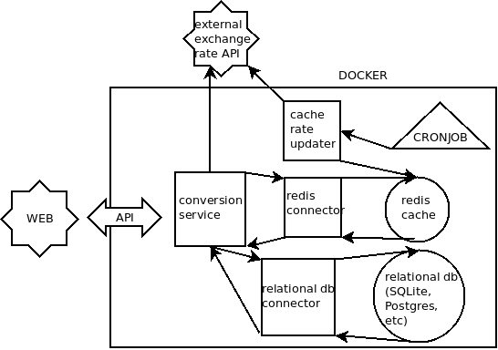

#  Desafio Bravo

## Introduction
This project was built with a few things in mind:
- To build the smallest and simplest piece of software that meets the provided requirements;
- To use the least amount of external dependencies possible; 

The language of choice was Python, using Sanic as the api framework due to it's high performance and simplicity.

For more detailed info, refer to the docs folder, starting with [the plan](docs/theplan.md).

## Routes (@ localhost:8033)

| Route          | HTTP Method | Required params                    | Description |
| :---:          | :---:       | :---:                              | :---:       |
| /allCurrencies | GET         | N/A                                | Gets all currencies known by the api
| /allUserCreated| GET         | N/A                                | Gets all user created currencies
| /allReal       | GET         | N/A                                | Gets all "real" currencies (the ones acquired via the external api)
| /create        | POST        | name(str), base_value(float)       | Creates a new currency
| /update        | PUT         | name(str), new_base_value(float)   | Updates an already existing user created currency
| /delete        | DELETE      | name(str)                          | Deletes an user created currency
| /convert       | GET         | from(str), to(str), amount(float)  | Performs a conversion operation of the specified amount between the two provided currencies (from and to)

Note: For creating and updating user created currencies, keep in mind the values refer to USD.

## On running the project

To run the project in the most "automatic" way:  

1. `git clone git@github.com:lgcavalheiro/challenge-bravo.git `
2. `cd challenge-bravo`
3. `make dbu-dev` *dbu stands for docker-compose Down && Build && Up

This should launch the whole project using docker and docker-compose and is the fastest way to get it up and running. After the last command completes, you can access the api at `http://localhost:8033` and locust (used for load testing) at `http://localhost:8089`.

For development purposes, other commands are provided that can launch only certain parts of the project at a time, these are all defined inside the Makefile.

Note: The api uses `nproc - 1` workers in order to reach the 1000+ rps requirement, if launching using `make api`, the worker count is hardcoded to 3, if that needs changing it will need to be done by hand inside the Makefile.

## On running the unit tests

In order to run the unit tests:

1. `python3 -m venv venv`
2. `source venv/bin/activate`
3. `make redis`
4. `make test`

Note: It is possible that some tests will fail at the very first launch, due to some data being missing in the sqlite database or the redis database, in this case, just run `make test` again, if there are still failing tests, run `python3 script/cache_updater.py`.

After running the unit tests, you can check the coverage report at `htmlcov/index.html`, you can use an extension such as Live Server to serve this file.

## On running load tests

For running load tests, launch the project using docker-compose (`make dbu-dev`) and access locust's web interface at http://localhost:8089, fill out the form that is shown and press `start swarming`.

