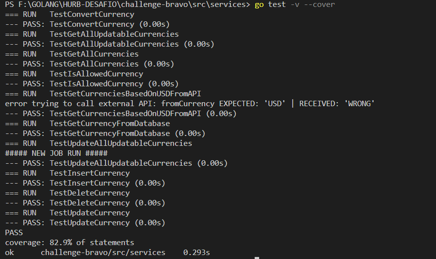

#  Bravo Challenge

## Arquitetura do Projeto de API
   

  Através da API é possível:
    -> Consultar todas as Moedas cadastradas
    -> Consultar uma Moeda cadastrada pelo Nome
    -> Inserir uma nova Moeda no Banco de Dados
    -> Deletar uma Moeda cadastrada pelo seu Nome
    -> Converter uma Moeda em outra, ambas devendo estar previamente registradas na API

  Outras funcionalidades:
    -> Caso a Moeda cadastrada exista na API externa utilizada e esteja com a flag "isAutoUpdatable" como "true", ela será automaticamente atualizada a cada 15 segundos via CronJob.

    -> Caso a Moeda cadastrada NÃO exista na API externa utilizada e esteja com a flag "isAutoUpdatable" como "true", um log no servidor apontará que a Moeda não existe na API, manterá sua taxa de conversão como a previamente cadastrada pelo usuário e alterará a flag "isAutoUpdatable" para "false".
    
    -> Sempre que a API for inicializada, ela buscará via API Externa os valores atuais para as 5 Moedas Padrão definidas no desafio (USD, BRL, EUR, BTC e ETH) e as atualizará/inserirá no banco de dados.

## Tecnologias envolvidas
  Linguagem GO
  Banco de Dados Redis
  Docker

## Motivo das Escolhas Tecnológicas
  Para este desafio, escolhi a linguagem Golang, principalmente por ser relativamente simples de levantar uma API com essas finalidades, mas também por fazer parte da Stack já utilizada pelo Hurb.

  Outro motivo é por este ser o meu primeiro projeto em Golang, o que me motivou a me desafiar ainda mais para aprender uma nova linguagem e suas nuances a fim de concluir este projeto.

  Escolhi o Redis por ser um banco de dados muito rápido, visando atingir ótimos resultados nos testes de stress.

  O Docker foi utilizado por ser da preferência do desafio e por facilitar o transporte e a implantação ao enviar o projeto.

## Módulos externos utilizados
    github.com/stretchr/testify
      -> Módulo utilizado para os arquivos de Teste.

    github.com/go-co-op/gocron
      -> Módulo utilizado para criar o cronjob responsável pela atualização contínua, a cada 15 segundos, dos valores das moedas com "isAutoUpdatable = true".

    github.com/joho/godotenv
      -> Módulo responsável pelo carregamento de informações do arquivo .env no ambiente.

    github.com/gorilla/mux
      -> Módulo responsável por instanciar e gerenciar o roteador de gerenciamento das rotas das chamadas da API.

    github.com/go-redis/redis
      -> Módulo responsável por disponibilizar buscas e atualizações no banco de dados Redis.

## Como instalar e rodar o Projeto
  Para subir as imagens de BD e App, bastar rodar, na raiz do projeto, dentro do arquivo "CHALLENGE-BRAVO":
   
  <pre><code>docker-compose up</code></pre>

## Endpoints

Retorna todas as moedas cadastradas:
  <pre><code>curl http://localhost:5000/currencies</code></pre>

Retorna uma moeda cadastrada:
  <pre><code>curl http://localhost:5000/currencies/BRL</code></pre>

Adiciona a moeda "TEST", com a taxa de conversão igual a 88 (Taxa de Conversão calculada em relação ao dólar americano) e a flag "isAutoUpdatable" igual a "false":
  <pre><code>curl --header "Content-Type: application/json" -d "{\"name\":\"TEST\", \"conversionRate\":88, \"isAutoUpdatable\": false}" http://localhost:5000/currencies</code></pre>

Remove uma moeda pelo seu nome:
  <pre><code>curl -X DELETE http://localhost:5000/currencies/TEST</code></pre>

Conversão entre moedas:
  <pre><code>curl "http://localhost:5000/convert?from=USD&amount=10&to=BRL"</code></pre>
    

## Cobertura de Testes
  Realizei os testes para os Services, com cobertura de 82.9%
  #  

  Para executar os testes, acessar a pasta de Services e rodar, conforme necessidade:
    
    <pre><code>go test -v --cover</code></pre>
      -> Mostra os testes que passaram ou falharam com a porcentagem de cobertura.
  
    <pre><code>go test --coverprofile coverage.txt</code></pre>
      -> Gera o arquivo de cobertura para ser lido no próximo comando.

    <pre><code>go tool cover --html=coverage.txt</code></pre>
      -> Abre em um navegador, separado por cada arquivo testado, uma visibilidade de todas as linhas cobertas pelos testes e a porcentagem de cobertura de cada arquivo.

## Testes de stress - Vegeta
  Realizei o teste de stress na funcionalidade de maior complexidade da aplicação, Converter valores entre moedas. Todas as requisições foram atendidas com sucesso e rapidamente.

  Segue o print do resultado. Teste efetuado dia 20/11/2022:
  #  

## Oportunidades de Melhoria
  -> Gerar um projeto separado para que o Cronjob, que atualiza as moedas "isAutoUpdatable = true", rode independente da API.

  -> Finalizar todos os testes para todos os pacotes.

  -> Incluir autenticação para utilização da API.