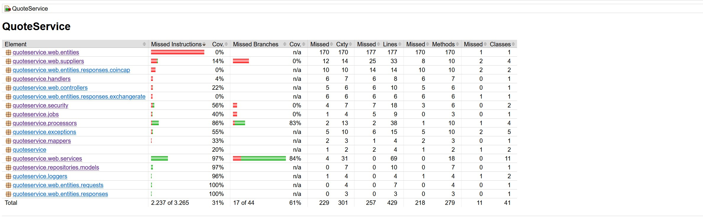
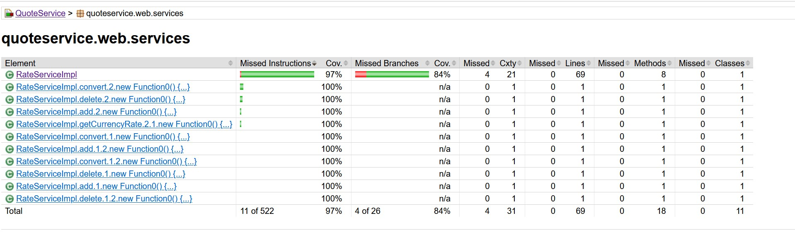
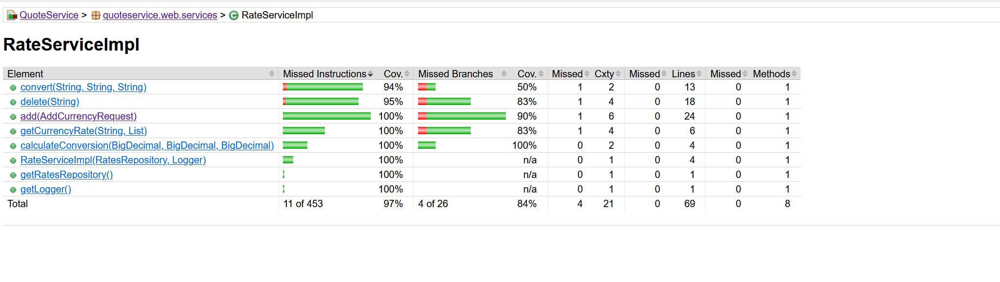
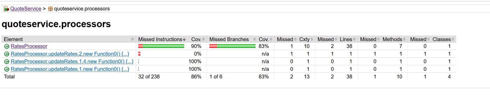
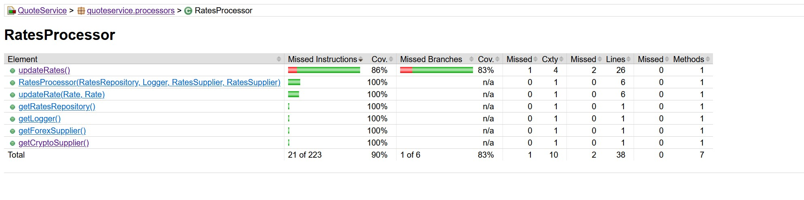

[[English](README.md) | [Portuguese](README.pt.md)]

<h2>QuoteService</h2>

<h3>Sobre o QuoteService</h3>

O propósito desta api é realizar conversões entre moedas fiat, crypto e imaginárias/foras do padrão. Foi
construído utilizando Spring Boot e Kotlin.

A API oferece suporte inicial para conversão entre as seguintes moedas:

- USD
- BRL
- EUR
- BTC
- ETH
- D&D (Dungeons & Dragons Gold Coins que é uma moeda imaginária)

A ideia básica desta API é recuperar dados de APIs abertas de câmbios/cotação e usá-las para calcular as conversões.
Como os fornecedores permitem uso aberto de usar APIs públicas a implementação usa uma rotina para recuperar os dados
delas em um tempo de delay configurável via variável de ambiente em millis de modo a evitar sobretaxá-las com
requisições e ultrapassar seu rate limit. Os dados são então convertidos para o padrão definido no código e então
persistidos no banco de dados para utilização posterior nas conversões. **Por favor note que as conversões podem
diferenciar de outros motores como google ou outras APIs devido as diferentes fontes de cotações**

<h3>Setup</h3>

A API é dockerizada o que significa que deve ser relativamente fácil de a fazer rodar.
Para realizar a inicialização primeiro clone esse repositório para sua máquina, então abra o terminal e navegue até a
raiz do repositório clonado e então use o seguinte comando:

``` docker-compose up --build ```

O processo pode demorar um pouco mas eventualmente o serviço estará "em pé" e "rodando". Se forem acusados erros de
"missing images" basta utilizar o comando a seguir para cada uma das imagens faltando:

``` docker pull <imagem_faltando> ```

<h3>Utilização</h3>

Currently, QuoteService offers 3 endpoints. One to convert between currencies, one to add a new currency and other to
remove a currency.Atualmente, o QuoteService oferece 3 endpoints. Um para realizar conversões entre moedas, um para
adicionar novas moedas individualmente e outro para remover moedas individualmente.

</h2>Endpoint de conversão</h2>

Verbo: GET

Esse endpoint é usado para converter uma quantia em uma moeda base para uma em moeda alvo

A rota do endpoint de conversão (localmente) é:
``` http://localhost:8080/currency/convert?from=<BaseCurrency>&to=<TargetCurrency>&amount=<Amount> ```

ex: ``` http://localhost:8080/currency/convert?from=ETH&to=BRL&amount=1 ```

Você deve adicionar o seguinte header obrigatório: Header: ``` Authorization: <API-Key> ```

Abaixo está o curl para chamar o endpoint de conversão (localmente):

curl --location 'http://localhost:8080/currency/convert?from=ETH&to=BRL&amount=1' \
--header 'Authorization: c4bf1743-1725-4a47-acbc-69668962fcdc'

</h2>Endpoint para adicionar moeda</h2>

Esse endpoint é utilizado para adicionar novas moedas na API:

Verbo: POST

A rota do endpoint de adição de novas moedas é a seguinte (localmente):
``` http://localhost:8080/currency/add ```

Você deve adicionar o seguinte header obrigatório: Header: ``` Authorization: <API-Key> ```

Body:

{

    "symbol": <Currency-Symbol>,

    "from_usd": <Conversion-Rate-From-USD>,

    "to_usd": <Conversion-Rate-To-USD>

}

Parâmetros:
- symbol: Símbolo oficial da moeda (USD, BRL, EUR, BTC, ETH, etc...);
- from_usd: Valor resultante da conversão de $1 USD para a moeda sendo adicionada
(ex: Quanto vale um dólar americano em real);
- to_usd: Valor resultante da conversão de $1 da moeda sendo adicionada para USD (ex: Quanto vale um real em dólar).


Abaixo está o curl para chamar o endpoint de adição de moedas (localmente):

curl --location 'http://localhost:8080/currency/add' \
--header 'Authorization: c4bf1743-1725-4a47-acbc-69668962fcdc' \
--header 'Content-Type: application/json' \
--data '{
"symbol": "BRL",
"from_usd": "5.14723",
"to_usd": "0.194279"
}'

Obs: Por favor note que quanto maior a quantidade depois do ponto mais preciso serão os cálculos
(o valor recomendado de casas decimais é 6).

Obs2: Ao invés de vírgula é usando ponto para representar so números com casas decimais.

</h2>Endpoint para deletar moedas</h2>

Esse endpoint é utilizado para remover moedar de forma lógica da API

Verbo: DELETE

A rota do endpoint de remoção de moedas é a seguinte (localmente):
``` http://localhost:8080/currency/delete?currency=<CurrencySymbol> ```

Você deve adicionar o seguinte header obrigatório: Header: ``` Authorization: <API-Key> ```

ex: ``` http://localhost:8080/currency/delete?currency=BRL ```

Abaixo está o curl para chamar o endpoint de remoção de moedas (localmente):

curl --location --request DELETE 'http://localhost:8080/currency/delete?currency=BRL' \
--header 'Authorization: c4bf1743-1725-4a47-acbc-69668962fcdc'

**Observação importante: o valor padrão do header Authorization é c4bf1743-1725-4a47-acbc-69668962fcdc**

<h3>Aviso importante</h3>

Atualmente a cobertura no jacoco está relativamente baixa devido ao fato que ainda não consegui fazer com que a
exclusão de classes funcionasse apropriadamente. Basicamente o jacoco está considerando todas as classes em seu
relatório como pode ser visto na imagem abaixo:


<p align="center">
  
</p>

No entanto, as classes que contém as partes mais importantes do código estão com cobertura satisfatória como pode ser
visto nas imagens abaixo:

Services:

<p align="center">
  
</p>

RateService:

<p align="center">
  
</p>

Processors:

<p align="center">
  
</p>

RateProcessor:

<p align="center">
  
</p>