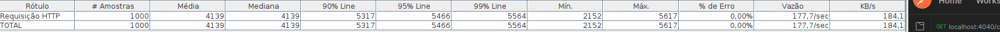

# Bravo Challenge - HURB - Patrick Navega

<p align="left">O objetivo desse projeto foi criar um serviço que realizasse a conversão entre moedas - sejam elas fictícias ou legítimas. Para tal, foi utilizado NODE JS como back-end devido à familiaridade do desenvolvedor com a ferramenta. Em relação ao armazenamento, visando a otimização de perfomance para o proposto teste de stress, foi utilizado o MongoDB como banco de dados.</p>
<br>

## BREVE RESUMO 

<p> O projeto foi arquitetado da maneira simples tendo como principais pilares a organização de idéias, clareza de código e desempenho do serviço. Para alcançar o objetivo, o código possui somente 3 métodos de requisição do protocolo HTTP - GET, POST e DELETE -, e validações de dados rigorosas, com o auxílio de libs e também feitas manualmente, que visam otimizar a sua perfomance.<p>
<br>

## Fluxo da requisição e envio de resposta

 

<br>

## TECNOLOGIAS

- Node JS v16.5 
- Mongo DB v4.6
<br>
<br>

## FRAMEWORKS E LIBS
- Express:4.18 - Servidor WEB 
- Axios:0.27 - Requisições de API 
- DotEnv:16.0 - Encapsulamento de informações frágeis
- Mongoose:6.4 - conexão ao banco de dados
- Yup:0.32 - Validação de entrada de dados
- <strike>Jest:28.1 - Criação de testes unitários</strike>
 

<br>

## API externa
- https://economia.awesomeapi.com.br/json/last/
<br>
<br>
<br>

# Fragilidade do serviço
- Por se tratar de um serviço público permitindo a manipulação total dos dados sem a validação de um token, os dados encontram-se expostos.
<br>
<br>
<br>

# Start do serviço
<p> Inicialmente, é necessário realizar o clone do repositório. Após a criação do clone, entre na pasta do repositório e execute o comando de construção de imagem, conforme instruções abaixo. </p>

```bash
$   git clone 'URL repositório'
$   cd 'repositorio'.
$   docker-compose up
```

<p> Após a criação do ambiente pelo docker-compose o acesso já será possível via URL - Isto é, via browser ou por softwares auxiliares, como o Postman por exemplo. </p>

```bash
    localhost:4040/ping
```

# Como utilizar 

<p> De maneira simplificada, possuímos 5 rotas com seus respectivos endpoints. </p>
<br>

```bash
1    .GET localhost:4040/currency
2    .GET localhost:4040/currency/<STRING>
3    .POST localhost:4040/currency
4    .DELETE localhost:4040/currency/<STRING>  
5    .GET localhost:4040/exchange/?from=<STRING>&to=<STRING>&rate=<NUMBER> 
```
<br>

## Buscando todas as moedas
<p> Ao realizarmos essa primeira requisição do método GET, esperamos como retorno um corpo como informado abaixo. Um array contendo todos os objetos contidos no banco.<p>

```bash
Exemplo de requisição: 

        localhost:4040/currency
```

### Descrição dos campos:
    
<li> name: Nome da moeda: STRING
<li> code: Código daquela moeda: STRING
<li> rate: Cotação da moeda tendo o Dólar como lastro: NUMBER
<li> fiatOrFic: Se é legítima ou fictícia: BOOLEAN
<br>
<br>


```bash
Exemplo de resposta

$   [
        {
            "_id": "62b261647c6a7d7cf3f56a25", 
            "name": "BITCOIN",
            "code": "BTC", 
            "rate": 1, 
            "fiatOrFic": true,
            "createdAt": "2022-06-22T00:25:08.615Z", 
            "updatedAt": "2022-06-22T00:25:08.615Z" 
        },
        .
        .
        .
        {
            "_id": "7896acadc6a7d7cf3f56a25",
            "name": "American Dĺar",
            "code": "USD",
            "rate": 1,
            "fiatOrFic": true,
            "createdAt": "2022-06-22T00:25:08.615Z",
            "updatedAt": "2022-06-22T00:25:08.615Z"
        }
]
```

<br>

## Buscando de um registro específico
<p id="2">Essa segunda requisição GET é aplicada em situações que estejamos buscando um elemento específico ao longo da base de dados a partir do código da moeda.<p>


```bash
Exemplo de requisição: 

        localhost:4040/currency/BTC
```

<p> O exemplo do retorno da requisição anterior é valido para esse caso também, entretanto, com somente <b>um</b> objeto no array. A menos que a requisição não encontre o registro solicitado, nesse caso haverá um outro retorno informando o status. <p>

```bash
Exemplo de resposta - CASO NÃO ENCONTRE O CODE PASSADO POR PARÂMETRO: 

$ { error: 'Currency code not exists at database' } 
```

<br>

## Cadastrar uma moeda
<p>

```bash
Exemplo de requisição:

    localhost:4040/currency

BODY da requisição

{
    "name": "PokeCoin",
    "code": "POK",
    "rate": 900,
    "fiatOrFic": 0
}
```

<p>Em caso de conversão <b>entre moedas legítimas</b>, não é necessário se importar com o campo de cotação (rate), uma vez que ele será atualizado de maneira assíncrona a cada requisição, conforme será visto mais adiante.</p>

<p>A princípio, o serviço não aceita a inserção de uma mesma moeda mais de uma vez no banco - usando como parâmetro de validação o código da moeda. O intuito dessa validação é minimizar quaisquer problemas que possam vir a ocorrer durante a conversão caso houvesse mais de um registro.</p>
<br>

## Deletar uma moeda

<p> O parâmetro a ser excluído deve ser enviado via parâmetro abaixo</p>

```bash
Exemplo de requisição DELETE:

    localhost:4040/currency/BTC
```
<br>

## Conversão de moedas

```bash
Exemplo de requisição GET/exchange:

    localhost:4040/exchange?to=BRL&from=USD&rate=10
```

<p> Antes de prosseguirmos à resposta da requisição, é importante entendermos a distinção que há entre as moedas fictícias para as moedas legítimas. Os códigos definidos como legítimos realizarão requisições assíncronas à API externa a cada requisição de conversão e gravarão seus novos dados no banco de dados. Já os códigos definidos como fictícios não, usarão como base o campo 'rate' inserido no dado.</p>

```bash
Retorno da requisição GET/Exchange
$ {
    "from": "USD",
    "to": "BRL",
    "rate": "BRL : 52.38 "
}
```

# Cobertura de testes

<p> Conforme imagem a seguir, utilizando o software Jmeter da empresa Apache, o serviço foi capaz de suportar o teste de stress de 1000 requisições simultâneas com 100% de eficácia.</p>

 

<p> Entretanto, devido à falta de habilidade do desenvolvedor desafiado com a criação de testes unitários, não fui capaz de elaborar testes com qualidade suficiente para serem entregues. Sorry for that. =D </p>

=======
  
</p>
>>>>>>> 4ff604586f0f94d7db9e28d491054653cffc6a0d
