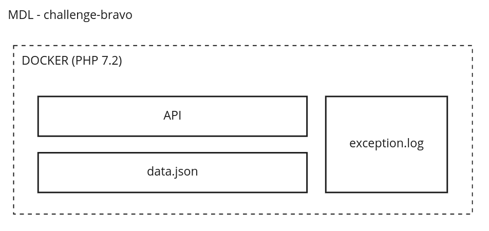
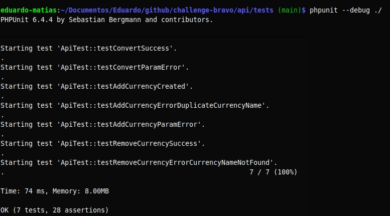

# API PHP

Esta API foi criada para converter valores entre diferentes tipos de moeda, além disso é possível cadastrar e exluir moedas.

**Importante**: O valor de referência ao cadastrar uma moeda deve ser o USD, ex.: BRL ~= 0.19 :weary:

## Considerações
* A API não utiliza banco de dados, as informações são salvas em um arquivo JSON (```api/data/data.json```);
* Existe validação na request apenas para garantir os campos obrigatórios, campos adicionais serão ignorados;
* Não existe validação para no nome da moeda, apenas não permite cadastrar um nome repetido;
* A conversão entrega o valor sem arredondamento;
* Foi adicionado um arquivo .htaccess para redirecionar qualquer URL para o ```index.php```;
* A API utiliza uma Exception (```api/class/ExceptionApi.class.php```) que loga qualquer erro de sistema ou de validação em um arquivo de log (```api/data/exception.log```);
* O docker foi configurado para utilizar a porta 80 para o apache;
* Não foi utilizado nenhum framework;
* Não criei testes para todos os cenários;

<br />

# MDL - Micro Development Language
<p align="center">
  
</p>

# Instruções
Necessário possuir o Doker instalado. [Link aqui.](https://www.docker.com/)

	-   git clone https://github.com/eduardomatias/challenge-bravo.git
	-   cd challenge-bravo/docker
	-   docker-compose up -d --build

# Endpoints

## Converter moeda
REQUEST_METHOD  | ```GET```
------------- | -------------
PARAM  | <pre>from=USD&to=BTC&amount=1</pre>
RETURN  | <pre>{"from": "BTC", "to": "BRL", "amount": "1", "result": 205296.68421052632}</pre>


## Adicionar moeda
REQUEST_METHOD  | ```POST```
------------- | -------------
PARAM  | <pre>{"name": "BTC", "amount": 39006.37}</pre>
RETURN  | <pre>{"message": "Moeda cadastrada com sucesso."}</pre>


## Excluir moeda
REQUEST_METHOD  | ```DELETE```
------------- | -------------
PARAM  | <pre>{"name": "BTC"}</pre>
RETURN  | <pre>{"message": "Moeda excluída com sucesso."}</pre>


# Testes
O teste foi executado local utilizando PHPUnit6.4. [Link aqui para instalação.](https://phpunit.readthedocs.io/pt_BR/latest/installation.html)

<p align="center">
  
</p>
