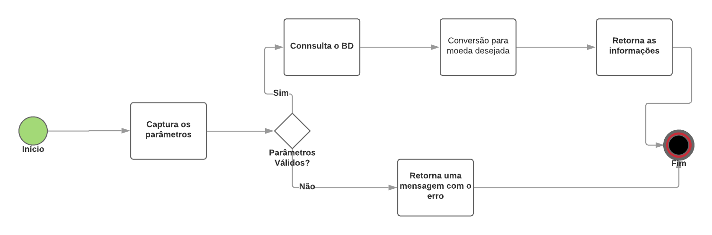

## API Bravo

Esta API desenvolvida em Python tem como objetivo fazer a conversão das seguintes moedas:
- BRL - Real
- USD - Dollar
- EUR - Euro
- BTC - Bitcoin
- ETH - Ethereum

### Seu processo está estrutudado da seguinte maneira:



****
### Arquivo de configuração
```python
DEBUG           = False
PORT            = 5000
# moedas disponíveis para conversão
COINS_AVAILABLE = ['USD','BRL', 'EUR', 'BTC', 'ETH']
# credenciais de acesso ao banco
USER        = ""
PASS        = ""
ADRESS      = "ds131676.mlab.com"
PORT        = "31676"
DATABASE    = "hurb"
COLLECTON   = "cotation"
```
***
### Informações

Com o objetivo de facilitar o lado dos avaliadores, hospedei a API na plataforma do [heroku](https://www.heroku.com/). 
Para de certificar que a API está de pé, basta acessar. 
```
https://challengerhurb.herokuapp.com/
```

***
### Testes de estresse

Foi-se utilizado o software [JMeter](https://jmeter.apache.org/) para realização dos testes testes iniciais de estresse. O cenário configurado foi de 5 usuário em um intervalo de 1s realizando 1000 requisição. A aplicação de comportou muito bem, com uma média de resposta em sua requisições de 25ms.

***
### Endpoints

A url para a conversão é ```api/v1/bravo``` e seus parâmetros obrigatórios de entrada são:
- from : Moeda de origem a ser convertida
- to: Moeda de destino a ser convertida
- amount: Quantidade desejada a ser convertida

***Exemplo de uso***
- get ```https://challengerhurb.herokuapp.com/api/v1/bravo?from=USD&to=EUR&amount=2000```
- get ```https://challengerhurb.herokuapp.com/api/v1/bravo?from=BRL&to=USD&amount=73.9```

***Exemplo de resposta***

```json
{
    "Amount": "73.9",
    "Converted": 18.76,
    "From": "BRL",
    "To": "USD",
    "Updated At": "2019-04-11 01:49:21",
}
```
